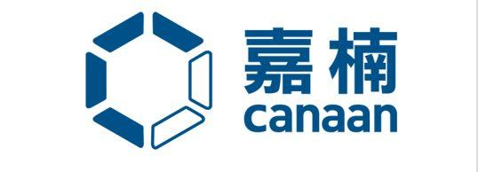

**English | [简体中文](README_zh.md)**

<h1 align="center" style="margin: 30px 0 30px; font-weight: bold;">CherryUSB</h1>
<p align="center">
	<a href="https://github.com/cherry-embedded/CherryUSB/releases"></a>
	<a href="https://github.com/cherry-embedded/CherryUSB/blob/master/LICENSE"></a>
    <a href="https://github.com/cherry-embedded/CherryUSB/actions/workflows/deploy-docs.yml"> </a>
    <a href="https://discord.com/invite/wFfvrSAey8"> </a>
</p>

CherryUSB is a tiny and beautiful, high performance and portable USB host and device stack for embedded system with USB IP.


## Why choose CherryUSB

### Easy to Learn USB

To facilitate user learning of USB fundamentals, enumeration, driver loading, and IP drivers, the written code has the following advantages:

- Streamlined code with simple logic and no complex C language syntax
- Tree-structured programming with progressive code layers
- Templated and simplified Class drivers and porting drivers
- Clear API categorization (Device: initialization, class registration, command callbacks, data transmission; Host: initialization, class discovery, data transmission)

### Easy to Use USB

To facilitate user interaction with USB interfaces, considering users’ familiarity with UART and DMA, the designed data transmission interface has the following advantages:

- Equivalent to using UART TX DMA/UART RX DMA
- No length restrictions on transmission/reception; users don’t need to worry about USB packetization (porting drivers handle packetization)

### Easy to Achieve USB Performance

Considering USB performance requirements to reach theoretical USB hardware bandwidth, the designed data transmission interface has the following advantages:

- Porting drivers directly interface with registers without abstraction layer encapsulation
- Memory zero copy
- DMA mode used when IP supports DMA (DMA provides hardware packetization functionality)
- No length restrictions, facilitating hardware DMA interfacing and maximizing DMA advantages
- Packetization handled in interrupt context

Performance show：https://cherryusb.cherry-embedded.org/show/

## Directory Structure

|   Directory       |  Description            |
|:-------------:|:---------------------------:|
|class          |  usb class driver           |
|common         |  usb spec macros and utils  |
|core           |  usb core implementation    |
|demo           |  usb device and host demo   |
|osal           |  os wrapper                 |
|platform       |  class support for other os |
|docs           |  doc for guiding            |
|port           |  usb dcd and hcd porting    |
|tools          |  tool url                   |

## Device Stack Overview

CherryUSB Device Stack provides a unified framework of functions for standard device requests, CLASS requests, VENDOR requests and custom special requests. The object-oriented and chained approach allows the user to quickly get started with composite devices without having to worry about the underlying logic. At the same time, a standard dcd porting interface has been standardised for adapting different USB IPs to achieve ip-oriented programming.

CherryUSB Device Stack has the following functions:

- Support USB2.0 full and high speed(USB3.0 super speed TODO)
- Support endpoint irq callback register by users, let users do whatever they wants in endpoint irq callback.
- Support Composite Device
- Support Communication Device Class (CDC_ACM, CDC_ECM)
- Support Human Interface Device (HID)
- Support Mass Storage Class (MSC)
- Support USB VIDEO CLASS (UVC1.0, UVC1.5)
- Support USB AUDIO CLASS (UAC1.0, UAC2.0)
- Support Device Firmware Upgrade CLASS (DFU)
- Support USB MIDI CLASS (MIDI)
- Support Remote NDIS (RNDIS)
- Support Media Transfer Protocol (MTP)
- Support WINUSB1.0, WINUSB2.0, WEBUSB, BOS
- Support Vendor display ([xfz1986_usb_graphic_driver](https://github.com/chuanjinpang/win10_idd_xfz1986_usb_graphic_driver_display))
- Support Vendor class
- Support UF2
- Support Android Debug Bridge (Only support shell)
- Support multi device with the same USB IP

CherryUSB Device Stack resource usage (GCC 10.2 with -O2, disable log):

|   file        |  FLASH (Byte)  |  No Cache RAM (Byte)      |  RAM (Byte)   |  Heap (Byte)     |
|:-------------:|:--------------:|:-------------------------:|:-------------:|:----------------:|
|usbd_core.c    |  ~4500          | (512(default) + 320) * bus | 0           | 0                |
|usbd_cdc_acm.c |  ~900           | 0                         | 0            | 0                |
|usbd_msc.c     |  ~5000          | (128 + 512(default)) * bus | 16 * bus    | 0                |
|usbd_hid.c     |  ~300           | 0                         | 0            | 0                |
|usbd_audio.c   |  ~4000          | 0                         | 0            | 0                |
|usbd_video.c   |  ~7000          | 0                         | 132 * bus    | 0                |
|usbd_rndis.c   |  ~2500          | 2 * 1580(default)+156+8   | 80           | 0                |
|usbd_cdc_ecm.c |  ~900           | 2 * 1514(default)+16      | 42           | 0                |
|usbd_mtp.c     |  ~9000          | 2048(default)+128         | sizeof(struct mtp_object) * n| 0 |
|usbd_dfu.c     |  ~2200          | 0                         | 45                           | 0 |

## Host Stack Overview

The CherryUSB Host Stack has a standard enumeration implementation for devices mounted on root hubs and external hubs, and a standard interface for different Classes to indicate what the Class driver needs to do after enumeration and after disconnection. A standard hcd porting interface has also been standardised for adapting different USB IPs for IP-oriented programming. Finally, the host stack is managed using os, and provides osal to make a adaptation for different os.

CherryUSB Host Stack has the following functions:

- Support low speed, full speed, high speed and super speed devices
- Automatic loading of supported Class drivers
- Support blocking transfers and asynchronous transfers
- Support Composite Device
- Multi-level HUB support, expandable up to 7 levels(Testing hub with 10 ports works well,only support dwc2/ehci/xhci/rp2040)
- Support Communication Device Class (CDC_ACM, CDC_ECM, CDC_NCM)
- Support Human Interface Device (HID)
- Support Mass Storage Class (MSC)
- Support USB Video CLASS (UVC1.0, UVC1.5)
- Support USB Audio CLASS (UAC1.0)
- Support Remote NDIS (RNDIS)
- Support USB Bluetooth class (support nimble and zephyr bluetooth stack, support **CLASS:0xE0** or vendor class like cdc acm)
- Support Vendor Serial Class(CH34X、CP210X、PL2303、FTDI、GSM)
- Support Vendor network Class(RTL8152、AX88772)
- Support USB modeswitch
- Support Android Open Accessory
- Support multi host with the same USB IP

The CherryUSB Host stack also provides the lsusb function, which allows you to view information about all mounted devices, including those on external hubs, with the help of a shell plugin.

CherryUSB Host Stack resource usage (GCC 10.2 with -O2, disable log):

|   file        |  FLASH (Byte)  |  No Cache RAM (Byte)            |  RAM (Byte)                 |  Heap (Byte) |
|:-------------:|:--------------:|:-------------------------------:|:---------------------------:|:------------:|
|usbh_core.c    |  ~4500 | (512(default) + 8 * (1+x) *n) * bus | sizeof(struct usbh_hub) * bus     | raw_config_desc |
|usbh_hub.c     |  ~3500          | (32 + 4 * (1+x)) * bus    | 12 + sizeof(struct usbh_hub) * x   | 0          |
|usbh_cdc_acm.c |  ~600           | 7 * x            | 4  + sizeof(struct usbh_cdc_acm) * x        | 0          |
|usbh_msc.c     |  ~2000          | 128 * x            | 4  + sizeof(struct usbh_msc) * x          | 0          |
|usbh_hid.c     |  ~800           | 64 * x           | 4  + sizeof(struct usbh_hid) * x            | 0          |
|usbh_video.c   |  ~5000          | 128 * x           | 4  + sizeof(struct usbh_video) * x         | 0          |
|usbh_audio.c   |  ~4000          | 128 * x           | 4  + sizeof(struct usbh_audio) * x         | 0          |
|usbh_rndis.c   |  ~3000          | 512 + 2 * 2048(default)| sizeof(struct usbh_rndis) * 1         | 0          |
|usbh_cdc_ecm.c |  ~1500          | 2 * 1514 + 16           | sizeof(struct usbh_cdc_ecm) * 1      | 0          |
|usbh_cdc_ncm.c |  ~2000          | 2 * 2048(default) + 16 + 32   | sizeof(struct usbh_cdc_ncm) * 1| 0          |
|usbh_bluetooth.c |  ~1000        | 2 * 2048(default)   | sizeof(struct usbh_bluetooth) * 1        | 0          |
|usbh_asix.c    |  ~7000          | 2 * 2048(default) + 16 + 32  | sizeof(struct usbh_asix) * 1    | 0          |
|usbh_rtl8152.c |  ~9000          | 16K+ 2K(default) + 2 + 32 | sizeof(struct usbh_rtl8152) * 1    | 0          |

Among them, `sizeof(struct usbh_hub)` and `sizeof(struct usbh_hubport)` are affected by the following macros:

```
#define CONFIG_USBHOST_MAX_EXTHUBS          1
#define CONFIG_USBHOST_MAX_EHPORTS          4
#define CONFIG_USBHOST_MAX_INTERFACES       8
#define CONFIG_USBHOST_MAX_INTF_ALTSETTINGS 2
#define CONFIG_USBHOST_MAX_ENDPOINTS        4
```

x is affected by the following macros:

```
#define CONFIG_USBHOST_MAX_SERIAL_CLASS  4
#define CONFIG_USBHOST_MAX_HID_CLASS     4
#define CONFIG_USBHOST_MAX_MSC_CLASS     2
#define CONFIG_USBHOST_MAX_AUDIO_CLASS   1
#define CONFIG_USBHOST_MAX_VIDEO_CLASS   1
```

## USB IP Support

Only standard and commercial USB IP are listed.

|   IP             |  device    | host     | Support status |
|:----------------:|:----------:|:--------:|:--------------:|
|  OHCI(intel)     |  none      | OHCI     |  √   |
|  EHCI(intel)     |  none      | EHCI     |  √   |
|  XHCI(intel)     |  none      | XHCI     |  √   |
|  UHCI(intel)     |  none      | UHCI     |  ×   |
|  DWC2(synopsys)  |  DWC2      | DWC2     |  √   |
|  MUSB(mentor)    |  MUSB      | MUSB     |  √   |
|  FOTG210(faraday)|  FOTG210   | EHCI     |  √   |
|  CHIPIDEA(synopsys)| CHIPIDEA | EHCI     |  √   |
|  CDNS2(cadence)  |  CDNS2     | CDNS2    |  √   |
|  CDNS3(cadence)  |  CDNS3     | XHCI     |  ×   |
|  DWC3(synopsys)  |  DWC3      | XHCI     |  ×   |

## Resources

### Getting Started

- 📖 [CherryUSB Documentation](https://cherryusb.readthedocs.io/en/latest/)
- 💻 [CherryUSB Demo Repo](https://cherryusb.readthedocs.io/en/latest/quick_start/demo.html)
- 📺 [CherryUSB Cheese(>= V1.4.3)](https://www.bilibili.com/cheese/play/ss707687201)

### Package Support

- [RT-Thread](https://packages.rt-thread.org/detail.html?package=CherryUSB)
- [YOC](https://www.xrvm.cn/document?temp=usb-host-protocol-stack-device-driver-adaptation-instructions&slug=yocbook)
- [ESP-Registry](https://components.espressif.com/components/cherry-embedded/cherryusb)

### Descriptor Generator Tool

Cherry Descriptor: https://desc.cherry-embedded.org/en

### Contact

CherryUSB discord: https://discord.com/invite/wFfvrSAey8

## Commercial Support

Refer to https://cherryusb.readthedocs.io/en/latest/support/index.html

## Company Support

Thanks to the following companies for their support (in no particular order):

               
