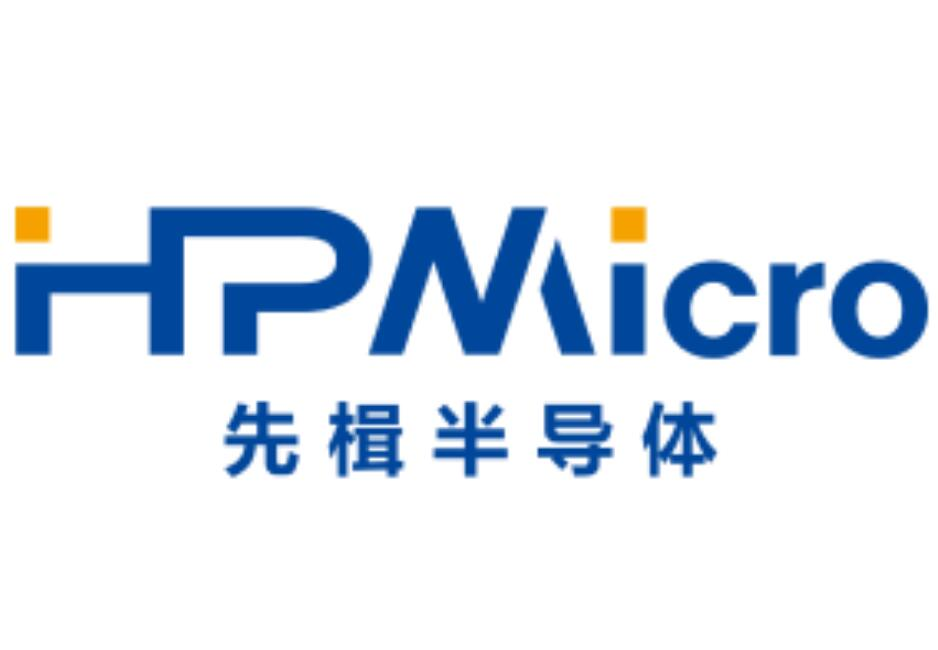
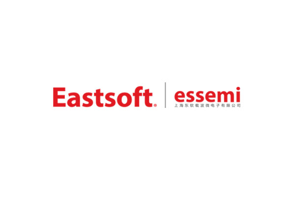
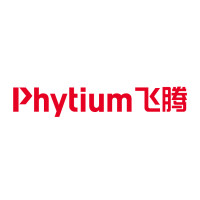
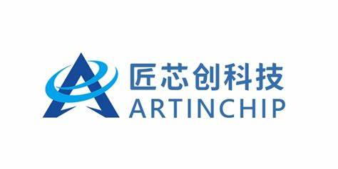
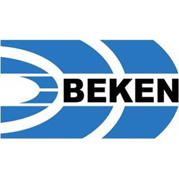
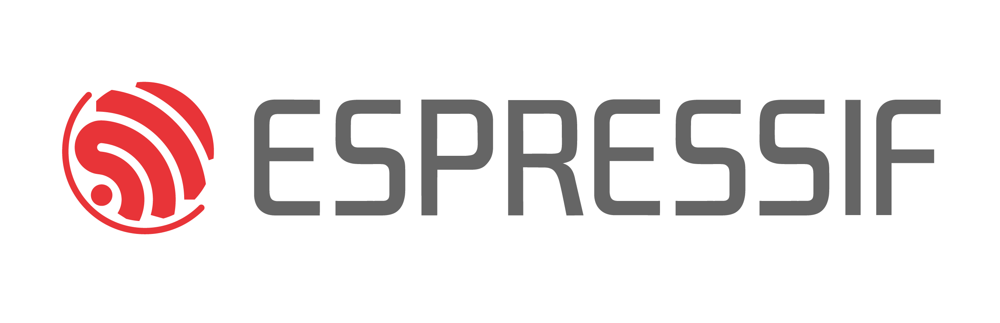
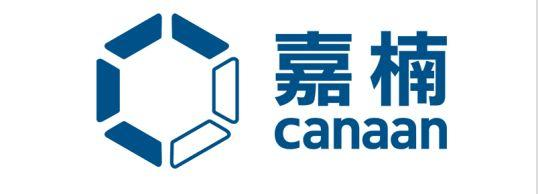

**[English](README.md) | 简体中文**

<h1 align="center" style="margin: 30px 0 30px; font-weight: bold;">CherryUSB</h1>
<p align="center">
	<a href="https://github.com/cherry-embedded/CherryUSB/releases"></a>
	<a href="https://github.com/cherry-embedded/CherryUSB/blob/master/LICENSE"></a>
    <a href="https://github.com/cherry-embedded/CherryUSB/actions/workflows/deploy-docs.yml"> </a>
    <a href="https://discord.com/invite/wFfvrSAey8"> </a>
</p>

CherryUSB 是一个小而美的、可移植性高的、用于嵌入式系统（带 USB IP）的高性能 USB 主从协议栈。


## 为什么选择 CherryUSB

### 易于学习 USB

为了方便用户学习 USB 基本知识、枚举、驱动加载、IP 驱动，因此，编写的代码具备以下优点：

- 代码精简，逻辑简单，无复杂 C 语言语法
- 树状化编程，代码层层递进
- Class 驱动和 porting 驱动模板化、精简化
- API 分类清晰（从机：初始化、注册类、命令回调类、数据收发类；主机：初始化、查找类、数据收发类）

### 易于使用 USB

为了方便用户使用 USB 接口，考虑到用户学习过 uart 和 dma，因此，设计的数据收发类接口具备以下优点：

- 等价于使用 uart tx dma/uart rx dma
- 收发长度没有限制，用户不需要关心 USB 分包过程（分包过程在 porting 中处理）

### 易于发挥 USB 性能

考虑到 USB 性能问题，尽量达到 USB 硬件理论带宽，因此，设计的数据收发类接口具备以下优点：

- Porting 驱动直接对接寄存器，无抽象层封装
- Memory zero copy
- IP 如果带 DMA 则使用 DMA 模式（DMA 带硬件分包功能）
- 长度无限制，方便对接硬件 DMA 并且发挥 DMA 的优势
- 分包过程在中断中执行

性能展示：https://cherryusb.cherry-embedded.org/show/

## 目录结构

|   目录名       |  描述                          |
|:-------------:|:-------------------------------:|
|class          |  usb class 类主从驱动           |
|common         |  usb spec 定义、常用宏、标准接口定义 |
|core           |  usb 主从协议栈核心实现          |
|demo           |  主从 class demo                 |
|docs           |  文档                            |
|osal           |  os 封装层                       |
|platform       |  其他 os 全家桶适配              |
|port           |  usb 主从需要实现的 porting 接口 |
|tools          |  工具链接                        |

## Device 协议栈简介

CherryUSB Device 协议栈对标准设备请求、CLASS 请求、VENDOR 请求以及 custom 特殊请求规范了一套统一的函数框架，采用面向对象和链表的方式，能够使得用户快速上手复合设备，不用管底层的逻辑。同时，规范了一套标准的 dcd porting 接口，用于适配不同的 USB IP，达到面向 ip 编程。

CherryUSB Device 协议栈当前实现以下功能：

- 支持 USB2.0 全速和高速设备（USB3.0 超高速 TODO）
- 支持端点中断注册功能，porting 给用户自己处理中断里的数据
- 支持复合设备
- 支持 Communication Device Class (CDC_ACM, CDC_ECM)
- 支持 Human Interface Device (HID)
- 支持 Mass Storage Class (MSC)
- 支持 USB VIDEO CLASS (UVC1.0、UVC1.5)
- 支持 USB AUDIO CLASS (UAC1.0、UAC2.0)
- 支持 Device Firmware Upgrade CLASS (DFU)
- 支持 USB MIDI CLASS (MIDI)
- 支持 Remote NDIS (RNDIS)
- 支持 Media Transfer Protocol (MTP)
- 支持 WINUSB1.0、WINUSB2.0、WEBUSB、BOS
- 支持 Vendor 类 class
- 支持 UF2
- 支持 Android Debug Bridge (Only support shell)
- 支持相同 USB IP 的多从机

CherryUSB Device 协议栈资源占用说明（GCC 10.2 with -O2）：

|   file        |  FLASH (Byte)  |  No Cache RAM (Byte)      |  RAM (Byte)   |  Heap (Byte)     |
|:-------------:|:--------------:|:-------------------------:|:-------------:|:----------------:|
|usbd_core.c    |  ~4500          | (512(default) + 320) * bus | 0           | 0                |
|usbd_cdc_acm.c |  ~900           | 0                         | 0            | 0                |
|usbd_msc.c     |  ~5000          | (128 + 512(default)) * bus | 16 * bus    | 0                |
|usbd_hid.c     |  ~300           | 0                         | 0            | 0                |
|usbd_audio.c   |  ~4000          | 0                         | 0            | 0                |
|usbd_video.c   |  ~7000          | 0                         | 132 * bus    | 0                |
|usbd_rndis.c   |  ~2500          | 2 * 1580(default)+156+8   | 80           | 0                |
|usbd_cdc_ecm.c |  ~900           | 2 * 1514(default)+16      | 42           | 0                |
|usbd_mtp.c     |  ~9000          | 2048(default)+128         | sizeof(struct mtp_object) * n| 0 |

## Host 协议栈简介

CherryUSB Host 协议栈对挂载在 root hub、外部 hub 上的设备规范了一套标准的枚举实现，对不同的 Class 类也规范了一套标准接口，用来指示在枚举后和断开连接后该 Class 驱动需要做的事情。同时，规范了一套标准的 hcd porting 接口，用于适配不同的 USB IP，达到面向 IP 编程。最后，协议栈使用 OS 管理，并提供了 osal 用来适配不同的 os。

CherryUSB Host 协议栈当前实现以下功能：

- 支持 low speed，full speed，high speed 和 super speed 设备
- 自动加载支持的Class 驱动
- 支持阻塞式传输和异步传输
- 支持复合设备
- 支持多级 HUB，最高可拓展到 7 级(目前测试 1拖 10 没有问题，仅支持 dwc2/ehci/xhci/rp2040)
- 支持 Communication Device Class (CDC_ACM, CDC_ECM, CDC_NCM)
- 支持 Human Interface Device (HID)
- 支持 Mass Storage Class (MSC)
- Support USB Video CLASS (UVC1.0、UVC1.5)
- Support USB Audio CLASS (UAC1.0)
- 支持 Remote NDIS (RNDIS)
- 支持 USB Bluetooth (支持 nimble and zephyr bluetooth 协议栈，支持 **CLASS: 0xE0** 或者厂家自定义类，类似于 cdc acm 功能)
- 支持 Vendor Serial 类(CH34X、CP210X、PL2303、FTDI、GSM)
- 支持 Vendor network 类(RTL8152、AX88772)
- 支持 USB modeswitch
- 支持 Android Open Accessory
- 支持相同 USB IP 的多主机

同时，CherryUSB Host 协议栈还提供了 lsusb 的功能，借助 shell 插件可以查看所有挂载设备的信息，包括外部 hub 上的设备的信息。

CherryUSB Host 协议栈资源占用说明（GCC 10.2 with -O2，关闭 log）：

|   file        |  FLASH (Byte)  |  No Cache RAM (Byte)            |  RAM (Byte)                 |  Heap (Byte) |
|:-------------:|:--------------:|:-------------------------------:|:---------------------------:|:------------:|
|usbh_core.c    |  ~4500 | (512(default) + 8 * (1+x) *n) * bus | sizeof(struct usbh_hub) * bus     | raw_config_desc |
|usbh_hub.c     |  ~3500          | (32 + 4 * (1+x)) * bus    | 12 + sizeof(struct usbh_hub) * x   | 0          |
|usbh_cdc_acm.c |  ~600           | 7 * x            | 4  + sizeof(struct usbh_cdc_acm) * x        | 0          |
|usbh_msc.c     |  ~2000          | 128 * x            | 4  + sizeof(struct usbh_msc) * x          | 0          |
|usbh_hid.c     |  ~800           | 64 * x           | 4  + sizeof(struct usbh_hid) * x            | 0          |
|usbh_video.c   |  ~5000          | 128 * x           | 4  + sizeof(struct usbh_video) * x         | 0          |
|usbh_audio.c   |  ~4000          | 128 * x           | 4  + sizeof(struct usbh_audio) * x         | 0          |
|usbh_rndis.c   |  ~3000          | 512 + 2 * 2048(default)| sizeof(struct usbh_rndis) * 1         | 0          |
|usbh_cdc_ecm.c |  ~1500          | 2 * 1514 + 16           | sizeof(struct usbh_cdc_ecm) * 1      | 0          |
|usbh_cdc_ncm.c |  ~2000          | 2 * 2048(default) + 16 + 32   | sizeof(struct usbh_cdc_ncm) * 1| 0          |
|usbh_bluetooth.c |  ~1000        | 2 * 2048(default)   | sizeof(struct usbh_bluetooth) * 1        | 0          |
|usbh_asix.c    |  ~7000          | 2 * 2048(default) + 16 + 32  | sizeof(struct usbh_asix) * 1    | 0          |
|usbh_rtl8152.c |  ~9000          | 16K+ 2K(default) + 2 + 32 | sizeof(struct usbh_rtl8152) * 1    | 0          |

其中，`sizeof(struct usbh_hub)` 和 `sizeof(struct usbh_hubport)` 受以下宏影响：

```
#define CONFIG_USBHOST_MAX_EXTHUBS          1
#define CONFIG_USBHOST_MAX_EHPORTS          4
#define CONFIG_USBHOST_MAX_INTERFACES       8
#define CONFIG_USBHOST_MAX_INTF_ALTSETTINGS 2
#define CONFIG_USBHOST_MAX_ENDPOINTS        4
```

x 受以下宏影响：

```
#define CONFIG_USBHOST_MAX_SERIAL_CLASS  4
#define CONFIG_USBHOST_MAX_HID_CLASS     4
#define CONFIG_USBHOST_MAX_MSC_CLASS     2
#define CONFIG_USBHOST_MAX_AUDIO_CLASS   1
#define CONFIG_USBHOST_MAX_VIDEO_CLASS   1
```

## USB IP 支持情况

仅列举标准 USB IP 和商业性 USB IP

|   IP             |  device    | host     | Support status |
|:----------------:|:----------:|:--------:|:--------------:|
|  OHCI(intel)     |  none      | OHCI     |  √   |
|  EHCI(intel)     |  none      | EHCI     |  √   |
|  XHCI(intel)     |  none      | XHCI     |  √   |
|  UHCI(intel)     |  none      | UHCI     |  ×   |
|  DWC2(synopsys)  |  DWC2      | DWC2     |  √   |
|  MUSB(mentor)    |  MUSB      | MUSB     |  √   |
|  FOTG210(faraday)|  FOTG210   | EHCI     |  √   |
|  CHIPIDEA(synopsys)| CHIPIDEA | EHCI     |  √   |
|  CDNS2(cadence)  |  CDNS2     | CDNS2    |  √   |
|  CDNS3(cadence)  |  CDNS3     | XHCI     |  ×   |
|  DWC3(synopsys)  |  DWC3      | XHCI     |  ×   |

## Resources

### 快速开始

- 📖 [CherryUSB Documentation](https://cherryusb.readthedocs.io/zh-cn/latest/)
- 💻 [CherryUSB Demo Repo](https://cherryusb.readthedocs.io/zh-cn/latest/quick_start/demo.html)
- 📺 [CherryUSB Cheese(>= V1.4.3)](https://www.bilibili.com/cheese/play/ss707687201)

### 软件包支持

- [RT-Thread](https://packages.rt-thread.org/detail.html?package=CherryUSB)
- [YOC](https://www.xrvm.cn/document?temp=usb-host-protocol-stack-device-driver-adaptation-instructions&slug=yocbook)
- [ESP-Registry](https://components.espressif.com/components/cherry-embedded/cherryusb)

### 描述符生成工具

Cherry Descriptor: https://desc.cherry-embedded.org/zh

### Contact

CherryUSB QQ群：642693751

CherryUSB 微信群：与我联系后邀请加入

## 商业支持

参考 https://cherryusb.readthedocs.io/zh-cn/latest/support/index.html

## 支持企业

感谢以下企业支持（顺序不分先后）：

               
