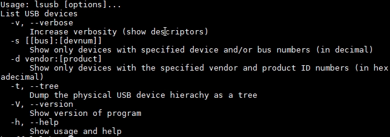

# USB Stack

[English](./README.md)

USB Stack 是一个小而美的、可移植性高的、用于嵌入式系统的 USB 主从协议栈。

## USB Stack 目录结构

```
.
├── class
│   ├── audio
│   ├── cdc
│   ├── dfu
│   ├── hid
│   ├── hub
│   ├── midi
│   ├── msc
│   ├── tmc
│   └── video
├── common
├── core
├── demo
│   ├── bouffalolab
│   └── stm32
│   └── mm32
│   └── ch32
├── docs
├── osal
├── packet capture
└── port
    ├── bouffalolab
    │   └── bl702
    ├── ch32
    ├── ehci
    ├── fsdev
    ├── mm32
    ├── synopsys
    ├── musb
    └── template
```

|   目录名       |  描述                          |
|:-------------:|:------------------------------:|
|class          |  usb class 类主从驱动           |
|common         |  usb spec 定义、常用宏、标准接口定义 |
|core           |  usb 主从协议栈核心实现            |
|demo           |  示例                          |
|docs           |  文档                          |
|osal           |  os 封装层                       |
|packet capture |  抓包文件（需要使用力科软件打开）|
|port           |  usb 主从需要实现的 porting 接口 |

## USB Device 协议栈简介

USB Device 协议栈对标准设备请求、CLASS 请求、VENDOR 请求以及 custom 特殊请求规范了一套统一的函数框架，采用面向对象和链表的方式，能够使得用户快速上手复合设备，不用管底层的逻辑。同时，规范了一套标准的 dcd porting 接口，用于适配不同的 USB IP，达到面向 ip 编程。

USB Device 协议栈的代码实现过程参考 <https://www.bilibili.com/video/BV1Ef4y1t73d> 。

USB Device 协议栈当前实现以下功能：

- 支持 USB2.0 全速和高速设备
- 支持端点中断注册功能，porting 给用户自己处理中断里的数据
- 支持复合设备和组合设备
- 支持 Communication Device Class (CDC)
- 支持 Human Interface Device (HID)
- 支持 Custom human Interface Device (HID)
- 支持 Mass Storage Class (MSC)
- 支持 USB VIDEO CLASS (UVC)
- 支持 USB AUDIO CLASS (UAC)
- 支持 Device Firmware Upgrade CLASS (DFU)
- 支持 USB MIDI CLASS (MIDI)
- 支持 Test and Measurement CLASS (TMC)
- 支持 Vendor 类 class
- 支持 WINUSB1.0、WINUSB2.0

USB Device 协议栈资源占用说明：

|   file      |  FLASH (Byte)  |  RAM (Byte)  |
|:-----------:|:--------------:|:------------:|
|usbd_core.c  |  3045          | 373          |
|usbd_cdc.c   |  302           | 20           |
|usbd_msc.c   |  2452          | 132          |
|usbd_hid.c   |  784           | 201          |
|usbd_audio.c |  438           | 14           |
|usbd_video.c |  402           | 4            |

## USB Host 协议栈简介

USB Host 协议栈对挂载在 roothub、外部 hub 上的设备规范了一套标准的枚举实现，对不同的 Class 类也规范了一套标准接口，用来指示在枚举后和断开连接后该 Class 驱动需要做的事情。同时，规范了一套标准的 hcd porting 接口，用于适配不同的 USB IP，达到面向 IP 编程。最后，协议栈使用 OS 管理，并提供了 osal 用来适配不同的 os。

USB Host 协议栈的代码实现过程参考：视频后续发布。

USB Host 协议栈当前实现以下功能：

- 自动加载支持的Class 驱动
- 支持阻塞式传输和异步传输
- 支持复合设备和组合设备
- 支持多级 HUB,最高可拓展到 7 级
- 支持 Communication Device Class (CDC)
- 支持 Human Interface Device (HID)
- 支持 Mass Storage Class (MSC)
- 支持安卓 AOA Communication

同时，USB Host 协议栈还提供了 lsusb 的功能，借助 shell 插件可以查看所有挂载设备的信息，包括外部 hub 上的设备的信息。



## USB Device API

更详细的设备协议栈 API 请参考: [USB Device API](docs/usb_device.md)

## USB Host API

更详细的主机协议栈 API 请参考: [USB Host API](docs/usb_host.md)

## RT-Thread 软件包使用

如何在 RT-Thread OS 中使用软件包，请参考：[USB Stack 在 RT-Thread package 中的使用](docs/rt-thread_zh.md)
