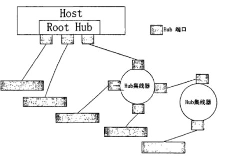
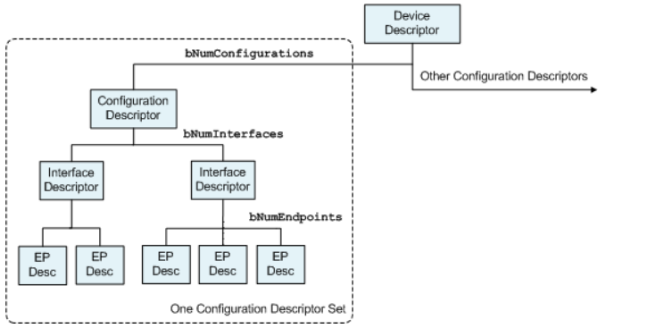

Host Protocol Stack
=======================================

For the naming, classification, and member composition of structures in the host protocol stack, refer to the following two diagrams:

CORE
-----------------

CLASS Driver Information Structure
""""""""""""""""""""""""""""""""""""

.. code-block:: C

    struct usbh_class_info {
        uint8_t match_flags;           /* Used for product specific matches; range is inclusive */
        uint8_t bInterfaceClass;       /* Base device class code */
        uint8_t bInterfaceSubClass;    /* Sub-class, depends on base class. Eg. */
        uint8_t bInterfaceProtocol;    /* Protocol, depends on base class. Eg. */
        const uint16_t (*id_table)[2]; /* List of Vendor/Product ID pairs */
        const struct usbh_class_driver *class_driver;
    };

Endpoint Structure
""""""""""""""""""""""""""""""""""""

.. code-block:: C

    struct usbh_endpoint {
        struct usb_endpoint_descriptor ep_desc;
    };

Interface Altsetting Structure
""""""""""""""""""""""""""""""""""""

.. code-block:: C

    struct usbh_interface_altsetting {
        struct usb_interface_descriptor intf_desc;
        struct usbh_endpoint ep[CONFIG_USBHOST_MAX_ENDPOINTS];
    };

Interface Structure
""""""""""""""""""""""""""""""""""""

.. code-block:: C

    struct usbh_interface {
        char devname[CONFIG_USBHOST_DEV_NAMELEN];
        struct usbh_class_driver *class_driver;
        void *priv;
        struct usbh_interface_altsetting altsetting[CONFIG_USBHOST_MAX_INTF_ALTSETTINGS];
        uint8_t altsetting_num;
    };

Configuration Structure
""""""""""""""""""""""""""""""""""""

.. code-block:: C

    struct usbh_configuration {
        struct usb_configuration_descriptor config_desc;
        struct usbh_interface intf[CONFIG_USBHOST_MAX_INTERFACES];
    };

hubport Structure
""""""""""""""""""""""""""""""""""""

.. code-block:: C

    struct usbh_hubport {
        bool connected;   /* True: device connected; false: disconnected */
        uint8_t port;     /* Hub port index */
        uint8_t dev_addr; /* device address */
        uint8_t speed;    /* device speed */
        uint8_t depth;    /* distance from root hub */
        uint8_t route;    /* route string */
        uint8_t slot_id;  /* slot id */
        struct usb_device_descriptor device_desc;
        struct usbh_configuration config;
        const char *iManufacturer;
        const char *iProduct;
        const char *iSerialNumber;
        uint8_t *raw_config_desc;
        struct usb_setup_packet *setup;
        struct usbh_hub *parent;
        struct usbh_hub *self; /* if this hubport is a hub */
        struct usbh_bus *bus;
        struct usb_endpoint_descriptor ep0;
        struct usbh_urb ep0_urb;
        usb_osal_mutex_t mutex;
    };

hub Structure
""""""""""""""""""""""""""""""""""""

.. code-block:: C

    struct usbh_hub {
        bool connected;
        bool is_roothub;
        uint8_t index;
        uint8_t hub_addr;
        uint8_t speed;
        uint8_t nports;
        uint8_t powerdelay;
        uint8_t tt_think;
        bool ismtt;
        struct usb_hub_descriptor hub_desc; /* USB 2.0 only */
        struct usb_hub_ss_descriptor hub_ss_desc; /* USB 3.0 only */
        struct usbh_hubport child[CONFIG_USBHOST_MAX_EHPORTS];
        struct usbh_hubport *parent;
        struct usbh_bus *bus;
        struct usb_endpoint_descriptor *intin;
        struct usbh_urb intin_urb;
        uint8_t *int_buffer;
        struct usb_osal_timer *int_timer;
    };

usbh_initialize
""""""""""""""""""""""""""""""""""""

``usbh_initialize`` is used to initialize the USB host protocol stack, including: initializing the USB host controller, creating roothub device, creating hub detection thread.

.. code-block:: C

    int usbh_initialize(uint8_t busid, uint32_t reg_base, usbh_event_handler_t event_handler);

- **busid**  bus id, starting from 0, cannot exceed `CONFIG_USBHOST_MAX_BUS`
- **reg_base**  hcd register base address
- **event_handler**  host event callback function, can be NULL
- **return**  0 indicates normal, other values indicate error

usbh_find_class_instance
""""""""""""""""""""""""""""""""""""

``usbh_find_class_instance`` finds the corresponding class structure handle based on the registered class name.

.. code-block:: C

    void *usbh_find_class_instance(const char *devname);

- **devname**  class name
- **return**  class structure handle

lsusb
""""""""""""""""""""""""""""""""""""

``lsusb`` is used to view and operate device information on the hub. Requires shell plugin to use.

.. code-block:: C

    int lsusb(int argc, char **argv);

SERIAL
-----------------

usbh_serial_open
""""""""""""""""""""""""""""""""""""

``usbh_serial_open`` opens a serial device according to the path.

.. code-block:: C

    struct usbh_serial *usbh_serial_open(const char *devname, uint32_t open_flags);

- **devname**  serial path
- **open_flags**  open flags, refer to `USBH_SERIAL_OFLAG_*` definitions
- **return**  serial structure handle

usbh_serial_close
""""""""""""""""""""""""""""""""""""

``usbh_serial_close`` closes the serial device.

.. code-block:: C

    void usbh_serial_close(struct usbh_serial *serial);

- **serial**  serial structure handle

usbh_serial_control
""""""""""""""""""""""""""""""""""""

``usbh_serial_control`` configures the serial port.

.. code-block:: C

    int usbh_serial_control(struct usbh_serial *serial, int cmd, void *arg);

- **serial**  serial structure handle
- **cmd**  control command, refer to `USBH_SERIAL_CMD_*` definitions
- **arg**  control parameter pointer
- **return**  0 indicates normal, other values indicate error

usbh_serial_write
""""""""""""""""""""""""""""""""""""

``usbh_serial_write`` writes data to the serial port.

.. code-block:: C

    int usbh_serial_write(struct usbh_serial *serial, const void *buffer, uint32_t buflen);

- **serial**  serial structure handle
- **buffer**  data buffer pointer
- **buflen**  length of data to write
- **return**  actual length of data written or error code

.. note:: If CONFIG_USB_DCACHE_ENABLE is not enabled, buffer needs to be in nocache area, otherwise it needs to be aligned to CONFIG_USB_ALIGN_SIZE area.

usbh_serial_read
""""""""""""""""""""""""""""""""""""

``usbh_serial_read`` reads data from the serial port. **If baud rate is not set, this API is not allowed to be used. After setting baud rate, rx reception will be enabled internally and data will be written to ringbuf**.

.. code-block:: C

    int usbh_serial_read(struct usbh_serial *serial, void *buffer, uint32_t buflen);

- **serial**  serial structure handle
- **buffer**  data buffer pointer
- **buflen**  maximum length of data to read
- **return**  actual length of data read or error code

.. note:: Since ringbuffer is used internally, there are no restrictions on user buffer attributes.

usbh_serial_cdc_write_async
""""""""""""""""""""""""""""""""""""

``usbh_serial_cdc_write_async`` asynchronously writes data to the serial port. **If baud rate is set, this API is not allowed to be used**.

.. code-block:: C

    int usbh_serial_cdc_write_async(struct usbh_serial *serial, uint8_t *buffer, uint32_t buflen, usbh_complete_callback_t complete, void *arg);

- **serial**  serial structure handle
- **buffer**  data buffer pointer
- **buflen**  length of data to send
- **complete**  data write completion callback function
- **arg**  callback function parameter
- **return**  0 indicates normal, other values indicate error

.. note:: If CONFIG_USB_DCACHE_ENABLE is not enabled, buffer needs to be in nocache area, otherwise it needs to be aligned to CONFIG_USB_ALIGN_SIZE area.

usbh_serial_cdc_read_async
""""""""""""""""""""""""""""""""""""

``usbh_serial_cdc_read_async`` asynchronously reads data from the serial port. **If baud rate is set, this API is not allowed to be used. After setting baud rate, rx reception will be enabled internally and data will be written to ringbuf**.

.. code-block:: C

    int usbh_serial_cdc_read_async(struct usbh_serial *serial, uint8_t *buffer, uint32_t buflen, usbh_complete_callback_t complete, void *arg);

- **serial**  serial structure handle
- **buffer**  data buffer pointer
- **buflen**  maximum length of data to read, up to 16K at a time. Must be a multiple of wMaxPacketSize
- **complete**  data read completion callback function
- **arg**  callback function parameter
- **return**  0 indicates normal, other values indicate error

.. note:: If CONFIG_USB_DCACHE_ENABLE is not enabled, buffer needs to be in nocache area, otherwise it needs to be aligned to CONFIG_USB_ALIGN_SIZE area.

HID
-----------------

MSC
-----------------

usbh_msc_scsi_init
""""""""""""""""""""""""""""""""""""

``usbh_msc_scsi_init`` initializes msc scsi device. Gets MSC status and capacity information.

.. code-block:: C

    int usbh_msc_scsi_init(struct usbh_msc *msc_class);

- **msc_class**  msc structure handle
- **return**  0 indicates normal, other values indicate error

usbh_msc_scsi_write10
""""""""""""""""""""""""""""""""""""

``usbh_msc_scsi_write10`` writes data to msc device.

.. code-block:: C

    int usbh_msc_scsi_write10(struct usbh_msc *msc_class, uint32_t start_sector, const uint8_t *buffer, uint32_t nsectors);

- **msc_class**  msc structure handle
- **start_sector**  starting sector
- **buffer**  data buffer pointer
- **nsectors**  number of sectors to write
- **return**  returns 0 for normal, other values indicate error

usbh_msc_scsi_read10
""""""""""""""""""""""""""""""""""""

``usbh_msc_scsi_read10`` reads data from msc device.

.. code-block:: C

    int usbh_msc_scsi_read10(struct usbh_msc *msc_class, uint32_t start_sector, uint8_t *buffer, uint32_t nsectors);

- **msc_class**  msc structure handle
- **start_sector**  starting sector
- **buffer**  data buffer pointer
- **nsectors**  number of sectors to read
- **return**  returns 0 for normal, other values indicate error

NETWORK
-----------------

Already integrated with lwIP protocol stack or other network protocol stacks, use socket API.