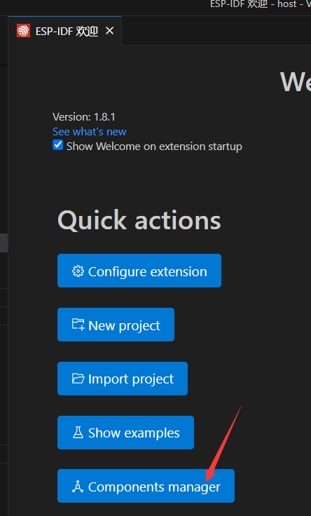
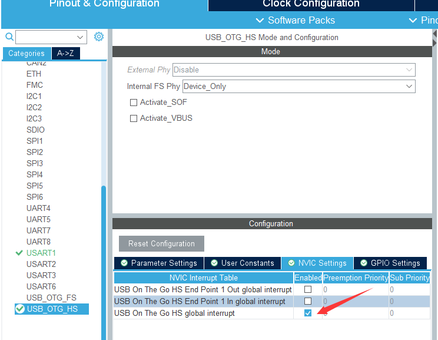
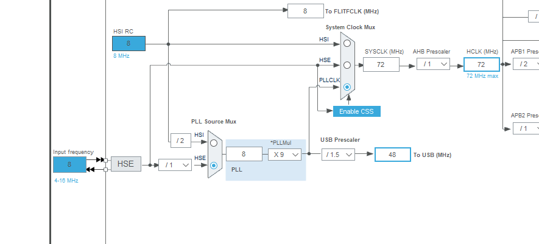
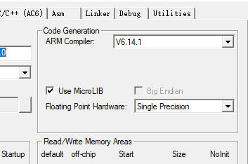
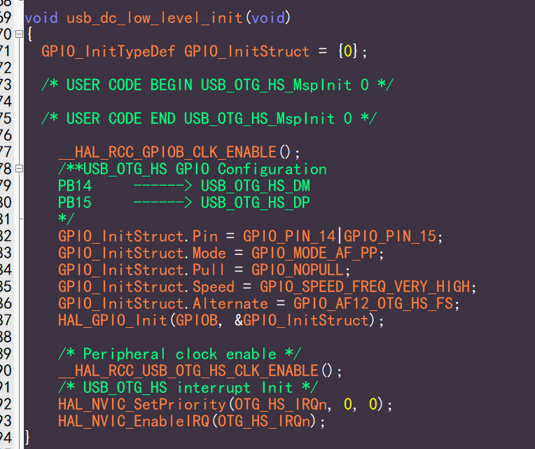
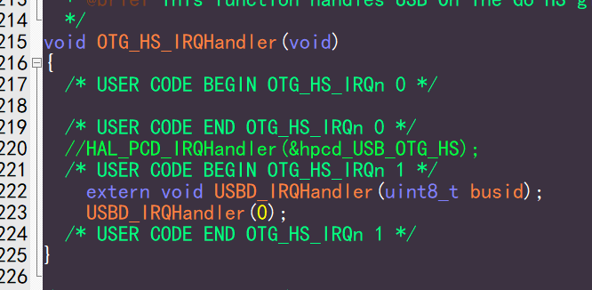
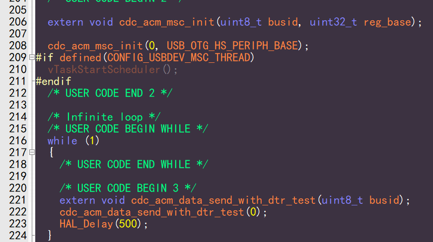
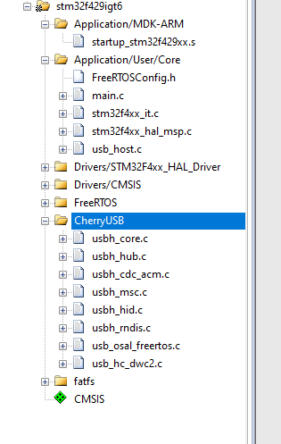

Quick Verification Based on Existing Demos
=============================================

Before learning USB or CherryUSB code, we need to quickly verify based on existing demos. Why? To enhance interest in USB and build confidence for the next steps. If demos can't run, or if you explore writing code by yourself, or read USB basic concepts first, you may find that you can't understand anything in the end - there are so many concepts that you simply can't remember them, thus losing interest in USB. Therefore, running demos first is very important. Below I will list the currently supported demo repositories.

Based on Bouffalolab Series Chips (Official SDK Support)
--------------------------------------------------------------

.. list-table::
    :widths: 10 10 10
    :header-rows: 1

    * - Repo url
      - USB IP
      - Version
    * - https://github.com/CherryUSB/cherryusb_bouffalolab
      - FOTG210
      - less than latest

Based on HPMicro Series Chips (Official SDK Support)
-----------------------------------------------------

.. list-table::
    :widths: 10 10 10
    :header-rows: 1

    * - Repo url
      - USB IP
      - Version
    * - https://github.com/CherryUSB/cherryusb_hpmicro
      - CHIPIDEA
      - less than latest

Based on esp32s2/s3/p4 Series Chips (Official SDK Support)
-------------------------------------------------------------------------------

.. list-table::
    :widths: 10 10 10
    :header-rows: 1

    * - Repo url
      - USB IP
      - Version
    * - https://github.com/CherryUSB/cherryusb_esp32
      - DWC2
      - less than latest

Default demo uses component library installation form, can be searched at https://components.espressif.com/ for cherryusb

ESP-Registry can refer to the official documentation, recommended to use vscode + esp-idf development environment.

- ctrl + shift + p select ESP-IDF welcome interface, then select Component manager

- Find cherryusb and install

.. figure:: img/esp2.png

- Open menuconfig, and open cherryusb configuration, select host or device mode according to actual situation

.. figure:: img/esp3.png
.. figure:: img/esp4.png

Based on Phytium Series Chips (Official SDK Support)
-------------------------------------------------------

.. list-table::
    :widths: 10 10 10
    :header-rows: 1

    * - Repo url
      - USB IP
      - Version
    * - https://gitee.com/phytium_embedded/phytium-free-rtos-sdk
      - PUSB2/XHCI
      - equal to v1.4.0

Based on Essemi Series Chips (Official SDK Support)
-------------------------------------------------------------

.. list-table::
    :widths: 10 10 10
    :header-rows: 1

    * - Repo url
      - USB IP
      - Version
    * - https://github.com/CherryUSB/cherryusb_es32
      - MUSB
      - less than latest

Based on Artinchip Series Chips (Official SDK Support)
-------------------------------------------------------------------

.. list-table::
    :widths: 10 10 10
    :header-rows: 1

    * - Repo url
      - USB IP
      - Version
    * - https://gitee.com/artinchip/luban-lite
      - AIC/EHCI/OHCI
      - less than latest

Based on Kendryte canmv-k230 Chip (Official SDK Support)
---------------------------------------------------------

.. list-table::
    :widths: 10 10 10
    :header-rows: 1

    * - Repo url
      - USB IP
      - Version
    * - https://github.com/CherryUSB/k230_sdk
      - DWC2
      - less than latest

Based on NXP MCX Series Chips
-------------------------------------

.. list-table::
    :widths: 10 10 10
    :header-rows: 1

    * - Repo url
      - USB IP
      - Version
    * - https://github.com/CherryUSB/cherryusb_mcx  https://github.com/RT-Thread/rt-thread/tree/master/bsp/nxp/mcx
      - CHIPIDEA/kinetis
      - less than latest

Based on SiFli SF32 Series Chips (Official SDK Support)
--------------------------------------------------------

.. list-table::
    :widths: 10 10 10
    :header-rows: 1

    * - Repo url
      - USB IP
      - Version
    * - https://github.com/OpenSiFli/SiFli-SDK
      - MUSB
      - less than latest

Based on RP2040/RP2035 Chips (Official SDK Support Coming Soon)
--------------------------------------------------------------------------

.. list-table::
    :widths: 10 10 10
    :header-rows: 1

    * - Repo url
      - USB IP
      - Version
    * - https://github.com/CherryUSB/pico-examples  https://github.com/CherryUSB/pico-sdk
      - RP2040
      - less than latest

Based on Actionstech Series Chips (Official SDK Support)
-----------------------------------------------------------

Not opensource, please contact to Actionstech official

Based on ST Series Chips
---------------------------

.. list-table::
    :widths: 10 10 10
    :header-rows: 1

    * - Repo url
      - USB IP
      - Version
    * - https://github.com/CherryUSB/cherryusb_stm32
      - DWC2/FSDEV
      - less than latest

Default demo projects provided:

- F103 uses fsdev ip
- F429 host and device use USB1, pins pb14/pb15, default device does not enable DMA mode
- H7 device uses USB0, pins pa11/pa12, DMA mode not enabled. Host uses USB1, pins pb14/pb15, and needs nocache processing

Demo provides **stm32xxx.ioc** file, double click to open, click **Generate Code**.

.. caution:: After generation, please use git reset function to restore the overwritten `main.c` and `stm32xxx_it.c` files, prohibit being overwritten by cubemx.

Covers F1/F4/H7, other chips are basically similar and won't be repeated. Specific differences are:

- usb ip difference: F1 uses fsdev, F4/H7 use dwc2
- dwc2 ip difference: USB0 (pins PA11/PA12) and USB1 (pins PB14/PB15), where USB1 defaults to full-speed, can connect external PHY to form high-speed host, and has DMA functionality
- F4 has no cache, H7 has cache

If it's STM32F7/STM32H7 with cache functionality, you need to locate the ram used by usb to the no cache ram area. Example as follows

.. code-block:: C

    cpu_mpu_config(0, MPU_Normal_NonCache, 0x24070000, MPU_REGION_SIZE_64KB);

Corresponding sct script modification in Keil:

.. code-block:: C

    LR_IROM1 0x08000000 0x00200000  {    ; load region size_region
    ER_IROM1 0x08000000 0x00200000  {  ; load address = execution address
    *.o (RESET, +First)
    *(InRoot$$Sections)
    .ANY (+RO)
    .ANY (+XO)
    }
    RW_IRAM2 0x24000000 0x00070000  {  ; RW data
    .ANY (+RW +ZI)
    }
    USB_NOCACHERAM 0x24070000 0x00010000  {  ; RW data
    *(.noncacheable)
    }
    }

USB Device Porting Points
^^^^^^^^^^^^^^^^^^^^^^^^^^^^^

- Use **stm32cubemx** to create project, configure basic RCC, UART (used as log)

.. figure:: img/stm32_1.png
.. figure:: img/stm32_2.png

- If using fsdev ip, check **USB**. If using dwc2 ip, check **USB_OTG_FS** or **USB_OTG_HS**. Enable USB interrupt. Other configurations are useless to us, no ST USB library will be used in the code.

.. figure:: img/stm32_3_1.png

- Configure usb clock to 48M

.. figure:: img/stm32_4_2.png

- Select project, here we choose keil, set stack and heap properly. If using msc, it's recommended to set them larger, then click **Generate Code**.

.. figure:: img/stm32_5.png

- Add CherryUSB required source code (**usbd_core.c**, **dwc2/usb_dc_dwc2.c** or **fsdev/usb_dc_fsdev.c**), as well as the class drivers you want to use. You can add corresponding class templates for convenient testing.

.. figure:: img/stm32_6.png

- Add necessary header files

.. figure:: img/stm32_7.png

- Copy **cherryusb_config_template.h**, place it in the `Core/Inc` directory, and name it `usb_config.h`

.. figure:: img/stm32_8.png

- If using fsdev ip, (starting from V1.5.0, need to add **fsdev/usb_glue_st.c**) implement the following macro definition in `usb_config.h`. The specific value varies for different chips:

.. code-block:: C

    #define CONFIG_USBDEV_FSDEV_PMA_ACCESS 2

- Compiler recommends using **AC6**. Check **Microlib**, and implement **printf** for convenient log viewing later.

.. figure:: img/stm32_11.png

.. note :: Starting from V1.5.0, the following two steps are no longer needed because they are already implemented in **fsdev/usb_glue_st.c** and **dwc2/usb_glue_st.c** files

- Copy the content of **HAL_PCD_MspInit** function in **xxx_msp.c** to **usb_dc_low_level_init** function, disable ST generated USB initialization

.. figure:: img/stm32_14.png

- Call `USBD_IRQHandler` in interrupt function and pass in `busid`

- If the chip has cache, please refer to :ref:`usb_cache` chapter for cache modification

- Call template content initialization and fill in `busid` and USB IP's `reg base`. `busid` starts from 0 and cannot exceed `CONFIG_USBDEV_MAX_BUS`

USB Host Porting Points
^^^^^^^^^^^^^^^^^^^^^^^^^^^^^

The first 6 steps are the same as device side. Note that host driver only supports HS port with DMA (pins PB14/PB15), so FS port (pins PA11/PA12) is not supported (what's the point of a host without DMA).

- Add CherryUSB required source code (**usbh_core.c**, **usbh_hub.c**, **usb_hc_dwc2.c**, **usb_glue_st.c** and adapter layer files in **osal** directory), as well as the class drivers you want to use, and you can add corresponding **usb host.c** for convenient testing.

- Compiler recommends using **AC6**. Check **Microlib**, and implement **printf** for convenient log viewing later.

.. figure:: img/stm32_11.png

- Copy **cherryusb_config_template.h**, place it in the `Core/Inc` directory, and name it `usb_config.h`

.. note :: Starting from V1.5.0, the following two steps are no longer needed because they are already implemented in **fsdev/usb_glue_st.c** and **dwc2/usb_glue_st.c** files

- Copy the content of `HAL_HCD_MspInit` function in **xxx_msp.c** to `usb_hc_low_level_init` function, disable ST generated USB initialization
- Call `USBH_IRQHandler` in interrupt function and pass in `busid`

.. figure:: img/stm32_19.png

- For linker script modifications, refer to :ref:`usbh_link_script` chapter
- If the chip has cache, please refer to :ref:`usb_cache` chapter for cache modification
- Call `usbh_initialize` and fill in `busid` and USB IP's `reg base` and `event_handler` (can be omitted as NULL). `busid` starts from 0 and cannot exceed `CONFIG_USBHOST_MAX_BUS`
- Start thread

.. figure:: img/stm32_18.png
