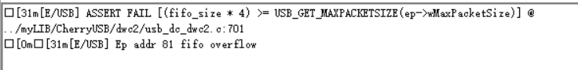

Q & A
============================================

Porting Question Template
------------------------------

Please submit questions through the following channels:
- RT-Thread Official Forum: https://club.rt-thread.org/ask/tag/5f5f851966917b14.html
- Github issue: https://github.com/cherry-embedded/CherryUSB/issues/new/choose

Please include the following information in your question:

- Version being used
- Board, pins, and USB IP being used
- Whether USB interrupts, USB clock, USB pins, USB PHY configuration are configured, and whether USB register addresses are correct (include screenshots)
- Whether USB interrupts are triggered
- Whether the chip has cache functionality and whether no-cache processing has been implemented (include screenshots)
- Whether USB circuit is drawn correctly, whether dupont wires are used for connection, whether direct connection is used; if normal, please explain why it's normal
- If interrupts can be triggered, configure **#define CONFIG_USB_DBG_LEVEL USB_DBG_LOG** and provide logs (limited to commercial IPs only; other IPs are prohibited from enabling logs, otherwise enumeration will fail)
- Whether the chip has been taped out and is being sold

Other Question Template
--------------------------------

Specifically describe the phenomenon, reproduction method, test using my provided demo, and provide complete logs

How Much Performance Can CherryUSB Achieve
----------------------------------------------------------------

Reference: :ref:`performace_show`

ST IP Naming Issues
-------------------------

ST naming uses USB_OTG_FS, USB_OTG_HS, which doesn't indicate whether it's actually high-speed or full-speed, but represents the maximum speed it can support (high-speed). Both are actually full-speed and require external high-speed PHY. Therefore, please avoid using these terms in questions; use USB0(PA11/PA12), USB1(PB14/PB15) instead. The same applies to other domestic manufacturers.

GD IP Issues
------------------

GD IP uses DWC2, but all hardware parameters read are 0 (I don't understand why they don't want people to know). Therefore, users need to know the hardware information themselves. Starting from version 1.5.0, because hardware information needs to be read, it cannot be used directly.

Additionally, GD cannot use the EPDIS function to close endpoints after reset. Users need to delete the following code from the reset interrupt:

.. code-block:: C

    USB_OTG_INEP(i)->DIEPCTL = (USB_OTG_DIEPCTL_EPDIS | USB_OTG_DIEPCTL_SNAK);
    USB_OTG_OUTEP(i)->DOEPCTL = (USB_OTG_DOEPCTL_EPDIS | USB_OTG_DOEPCTL_SNAK);

There may also be other unknown bugs; please test yourself.

Cannot enumerate after enabling USB_LOG_DBG
----------------------------------------------------------------

Only commercial IPs can enumerate after enabling, other IPs are prohibited from enabling, otherwise enumeration will fail. Those who know, know.

Which version to use for USB3 CV testing
--------------------------------------------

Version 1.4.3 and above

Ep addr XXX fifo overflow
------------------------------

This error indicates that the default FIFO space setting for this endpoint is insufficient and needs to be increased. This is commonly seen in DWC2/MUSB IP. Refer to relevant glue files for FIFO settings.

Ep addr XXX overflow
------------------------------

.. figure:: img/question2.png

This error indicates that the IP hardware doesn't have that many endpoints. Please change IP or reduce endpoint usage.
Of course, you can also modify to bidirectional endpoints. Considering that not all IPs support bidirectional endpoints, the default demo doesn't implement bidirectional functionality. For example, the default is 81 02 rather than 81 01. If supported, modify it yourself. Some IP bidirectional endpoints may occupy the same hardware information and may not be usable simultaneously, please check yourself.

This dwc2 version does not support dma mode, so stop working
----------------------------------------------------------------

This DWC2 version doesn't support DMA mode, prohibited from use. Not using DMA mode will frequently trigger NAK interrupts (about every tens of microseconds), causing excessively high CPU usage.

Which chips support OTG
------------------------------

Currently, only HPM chips support OTG functionality in the mainline, automatically switching between host/device modes via ID pin. For other chips, please use manual switching mode OR implement ID recognition driver yourself.

How to change PC-recognized COM port name
----------------------------------------------------------------

This is a Microsoft CDC ACM driver issue that cannot be modified. If modification is needed, please contact Microsoft, pay fees, and write driver to make changes.

Connect and disconnect events not triggering
----------------------------------------------------------------

Currently only HPM chips support connect and disconnect events. For other chips, please use USB VBUS detection circuit. DWC2 IP supports it, but because it requires pin usage and most are log ports, and different enabling configurations vary, support is not provided.

__has_include error
------------------------------------------------------------------
If error occurs, compiler needs to support C99 syntax. If using Keil, please use AC6 compiler.

When to use CONFIG_USB_HS
----------------------------------------------------------------

Enable when your chip hardware supports high speed and you want to initialize in high-speed mode. Related IP will configure internal or external high-speed PHY based on this macro.

Failed to enable port
----------------------------------------------------------------

Insufficient power supply or hardware USB circuit issues

Porting USB host encounters URB return -12/-14
----------------------------------------------------------------

Check PHY configuration, cache configuration (if any), power supply (recommend self-powered)

USB_ERR_NAK explanation
----------------------------------------------------------------

USB_ERR_NAK only exists in DWC2 buffer DMA/slave mode (we don't use slave mode). DWC2 in buffer DMA mode doesn't support hardware handling of NAK interrupts for interrupt transfers, requiring software handling, resulting in very frequent NAK interrupts. Recommend using with timer.
DWC2 scatter/gather DMA mode is fully handled by hardware but doesn't support split transfers. In summary, **tasteless to eat, pity to discard**.

USB host connecting USB network adapter issues
----------------------------------------------------------------

Manifests as network adapter recognition and IP address allocation but inability to ping. This is because the network adapter itself needs to enable auto-dial, usually requiring AT port settings. Specifically for EC20/ML307 modules.

When to enable CONFIG_USB_DCACHE_ENABLE
-------------------------------------------------

Enable this macro when chip has cache functionality and doesn't use no-cache RAM to ensure data consistency. **When using EHCI, nocache RAM is still needed internally**. Usually, for third-party platforms or components that don't use no-cache RAM macros but use global variables or malloc operations, this RAM typically goes through cache, requiring this macro. Recommend mandatory enabling for third-party platform usage.

Which IPs have data alignment requirements
-------------------------------------------------

- When CONFIG_USB_DCACHE_ENABLE is not enabled, only DWC2/WCH/AIC IP requires 4-byte alignment, others need only 1-byte alignment.
- When CONFIG_USB_DCACHE_ENABLE is enabled, all IPs need alignment to CONFIG_USB_ALIGN_SIZE bytes