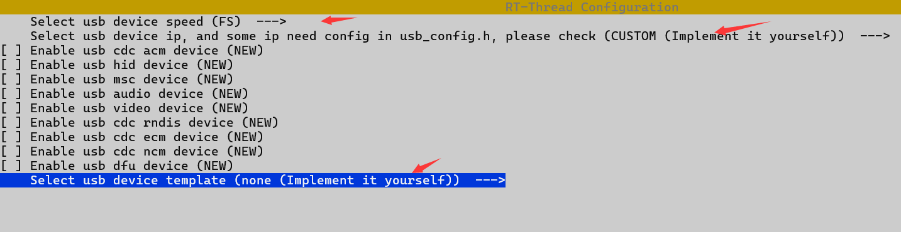

RT-Thread Software Package Development Guide
=============================================

.. note:: CherryUSB has been added to the RT-Thread mainline and you can choose to use the mainline version with the same configuration method.

This section mainly introduces using the software package manager provided by RT-Thread to configure projects, demonstrated with env. The operations in this section are the same for different chips and won't be repeated later. After opening env, use menuconfig to enter the package manager and select CherryUSB in the path shown in the figure.

.. figure:: img/env0.png

Device Configuration
--------------------------

* Select Enable USB device mode and press Enter to enter.
* The first configuration is to configure USB speed, divided into **FS, HS**, indicating whether to use full-speed or high-speed functionality. High-speed functionality requires built-in high-speed PHY or external PHY
* The second configuration is to select the USB device IP. If you are not sure which IP your chip uses, refer to the README in the corresponding `port` directory.
* Select the class you want to use
* Choose whether to use a demo template

* Finally exit and save.
* Copy `cherryusb_config_template.h` file to your project directory, rename it to `usb_config.h`, add the corresponding header file path, and modify the following content:

.. code-block:: C

        #include "rtthread.h"

        #define CONFIG_USB_PRINTF(...) rt_kprintf(__VA_ARGS__)

* USB IP related config needs to be modified by the user according to the actual chip situation
* Implement the `usb_dc_low_level_init` function in code
* Call `USBD_IRQHandler` in the USB interrupt function and pass in `busid`
* Call `usbd_initialize` and fill in `busid` and USB IP's `reg base`. `busid` starts from 0 and cannot exceed `CONFIG_USBDEV_MAX_BUS`
* Use `scons --target=mdk5` or `scons` to compile. If using mdk, you need to use the AC6 compiler
* If the chip has cache, refer to the :ref:`usb_cache` chapter for cache modifications

Host Configuration
--------------------------

* Select Enable usb host mode and press Enter
* Select USB host ip. If you're not sure which ip your chip uses, refer to the readme under the corresponding **port** directory
* Check class drivers as needed
* Choose whether to enable template demo, recommended not to use

.. figure:: img/env2.png

* Finally exit and save.
* Copy `cherryusb_config_template.h` file to your project directory, rename it to `usb_config.h`, add the corresponding header file path, and implement the following content:

.. code-block:: C

        #include "rtthread.h"

        #define CONFIG_USB_PRINTF(...) rt_kprintf(__VA_ARGS__)

* USB IP related config needs to be modified by the user according to the actual chip situation
* Implement the `usb_hc_low_level_init` function in code
* Call `USBH_IRQHandler` in the USB interrupt function and pass in `busid`
* Call `usbh_initialize` and fill in `busid` and USB IP's `reg base` and `event_handler` (can be omitted as NULL). `busid` starts from 0 and cannot exceed `CONFIG_USBHOST_MAX_BUS`
* Use `scons --target=mdk5` or `scons` to compile. If using mdk, you need to use the AC6 compiler
* For linker script modifications, refer to the :ref:`usbh_link_script` chapter
* If the chip has cache, refer to the :ref:`usb_cache` chapter for cache modifications
