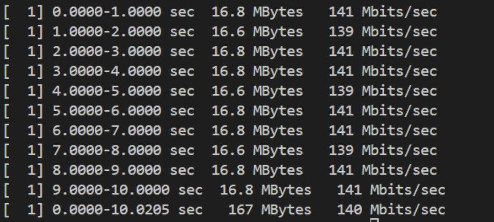
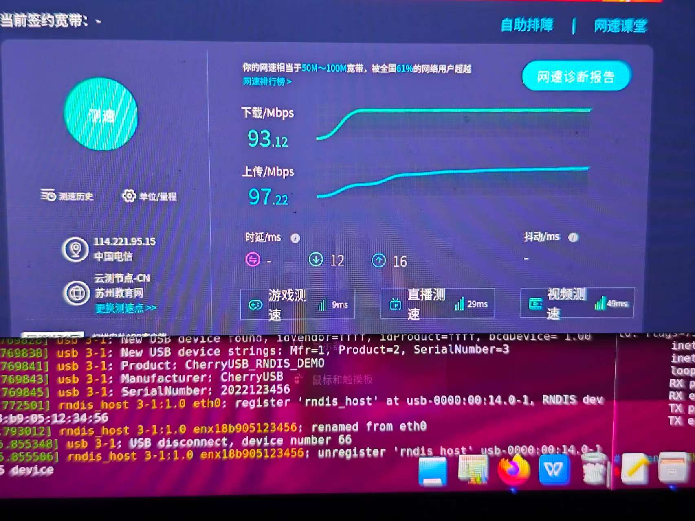
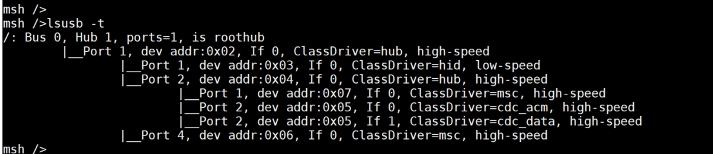
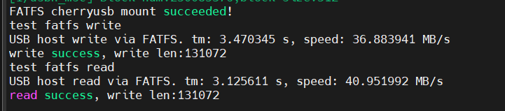
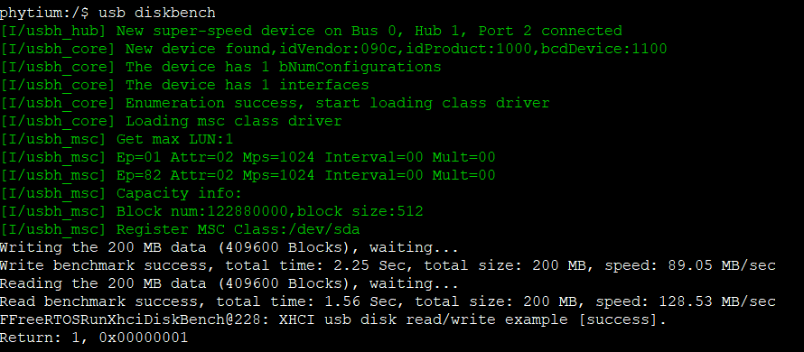
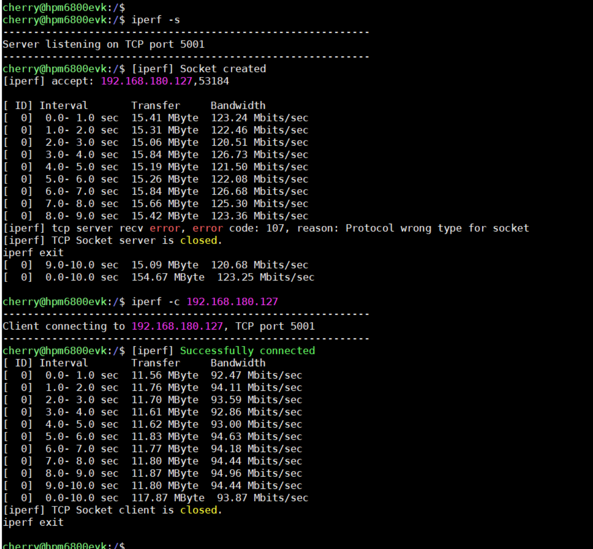
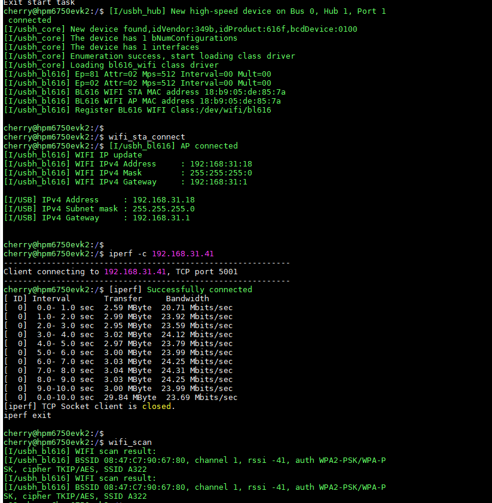

.. _performace_show:

Performance Showcase
============================================

The following demonstrates the performance of CherryUSB in different applications. Mainly demonstrates high-speed mode, as full-speed shows no significant performance difference.

CDC ACM Communication
-----------------------

Can achieve hardware limit performance. Of course, the hardware needs to theoretically support this speed, and CherryUSB supports it accordingly. Examples are as follows:

- HPM Series (Device can reach 42MB/S, Host 44MB/S, already reached hardware limit)
- BL Series (Device 32MB/S, Host 25MB/S, already reached hardware limit)
- STM32F4 Full-speed (Device 900KB/S, Host 1.12MB/S, already reached hardware limit)

Device speed test demo: cdc_acm_template.c with log disabled, script uses `tools/test_srcipts/test_cdc_speed.py`
Host speed test demo: usb_host.c with TEST_USBH_CDC_SPEED=1

USB Device MSC
-----------------

Demonstrates USB Device MSC using SDXC3.0 + EMMC testing.

.. figure:: img/usbdev_msc.png

USB Device RNDIS
-----------------------

.. note:: By default, RNDIS only supports single packets, so the speeds below are minimum speeds. Multi-packet support requires contacting the author.

Demonstrates USB Device RNDIS speed in LAN with lwip.

As client

.. figure:: img/usbdev_rndis_lwip.png

As server

Demonstrates USB Device RNDIS + WIFI passthrough testing.

.. figure:: img/usbdev_rndis_wifi.png
.. figure:: img/usbdev_rndis_wifi2.png

Demonstrates USB Device RNDIS + 100Mbps Ethernet passthrough testing.

.. figure:: img/usbdev_rndis_win.png

USB Device UVC
-----------------------

Demonstrates USB Device UVC + camera transmission of YUYV/MJPEG 640 * 480 images. 30 FPS.

.. figure:: img/usbdev_uvc_mjpeg.png
.. figure:: img/usbdev_uvc_yuv.png

USB Host HUB
-----------------------

Multi-level hub support, demonstrates 1-to-7 HUB.

.. figure:: img/usbhost_hub2.png

USB Host MSC
-----------------------

Demonstrates USB Host MSC speed under USB2.0 and USB3.0. Solid-state USB drives are recommended for testing.

USB Host UVC
-----------------------

Demonstrates USB Host UVC driving 648 * 480 YUV camera. 30 FPS.

.. figure:: img/usbhost_uvc.gif

USB Host ASIX Network Card
-------------------------------------------------

Demonstrates USB Host driving AX88772 USB Ethernet module.

.. figure:: img/usbhost_ax88772_1.png
.. figure:: img/usbhost_ax88772_2.png

USB Host RNDIS Network Card
-------------------------------------------------

Demonstrates USB Host driving mobile phone. Enable USB network sharing on the phone to use RNDIS.

USB Host WIFI
-----------------------

Demonstrates USB Host driving BL616 USB WIFI.

