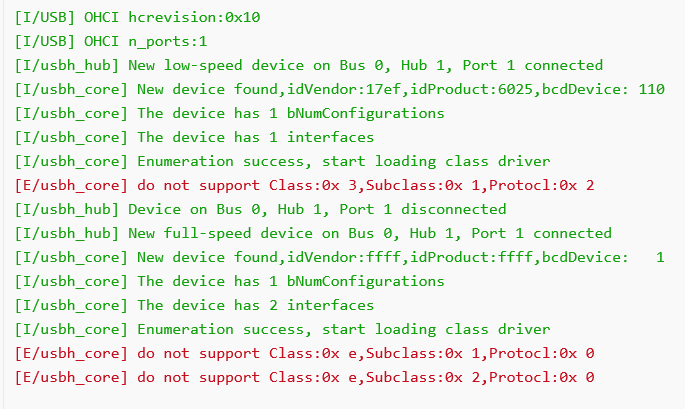
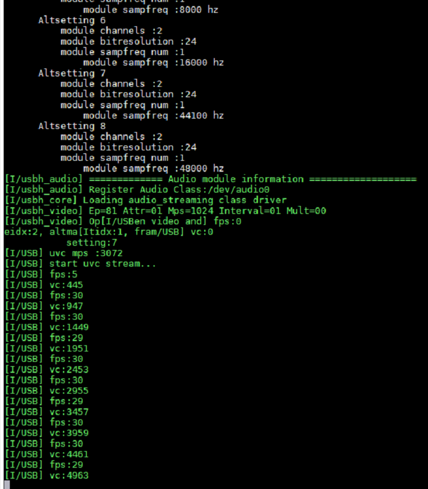
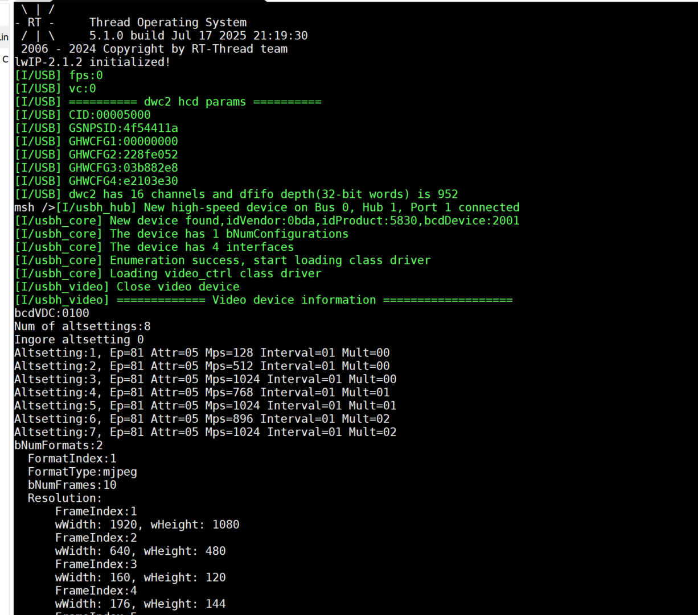
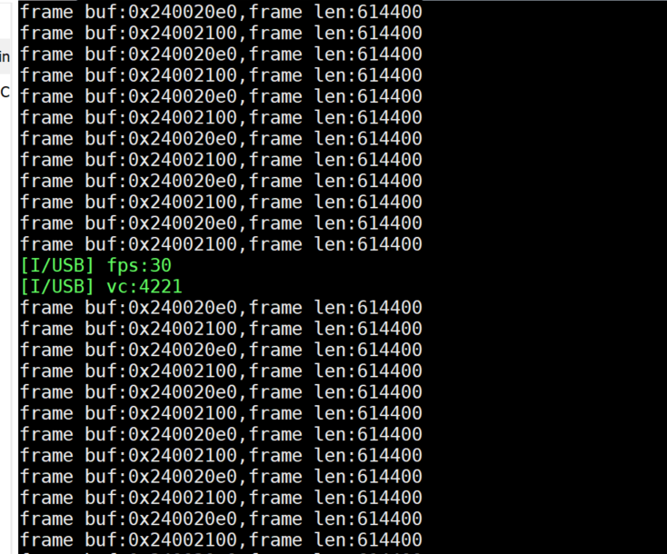
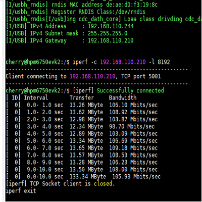

Commercial Support
============================================

The following content is commercially charged. For support, please email 1203593632@qq.com.

- OHCI Driver

- ISO driver and UAC/UVC framework in EHCI IP, used with host UVC & UAC classes (this part is open source). ISO supports 1/2/3 packets per microframe, supports MJPEG and YUV cameras

.. figure:: img/ehci_hostuvc1.png

Demonstrates USB Host UVC driver with 648 * 480 YUV camera. FPS 30.

.. figure:: img/usbhost_uvc.gif

- ISO driver and UAC/UVC framework in DWC2 IP, used with host UVC & UAC classes (this part is open source). ISO supports 1/2/3 packets per microframe, supports MJPEG and YUV cameras

.. figure:: img/dwc2_hostuvc2.png

.. figure:: img/dwc2_hostuac.png

- ISO driver and UAC/UVC framework in MUSB IP, used with host UVC & UAC classes (this part is open source). MUSB requires standard IP specified by Mentor Graphics company

- Device MTP class driver, supports multiple files and folders, supports MCU-side file addition/deletion and synchronization with PC

.. figure:: img/mtpdev.png

- Device TMC class driver

.. figure:: img/tmcdev1.png
.. figure:: img/tmcdev2.png

- USB network class high-performance version optimization, includes CDC-NCM, CDC-RNDIS, proprietary class drivers (supports multi-packet transmission and reception), RNDIS example shown below

.. figure:: img/rndisrx.png

- Customized class driver or IP driver adaptation
- Technical support services