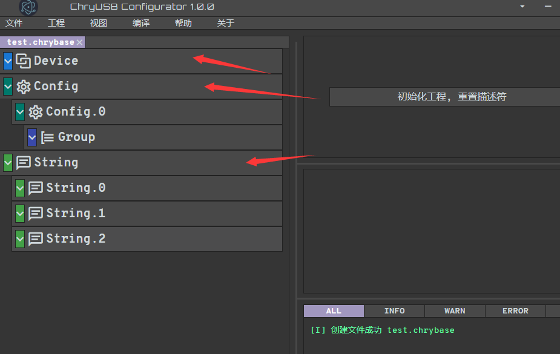
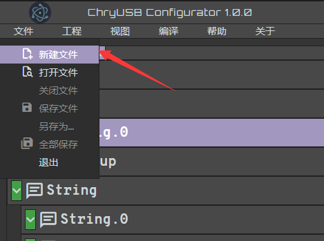

chryusb_configurator
--------------------------

`chryusb_configurator <https://github.com/CherryUSB/chryusb_configurator/releases/tag/1.0.0>`_ mainly serves to generate descriptor arrays when using the device protocol stack, which are then registered using `usbd_desc_register`.

- First, we download chryusb_configurator.exe from GitHub, then install it all the way through. Then double-click to open it, click `Project`, and click `New Project`

.. figure:: img/chrytool1.png

- After creation, default descriptor configuration will be generated, including **Device Descriptor**, **Configuration Descriptor**, **String Descriptor**, and **String Descriptor** supports three by default

- Then we can modify the information of related descriptors as needed, such as VID and PID in **Device Descriptor**, class parameters, **Power** in **Configuration Descriptor**, etc.

- Then for class addition, you need to click `File` and click `New File`

- Then the right side provides some class descriptor templates. Select one for initialization

.. figure:: img/chrytool4.png

- If there are multiple classes, repeat the above two steps

- Then we modify the parameters of related endpoints as needed, such as direction, address, size, interval

.. figure:: img/chrytool5.png

- Finally click `File` and save the file with extension `.chry`
- Switch to the project file with extension `.chrybase`, then click `Add Group Configuration` to import the just configured class file

.. figure:: img/chrytool6.png

- Click `Project` and click `Save Project`
- Click `Compile` to generate descriptor arrays

.. figure:: img/chrytool7.png

- Copy the compiled files to your own project for use

Lecroy USB Protocol Suite
--------------------------

Wireshark
--------------------------

Audacity
--------------------------
