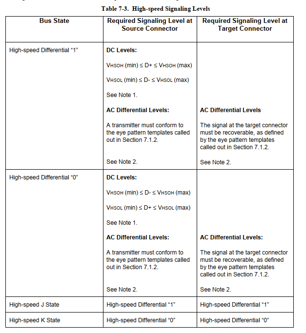
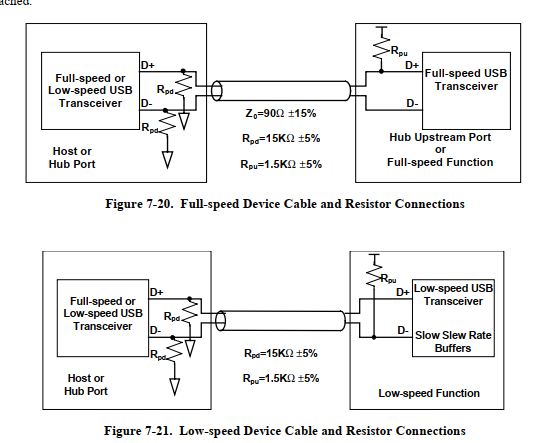
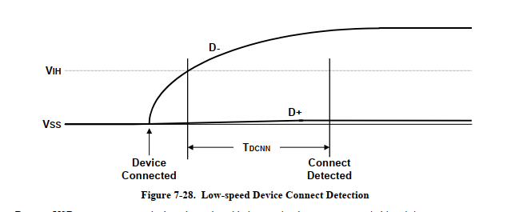
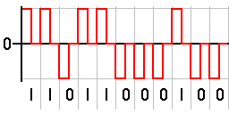
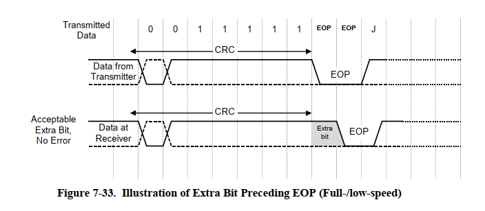
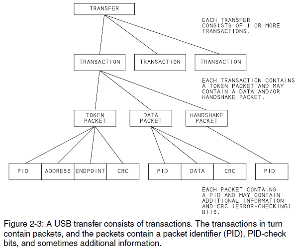
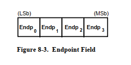
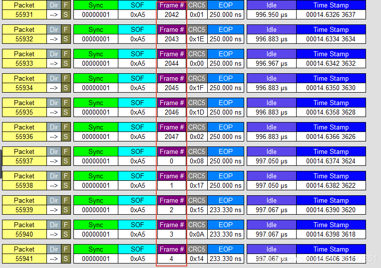
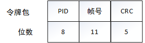

USB Basic Concepts (2.0 Focus)
=========================================

This document mainly explains Chapters 5, 7, 8, and 9 provided in the official USB manual `usb2.0.pdf <https://www.usb.org/document-library/usb-20-specification>`_.
If you are a beginner to USB, it's recommended not to read this section first, but to get the example demos running and become familiar with usage before reading.

Introduction
-----------------

What is USB? What is it used for? What are its advantages? You can search for these online, so I won't mention them. Let me first talk about USB interfaces and speed classifications according to different USB versions, as shown in the figure:

.. figure:: img/overview1.png

Next is the voltage level standard that USB needs to meet. With the voltage level standard, the signal states mentioned below can be classified. The voltage ranges and maximum currents supported by USB2.0 and USB3.0 are as follows:

.. figure:: img/overview2.png

USB Signal States
---------------------

First, we need to understand the Signaling Level in USB electrical characteristics, which refers to signal states. USB mainly relies on D+ and D- to achieve different signal states for communication. The official manual section 7.1.7 lists the requirements that D+ and D- need to meet for signal states corresponding to low-speed, full-speed, and high-speed operations.

.. figure:: img/1.png

.. figure:: img/3.png

- **Differential 0 and Differential 1**: These two states are used for general data communication through USB. When the D+ line is high and the D- line is low, this state is differential 1. When the D+ line is low and the D- line is high, this state is differential 0.
- **J State and K State**: In addition to differential signals, the USB specification also defines two other differential states: J state and K state. Their definitions are determined by device speed. On full-speed and high-speed devices, J state is differential 1 and K state is differential 0. On low-speed devices, this situation is reversed.
- **Single-Ended 0 (SE0)**: The state that occurs when both D+ and D- are at low level. This state indicates a reset, disconnection, or end of a data packet.
- **Single-Ended 1 (SE1)**: The state that occurs when both D+ and D- are at high level. This state is not intentionally generated and should not appear in USB design.
- **Idle**: A state that must occur before and after sending a data packet. If one data line is at low level and the other data line is at high level, it indicates an idle state. The definition of high and low levels is determined by the device speed. On full-speed devices, the idle state means D+ is high and D- is low. On low-speed devices, this situation is reversed.
- **Resume**: Used to wake up a device from suspended state. This operation is achieved by sending a K state.
- **Start of Packet (SOP)**: When the D+ and D- lines transition from idle state to K state, this will occur before starting a low-speed or full-speed data packet.
- **End of Packet (EOP)**: Occurs at the end of a low-speed or full-speed data packet. EOP occurs when the SE0 state lasts for two bit times (bit time will be introduced later) and the J state lasts for 1 bit time.
- **Reset**: Occurs when the SE0 state lasts for 10 ms. After SE0 lasts for at least 2.5 ms, the device will reset and begin entering the reset state.
- **Keep Alive**: A signal used in low-speed devices. Low-speed devices lack a start-of-frame packet (used to prevent suspended state). Every 1 ms, they use an EOP to prevent the device from entering suspended state.

.. note:: It should be noted that for low-speed devices, the J and K states and differential 0/1 are opposite to those of full-speed/high-speed devices.

Below, we use a waveform to distinguish these signal states:

.. figure:: img/4.png

- In the first red box, we can see the start of a data packet. Assuming this is a full-speed device, D+ is high and D- is low, which is an idle state.
- In the second red box, D+ is low and D- is high, indicating a K state. The transition from idle to K state indicates this is an SOP.
- Starting from the third red box represents data, showing JKJKJKJKJK.
- The fourth red box represents SE0, because both D+ and D- are at low level.
- In the fifth red box, after SE0 lasted for a period of time, it became D+ high and D- low, indicating it is a J state. The transition from SE0 to J state indicates this is an EOP.

USB Speed Detection
-------------------------

How is USB speed determined? This is described in manual section 7.1.5.1. USB speed detection mainly relies on 1.5K pull-up resistors on D+ and D- lines. If D+ has a 1.5k pull-up, the device is a full-speed device. If D- has a 1.5k pull-up, it is a low-speed device. High-speed devices initially appear as full-speed devices, with a 1.5k pull-up resistor on the D+ line just like full-speed devices. The USB2.0 hub treats it as a full-speed device. Subsequently, the hub and device confirm each other's identity through a series of handshake signals, ultimately determining the device as high-speed.

USB Connection and Disconnection Detection
---------------------------------------------

So when we plug our device into a USB host, how does the host know that a device has been inserted or removed? Manual section 7.1.7.3 provides the answer, as shown in the figure:

.. figure:: img/6.png

First is connection detection. The host detects that a data line level has been pulled high and maintained for a period of time, and considers that a device has been connected. When a low-speed device connects, the host will detect that the D- line is pulled high. When a full-speed/high-speed device connects, the host will detect that the D+ line is pulled high.
For disconnection detection, the pull-down resistors on the D+ and D- data lines on the host side take effect. After disconnection, both lines are at low level. When the low level persists for TDDIS time, it will be considered a disconnected state by the host. In the above figure, TDDIS is between 2 and 2.5us.

USB Power
---------------------

As USB power, USB devices can be divided into two device types: bus-powered and self-powered.

- Bus power is an advantage of USB design. Since devices are powered through the bus, they do not need to use bulky internal or external power supplies and can still maintain their own operation. The bus can be powered by the host or hub. When using a bus-powered device, users must consider its power consumption before configuring the device to a certain state.
- Self-powered devices power themselves by using external power sources (such as DC power adapters or batteries). Self-powered devices need to consider some precautions during the design process. The USB specification requires self-powered devices to continuously monitor their own VBUS line. During the time when VBUS is not present, the device must disconnect the power supplied to the pull-up resistors on the D+/D- lines, thereby preventing power supply to the host or hub. Otherwise, it will cause USB compliance testing to fail. However, self-powered hubs can obtain up to 100 mA of current from the bus.

USB Device States
---------------------

At the moment when a USB device is plugged into the host, the device state of the USB device itself will change. This device state, as we will learn later in the enumeration process, actually describes the enumeration process. This part is described in manual section 9.1.1.

.. figure:: img/9.png

- **Attached**: This state occurs when a device is plugged into the host/hub, but the host/hub is not supplying power to the VBUS line. It usually occurs when the hub detects an overcurrent event. Although the device is still connected, the host has removed the power supply to it.
- **Powered**: A device is connected to USB and receiving power, but has not yet received a reset request.
- **Default**: A device is connected to USB, receiving power, and has been reset by the host. At this time, the device has no device address and will respond to address 0.
- **Address**: A device is connected to USB, receiving power, has been reset, and has a unique address. However, the device is still not configured.
- **Configured**: The device is connected to USB, receiving power, has been reset, has a unique address, and is configured, but has not yet entered suspended state. At this time, bus-powered devices can consume more than 100 mA of current.
- **Suspended**: As described above, the device has established connection and is configured, but will not perform any bus operations within 3 ms.

The diagram translated into English is:

.. figure:: img/10.png

USB Encoding and Bit Stuffing
-----------------------------------

First, USB data is transmitted serially, just like UART, I2C, SPI, etc. Continuous 01 signals are sent to the receiver through only one data line. However, because the sender and receiver operate at different frequencies, signal synchronization becomes an issue. For example, when the receiver receives a low level that lasts for a period of time, it cannot determine whether this represents 5 zeros or 1000 zeros. One solution is to add a clock signal while transmitting the data signal to synchronize transmission at both ends. The receiver samples the data signal with the assistance of the clock signal to correctly parse the transmitted data. I2C does this, with SDA transmitting data and SCL transmitting the synchronization clock:

.. figure:: img/11.png

Although this solves the problem, it requires an additional clock signal line to transmit the clock. Since USB has no clock signal, is there a way to maintain synchronization at both ends without needing an additional clock signal?
Yes, this is RZ encoding (Return-to-zero Code), also called return-to-zero encoding.

RZ Encoding (Return-to-zero Code)
^^^^^^^^^^^^^^^^^^^^^^^^^^^^^^^^^^^^^

RZ encoding (Return-to-zero Code) is also called return-to-zero encoding. In RZ encoding, positive level represents logic 1, negative level represents logic 0, and after each bit of data is transmitted, the signal returns to zero level. That is, three voltage levels appear on the signal line: positive level, negative level, and zero level.

As can be seen from the diagram, because each bit is reset to zero after transmission, the receiver only needs to sample after the signal is reset to zero, thus eliminating the need for a separate clock signal. In fact, RZ encoding is equivalent to encoding the clock signal into the data using a reset-to-zero method. Such a signal is also called a self-clocking signal.
While this saves on clock and data lines, it still has drawbacks because in RZ encoding, most of the data bandwidth is wasted on transmitting "return to zero".
NRZ Encoding (Non-return-to-zero Code)
^^^^^^^^^^^^^^^^^^^^^^^^^^^^^^^^^^^^^^^^^^^^
Removing this return-to-zero step, NRZ encoding (Non-return-to-zero Code) emerged. The difference from RZ is that NRZ does not require return to zero.

.. figure:: img/13.png

NRZI Encoding (Non-Return-to-Zero Inverted Code)
^^^^^^^^^^^^^^^^^^^^^^^^^^^^^^^^^^^^^^^^^^^^^^^^^^^^^^^
The difference between NRZI encoding (Non-Return-to-Zero Inverted Code) and NRZ is that NRZI uses signal transitions to represent one logic and signal maintenance to represent another logic. This is described in manual section 7.1.8.

.. figure:: img/14.png

As shown in the figure, we can derive a simple memory method: when encountering a 0 edge, the level flips; when encountering a 1 edge, it remains unchanged.

Bit Stuffing
^^^^^^^^^^^^^^^^^^^^^^^^^^^^^^^^^^^^^^^^^^^^^^^^^^^^^^^
However, there is still a problem. Although the receiver can actively match the sender's frequency, there will always be errors between them. If the data signal consists of 1000 logic 1s, after USB NRZI encoding, it becomes a very long period without level changes. In this situation, even if the receiver's frequency differs from the sender by one thousandth, it will cause the data to be sampled as 1001 or 999 ones.
USB's solution to this problem is forced bit insertion, also known as bit stuffing. If the data to be transmitted contains 6 consecutive 1s, a 0 is forcibly inserted after the 6th 1 before transmission, forcing the transmitted signal to transition and thereby forcing the receiver to adjust frequency.
The receiver only needs to delete the 0 after 6 consecutive 1s to restore the original data. This is described in manual section 7.1.9.

.. figure:: img/15.png

.. figure:: img/17.png

Before data is NRZI encoded, a zero is inserted after every six consecutive ones in the data stream to force transitions in the NRZI data stream, which gives the receiver logic at least one data transition every seven bits to ensure data and clock lock. Bit stuffing is enabled starting from sync pattern. The data "one" that ends the sync pattern is counted as the first "one" in the sequence. Transmitter bit stuffing is always enforced except during high-speed EOP. If required by bit stuffing rules, a zero bit will be inserted even if it is the last bit before the end of packet (EOP) signal. The receiver must decode NRZI data, identify stuffed bits, and discard them.

.. caution:: The following content can be summarized in one diagram. Understanding it is sufficient; there is no need to memorize it.

USB Fields
---------------------

USB fields constitute the most basic and smallest unit in USB communication. Later packets and transactions are fundamentally composed of fields, while fields are composed of bits. The fields section is described in manual section 8.1.

.. note:: USB's bit transmission mode follows the LSB-first principle.

Sync Field
^^^^^^^^^^^^^^^^^^^^^^^^

In USB systems, the host and device do not share a clock, which makes it impossible for the receiver to accurately know when the sender is sending data. Although SOP can be detected, this is far from sufficient. Therefore, a sync field is needed to keep the receiver and sender synchronized during the transmission process, so every packet must start with a sync field. The sync field is 0x01, which after encoding becomes 10101000B.

.. figure:: img/18.png

Packet Identifier Field
^^^^^^^^^^^^^^^^^^^^^^^^

PID consists of a four-bit packet type field and a four-bit check field, occupying 8 bits, as shown in the figure. PID indicates the packet type and, by inference, the packet format and the type of error detection applied to the packet. The four-bit check field of PID is generated by performing a one's complement of the packet type field, ensuring reliable decoding of PID so that the rest of the packet can be correctly interpreted. If the four PID check bits are not the complement of their respective packet identifier bits, a PID error exists.

.. figure:: img/19.png

Since there are 4 bits, this means PID types can be divided into 16 types. These 16 types are further subdivided into 4 categories: Token PID, Data PID, Handshake PID, and Special PID.

.. figure:: img/20.png

Address Field
^^^^^^^^^^^^^^^^^^^^^^^^

The address field is divided into device address field and endpoint address field. The device address field occupies 7 bits. Excluding address 0, the host can allocate 127 addresses.

.. figure:: img/21.png

The endpoint address field occupies 4 bits, providing a total of 16 endpoints.

Frame Number Field
^^^^^^^^^^^^^^^^^^^^^^^^

The frame number field occupies 11 bits. Each time the host sends a frame, the frame number increases by 1, as shown in the figure. In high-speed devices, frames contain microframes. 1 frame = 8 microframes, and microframes increment by 0.1. The concepts of frames and microframes will be supplemented later.

Data Field
^^^^^^^^^^^^^^^^^^^^^^^^

Depending on the transmission type, the data length in the data field varies from 0-1024 bytes.

.. figure:: img/24.png

CRC Field
^^^^^^^^^^^^^^^^^^^^^^^^

Cyclic Redundancy Check (CRC) is used to protect all non-PID fields in token and data packets. PID is not included in the CRC check of packets containing CRC. All CRCs are generated on individual fields in the transmitter before bit stuffing is performed. Similarly, CRC is decoded in the receiver after stuffed bits are removed. Token and data packet CRCs provide 100% coverage for all single-bit and double-bit errors. CRC failure is considered to indicate that one or more protected fields have been corrupted and causes the receiver to ignore those fields and, in most cases, ignore the entire packet.

.. figure:: img/24.png

- Token CRC

A five-bit CRC field is provided for tokens and covers the ADDR and ENDP fields of IN, SETUP, and OUT tokens or the timestamp field of SOF tokens. PING and SPLIT special tokens also include a five-bit CRC field.

The generator polynomial is: G(X) = X^5 + X^2 + 1
The binary bit pattern representing this polynomial is 00101B. If all token bits are received without error, the five-bit checksum at the receiver will be 01100B.

- Data CRC

Data CRC is a 16-bit polynomial applied to the data field of data packets.

The generator polynomial is: G(X) = X^16 + X^15 + X^2 + 1
The binary bit pattern representing this polynomial is 1000000000000101B. If all data and CRC bits are received without error, the 16-bit checksum will be 1000000000001101B.

USB Packets
---------------------

Packets are composed of fields. According to PID type, packets are divided into four major categories: Token packets, Data packets, Handshake packets, and Special packets. This section is described in official section 8.4.1.

.. figure:: img/25.png

Including SOP, as shown in the figure, forms a complete packet.

Token Packets
^^^^^^^^^^^^^^^^^^^^^^^^

Token packets are divided into: SETUP, IN, OUT, SOF. Among them, SETUP, IN, and OUT have the same field composition, as shown:

.. figure:: img/27.png

- PID field: Defines the data transfer direction from USB host to USB device.
- ADDR field: Specifies the USB device address.
- ENDP field: Specifies the endpoint number for receiving data.
- CRC field: Performs cyclic redundancy check for ADDR and ENDP fields.

SOF packet field composition, as shown:

- PID field: Defines the data transfer direction from USB host to USB device.
- Frame Number field: Specifies the frame number of USB transmission, which is 11 bits.
- CRC field: Performs cyclic redundancy check for ADDR and ENDP fields.

Data Packets
^^^^^^^^^^^^^^^^^^^^^^^^

.. figure:: img/29.png

- PID field: Used to specify different data packet types. Supports 4 types of data packets: DATA0, DATA1, DATA2, and MDATA.
- Data field: Contains the transmitted data. The data size depends on the data transfer type and user requirements. According to USB protocol specifications, for low-speed USB data transmission, the maximum length is 8 bytes; for full-speed USB data transmission, the maximum length is 1023 bytes; for high-speed USB data transmission, the maximum data length is 1024 bytes.
- CRC field: Uses 16-bit cyclic redundancy check to protect the data field.

Handshake Packets
^^^^^^^^^^^^^^^^^^^^^^^^

Handshake packets consist of an 8-bit PID and are used at the end of data transmission to report the status of this data transmission. The handshake packet is followed by the EOP signal that marks the end of the entire transaction.

.. figure:: img/30.png

Special Packets
^^^^^^^^^^^^^^^^^^^^^^^^

USB Transactions
---------------------

There are three commonly used USB transactions: SETUP, IN, OUT. Except for control transfers which use three transactions, other transfers use two transactions. Special transactions are transactions that do not carry data.

SETUP Transaction
^^^^^^^^^^^^^^^^^^^^^^^^

IN Transaction
^^^^^^^^^^^^^^^^^^^^^^^^

OUT Transaction
^^^^^^^^^^^^^^^^^^^^^^^^

Special Transaction
^^^^^^^^^^^^^^^^^^^^^^^^

USB Transfers
---------------------

Control Transfer
^^^^^^^^^^^^^^^^^^^^^^^^

Bulk Transfer
^^^^^^^^^^^^^^^^^^^^^^^^

Interrupt Transfer
^^^^^^^^^^^^^^^^^^^^^^^^

Isochronous Transfer
^^^^^^^^^^^^^^^^^^^^^^^^
