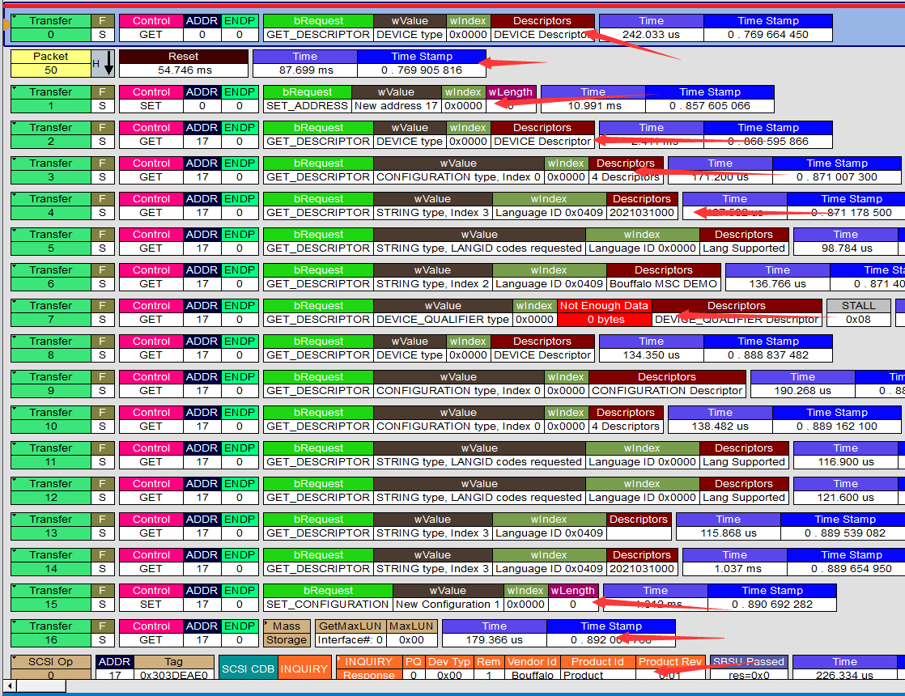

USB Enumeration
=========================================

After understanding USB device requests, we can learn about the entire enumeration process of USB devices and see how devices like serial ports, mice, and USB drives are enumerated. During enumeration, the host will send device requests to obtain relevant information (i.e., descriptors). For specific requests sent, refer to the diagram below.

- First, connect the device to the USB cable, then plug it into the computer
- After the device is plugged in, it powers up and enters a powered state
- The host detects device insertion through D+/D-
- Reset the device
- Host sends **Get Device Descriptor Request**
- Optional reset operation
- Host sends **Set Device Address Request**
- Host sends **Get Configuration Descriptor Request**, may be obtained multiple times, which doesn't matter
- Host sends **Get String Descriptor Request**, normally obtains 3 strings, and continues to obtain specified strings if they are specified in subsequent descriptors
- Host sends **Get Device Qualifier Descriptor Request**, used to obtain requests when the device operates at other speeds. If the device can only work in full-speed mode, it must reply with stall, and the protocol stack will definitely print this request to inform you that the device does not support this command.
- Host sends **Set Configuration Request**, configures device endpoints, usually based on the configuration in endpoint descriptors.
- Standard device requests end here
- Host loads corresponding supported class drivers based on interface descriptors. If the host doesn't support them, it will prompt that no driver is found for the device
- After loading is complete, begins executing related requests for that class
- Finally performs class data flow transmission