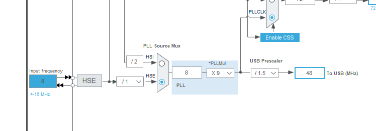

# USB Stack 在 RT-Thread package 中的使用

[English Version](rt-thread.md)

使用 USB Stack package 需要在 RT-Thread 的包管理器中选择它，具体路径如下：

```
-> RT-Thread online packages
    -> system packages
        ---  USB Stack: tiny and portable USB stack for embedded system with USB IP

            USB STACK Options  ---->
                    [ ] Enable usb high speed mode
                    [*] Enable usb device mode
                    [*]   Enable usb cdc acm device
                    [ ]   Enable usb hid device
                    [ ]   Enable usb dfu device
                    [ ]   Enable usb msc device
                    [ ]   Enable usb hub device
                    [ ]   Enable usb audio device
                    [ ]   Enable usb video device

            Version (latest)  --->
```

## 使用 USB Stack

### 在 STM32 平台

STM32 系列单片机有两种 USB IP,分别是 USB IP 和 USB OTG IP。其中 USB IP，例如 STM32F0、STM32F1、STM32F3等等，USB OTG IP(我们都知道用的是 **synopsys** 公司的)的有 STM32F4、STM32F7、STM32H7等等。当前如果你需要使用 USB Device 功能，porting 接口提供了两种，一种是不带 hal 层的 **usb_dc_nohal.c**，一种是带 hal 层的 **usb_dc_hal.c**,如果你使用的是 USB IP系列，推荐用前者，否则用后者，需要注意的是后者在后面会删除，不使用 hal 版本。

#### 使用 USB Device 功能

- 首先，你需要有一个 bsp 工程，之后进入到 `board\CubeMX_Config` 目录下，使用 **STM32CubeMX** 打开后缀名为 `.ioc` 的文件。
- 进入 **Connectivity** 选项，选择 **USB** 或者 **USB_OTG_FS** 或者 **USB_OTG_HS**，并使能 device 功能，在 **NVIC Setting** 中开启 USB 中断。


- 在 **Clock configuration** 栏配置 USB 时钟为 48Mhz.



- 点击 **Generate code**。
- 复制 **SystemClock_Config** 函数内容到 **board.c** 中。
- 如果你使用的是 hal 版本，需要复制 **MX_USB_OTG_FS_PCD_Init** 或者 **MX_USB_OTG_HS_PCD_Init** 到你的应用程序中，比如 **main.c**，并且还需要从 **it.c** 中复制中断函数。
- 实现 **printf** 函数或者将 **usb_utils.h** 中的 **printf** 改成 **rt_kprintf**，并添加 `#include <rtthread.h>`
- 现在我们可以调用 USB Stack 中的函数来注册描述符、接口、端点中断，并调用 `usb_dc_init`，示例如下：

```
int main(void)
{
    extern void cdc_init(void);
    cdc_init();
    extern void usb_dc_init(void);
    usb_dc_init();
    while (1)
    {
        rt_thread_mdelay(500);
    }
}
```

- 关于如何注册 class 类可以参考 [stm32 class examples](https://github.com/sakumisu/usb_stack/tree/master/demo/stm32/stm32f103c8t6/example)。

#### CDC demo 演示


#### 视频教程

如果对上述步骤还有问题，可以参考 [协议栈在 RT-Thread 包管理器中的使用](https://www.bilibili.com/video/BV1Ef4y1t73d?p=26)。