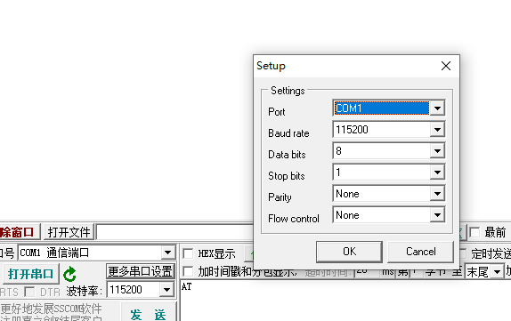

USB 转串口
=========================

USB转串口即实现计算机USB接口到通用串口之间的转换。为没有串口的计算机提供快速的通道，而且，使用USB转串口设备等于将传统的串口设备变成了即插即用的USB设备。市面上的比如 CH340、FT232、PL2302 等等。
所以如果需要实现该功能，那么我们使用的芯片需要具备以下两个条件：

- 有 UART 外设
- 有 USB DEVICE 外设

接下来，我们就可以愉快的进行代码的编写了。USB 转串口我们采用的是 CDC ACM 类。第一步我们先让 USB 能正常收发。

- 首先是实现 `usbd_cdc_acm_set_line_coding` 函数，这个函数的作用就是当我们点击电脑上的串口软件设置串口相关信息时（如下图所示），主机会通过 USB 发送设置串口的命令给设备，对设备上的串口进行配置，所以这边我们需要根据形参来配置串口。

- 其次实现 `usbd_cdc_acm_set_rts`，主要用来设置串口硬件流控。这里需要注意， windows 上任何软件是无法设置 RTS 的，可以说是 windows 驱动问题
- 调用 `usbd_desc_register` 注册 cdc acm 描述符，包含设备描述符、配置描述符、cdc acm 特定描述符、接口描述符、端点描述符、字符串描述符等等

.. code-block:: C

    static const uint8_t cdc_descriptor[] = {
        USB_DEVICE_DESCRIPTOR_INIT(USB_2_0, 0xEF, 0x02, 0x01, USBD_VID, USBD_PID, 0x0100, 0x01),
        USB_CONFIG_DESCRIPTOR_INIT(USB_CONFIG_SIZE, 0x02, 0x01, USB_CONFIG_BUS_POWERED, USBD_MAX_POWER),
        CDC_ACM_DESCRIPTOR_INIT(0x00, CDC_INT_EP, CDC_OUT_EP, CDC_IN_EP, 0x02),
        ///////////////////////////////////////
        /// string0 descriptor
        ///////////////////////////////////////
        USB_LANGID_INIT(USBD_LANGID_STRING),
        ///////////////////////////////////////
        /// string1 descriptor
        ///////////////////////////////////////
        0x14,                       /* bLength */
        USB_DESCRIPTOR_TYPE_STRING, /* bDescriptorType */
        'C', 0x00,                  /* wcChar0 */
        'h', 0x00,                  /* wcChar1 */
        'e', 0x00,                  /* wcChar2 */
        'r', 0x00,                  /* wcChar3 */
        'r', 0x00,                  /* wcChar4 */
        'y', 0x00,                  /* wcChar5 */
        'U', 0x00,                  /* wcChar6 */
        'S', 0x00,                  /* wcChar7 */
        'B', 0x00,                  /* wcChar8 */
        ///////////////////////////////////////
        /// string2 descriptor
        ///////////////////////////////////////
        0x26,                       /* bLength */
        USB_DESCRIPTOR_TYPE_STRING, /* bDescriptorType */
        'C', 0x00,                  /* wcChar0 */
        'h', 0x00,                  /* wcChar1 */
        'e', 0x00,                  /* wcChar2 */
        'r', 0x00,                  /* wcChar3 */
        'r', 0x00,                  /* wcChar4 */
        'y', 0x00,                  /* wcChar5 */
        'U', 0x00,                  /* wcChar6 */
        'S', 0x00,                  /* wcChar7 */
        'B', 0x00,                  /* wcChar8 */
        ' ', 0x00,                  /* wcChar9 */
        'C', 0x00,                  /* wcChar10 */
        'D', 0x00,                  /* wcChar11 */
        'C', 0x00,                  /* wcChar12 */
        ' ', 0x00,                  /* wcChar13 */
        'D', 0x00,                  /* wcChar14 */
        'E', 0x00,                  /* wcChar15 */
        'M', 0x00,                  /* wcChar16 */
        'O', 0x00,                  /* wcChar17 */
        ///////////////////////////////////////
        /// string3 descriptor
        ///////////////////////////////////////
        0x16,                       /* bLength */
        USB_DESCRIPTOR_TYPE_STRING, /* bDescriptorType */
        '2', 0x00,                  /* wcChar0 */
        '0', 0x00,                  /* wcChar1 */
        '2', 0x00,                  /* wcChar2 */
        '2', 0x00,                  /* wcChar3 */
        '1', 0x00,                  /* wcChar4 */
        '2', 0x00,                  /* wcChar5 */
        '3', 0x00,                  /* wcChar6 */
        '4', 0x00,                  /* wcChar7 */
        '5', 0x00,                  /* wcChar8 */
        '6', 0x00,                  /* wcChar9 */
    #ifdef CONFIG_USB_HS
        ///////////////////////////////////////
        /// device qualifier descriptor
        ///////////////////////////////////////
        0x0a,
        USB_DESCRIPTOR_TYPE_DEVICE_QUALIFIER,
        0x00,
        0x02,
        0x02,
        0x02,
        0x01,
        0x40,
        0x01,
        0x00,
    #endif
        0x00
    };

.. caution:: 注意数组最后的结束符，不要遗漏

- cdc acm 一共需要两个接口，一个控制接口，一个数据接口，由于我们只有一个 cdc acm，所以只需要注册一个 class + 两个接口。其中控制接口需要一个中断端点，数据接口需要两个 bulk 端点，由于接口驱动我们已经支持，所以调用 cdc acm 相关的添加接口的 API 即可。代码如下：

.. code-block:: C

    /*!< class */
    usbd_class_t cdc_class;
    /*!< interface one */
    usbd_interface_t cdc_cmd_intf;
    /*!< interface two */
    usbd_interface_t cdc_data_intf;

    /*!< endpoint call back */
    usbd_endpoint_t cdc_out_ep = {
        .ep_addr = CDC_OUT_EP,
        .ep_cb = usbd_cdc_acm_out
    };

    usbd_endpoint_t cdc_in_ep = {
        .ep_addr = CDC_IN_EP,
        .ep_cb = usbd_cdc_acm_in
    };

    usbd_desc_register(cdc_descriptor);
    /*!< add interface */
    usbd_cdc_add_acm_interface(&cdc_class, &cdc_cmd_intf);
    usbd_cdc_add_acm_interface(&cdc_class, &cdc_data_intf);
    /*!< interface add endpoint */
    usbd_interface_add_endpoint(&cdc_data_intf, &cdc_out_ep);
    usbd_interface_add_endpoint(&cdc_data_intf, &cdc_in_ep);

    usbd_initialize();

- 最后调用 `usbd_initialize` 初始化 usb。

.. code-block:: C

    /* function ------------------------------------------------------------------*/
    void usbd_cdc_acm_out(uint8_t ep)
    {
        uint8_t data[64];
        uint32_t read_byte;

        usbd_ep_read(ep, data, 64, &read_byte);
        for (uint8_t i = 0; i < read_byte; i++) {
            printf("%02x ", data[i]);
        }
        printf("\r\n");
        printf("read len:%d\r\n", read_byte);
        usbd_ep_read(ep, NULL, 0, NULL);
    }

    void usbd_cdc_acm_in(uint8_t ep)
    {
        printf("in\r\n");
    }

    volatile uint8_t dtr_enable = 0;

    void usbd_cdc_acm_set_dtr(bool dtr)
    {
        if (dtr) {
            dtr_enable = 1;
        } else {
            dtr_enable = 0;
        }
    }

    void cdc_acm_data_send_with_dtr_test(void)
    {
        if (dtr_enable) {
            uint8_t data_buffer[10] = { 0x31, 0x32, 0x33, 0x34, 0x35, 0x31, 0x32, 0x33, 0x34, 0x35 };
            usbd_ep_write(CDC_IN_EP, data_buffer, 10, NULL);
        }
    }

-  out 中断中我们将接收的数据进行打印，in 中断则是当 `usbd_ep_write` 发送完成后，进行打印
- 实现 `usbd_cdc_acm_set_dtr` 进行流控

.. caution:: 注意端点接收中断中，接收 buf 的大小根据全速和高速来定，并且尽量不要在中断中开辟这么大的 buf

- 此时，插上电脑可以枚举出一个 USB 设备，名称为 **USB 串行设备（COMx）**，然后我们可以打开枚举的串口，发一些数据，然后看调试口是否有数据，有的话，证明 USB 方面是通的，那上面测试的一些代码就可以删删了。

上面完成后，第二步，则是跟 UART 配合使用了，那怎么完成最终的 USB 转串口呢？首先我们需要梳理一下，整个的数据传输。

- 首先是 USB 发数据给设备，设备接收到数据以后，通过 UART TX 发送出去
- 其次是 UART RX 接收的数据，通过 USB 发送给主机

所以关于 UART RX 我们可以使用中断接收，来接收数据，但是呢，UART RX 的数据如果太多，会丢，所以我们需要准备一个 Ringbuffer 组件，将 UART RX 接收的数据存到 Ringbuffer，同理， USB OUT 接收的数据也放到 Ringbuffer，所以我们需要准备两块 Ringbuffer。关于 Ringbuffer 原理和代码，大家自行百度。
然后接下来的代码就非常简单啦，根据上面梳理的结果，代码呈现的结果就如下：

- 初始化 Ringbuffer A 和 Ringbuffer B
- USB out 中断中读取数据并存入 Ringbuffer A 中
- while（1） 中从 Ringbuffer A 中读取数据，并使用 UART 发送函数发出去
- UART RX 中断中接收数据，并存入 Ringbuffer B 中，while（1）中从 Ringbuffer B 中读取数据，并使用 USB 发送函数发出去

代码参考 ：https://github.com/bouffalolab/bl_mcu_sdk/tree/master/examples/usb/usb2uart