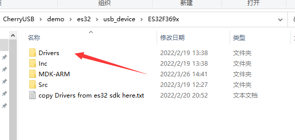
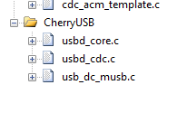

基于 ES32F369 开发指南
=========================

ES32F3xx 系列单片机中 USB 外设使用标准的 musb ip，并且拥有 usb device 和 usb host 功能。本章主要介绍如何在东软载波的 ES32F369x 开发板中使用 CherryUSB。

首先需要从 essemi 官网下载 `keil 芯片支持包 <http://www.essemi.com/index/product/detail?id=796>`_ 并安装，下载 `ES32 SDK <http://www.essemi.com/index/product/detail?id=755>`_ ，并进入 ES32 SDK 中，复制 `Drivers` 到 如图所示目录下：

进入 MDK-ARM 目录下，双击 `example.uvprojx` 打开工程，选择好调试器后，编译烧录即可。
如果是从机，默认提供的是 cdc acm 的示例，代码烧录以后，将 usb 线插到 板子的丝印为 USB-OTG 口，并接上电脑，按下复位键，电脑便会枚举出一个串口。打开串口，勾选 DTR 可以接收数据，在发送缓冲区填入数据并发送，调试器的串口便可以打印出接收的长度和数据。
如果是主机，则需要一个 usb 母口转接线，并接入相关 usb 设备，就可以进行测试了。比如接上 鼠标、U盘、4G 网卡等等。

USB Device 移植要点
-----------------------

针对自定义的工程移植，需要以下步骤：

- 准备好可以进行调试打印的工程，并且实现 `printf`。
- 拷贝 CherryUSB 源码到工程里
- 添加 CherryUSB 源码和头文件路径，其中 `usbd_core.c` 和 `usb_dc_musb.c` 为必须添加项。

.. figure:: img/3.png

- 实现 `usb_dc_low_level_init` 函数，该函数主要负责 USB 时钟、引脚、中断的初始化。例如

.. code-block:: C

    void usb_dc_low_level_init(void)
    {
        ald_pmu_perh_power_config(PMU_POWER_USB, ENABLE);
        ald_cmu_perh_clock_config(CMU_PERH_USB, ENABLE);
        ald_cmu_perh_clock_config(CMU_PERH_GPIO, ENABLE);
        ald_cmu_usb_clock_config(CMU_USB_CLOCK_SEL_HOSC, CMU_USB_DIV_1);
        ald_rmu_reset_periperal(RMU_PERH_USB);
        ald_mcu_irq_config(USB_INT_IRQn, 2, 2, ENABLE);
        ald_mcu_irq_config(USB_DMA_IRQn, 2, 2, ENABLE);
        usb_pin_init();
    }

- 描述符的注册、class的注册、接口的注册、端点中断的注册。不会的参考 demo 下的 template 。
- 调用 `usbd_initialize` 初始化 usb 硬件。
- 正常使用。

USB Host 移植要点
-----------------------

针对自定义的工程移植，需要以下步骤：

- 准备好可以进行调试打印的带 FreeRTOS 或者 RT-Thread 的工程，并且实现 `printf`、 `malloc` 、 `free` 函数（也可以直接勾选 Use microlib 来使用）。
- 拷贝 CherryUSB 源码到工程里
- 添加 CherryUSB 源码和头文件路径，其中 `usbh_core.c` 和 `usb_hc_musb.c` 、 osal 下的文件为必须添加项。

.. figure:: img/4.png
.. figure:: img/5.png

- 由于是作为主机，推荐添加所有的 class，功能全面。当然如果只用一个 class ，就添加一个。
- 实现 `usb_hc_low_level_init` 函数，该函数主要负责 USB 时钟、引脚、中断的初始化。例如

.. code-block:: C

    void usb_hc_low_level_init(void)
    {
        ald_pmu_perh_power_config(PMU_POWER_USB, ENABLE);
        ald_cmu_perh_clock_config(CMU_PERH_USB, ENABLE);
        ald_cmu_perh_clock_config(CMU_PERH_GPIO, ENABLE);
        ald_cmu_usb_clock_config(CMU_USB_CLOCK_SEL_HOSC, CMU_USB_DIV_1);
        ald_rmu_reset_periperal(RMU_PERH_USB);
        ald_mcu_irq_config(USB_INT_IRQn, 2, 2, ENABLE);
        ald_mcu_irq_config(USB_DMA_IRQn, 2, 2, ENABLE);
        usb_pin_init();
    }

- 调用 `usbh_initialize` 初始化 usb 硬件。
- 此时编译会报错，因为协议栈中为每个 class 都添加了测试 demo，文件在 `usb_host.c` 中，如果不想要，可以直接删除。
- 正常使用。