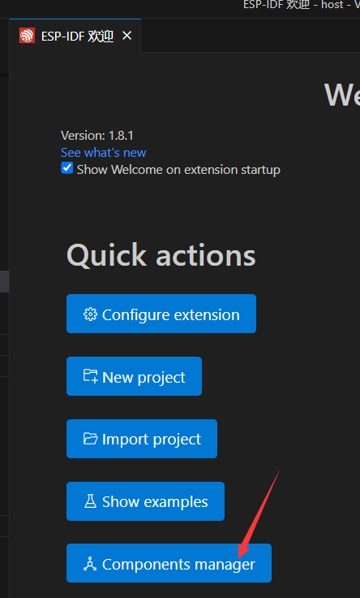
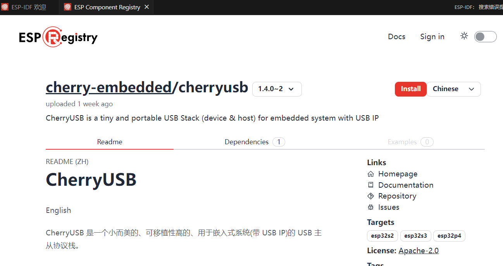
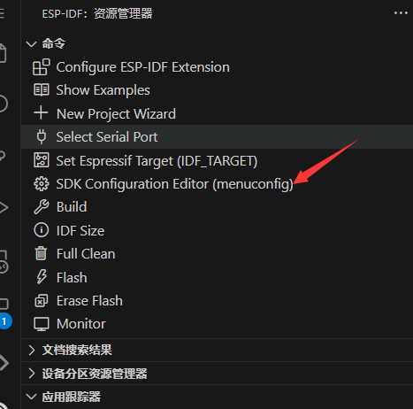
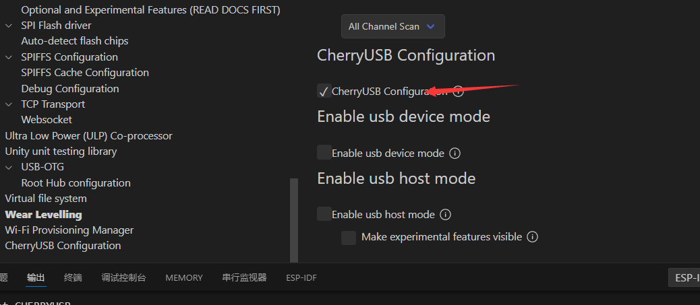

基于 ESP-Registry 开发指南
===========================

ESP-Registry 可以参考官方文档，推荐使用 vscode + esp-idf 的开发环境。

- ctrl + shift + p 选择 ESP-IDF 欢迎界面，然后选择 Component mananger

- 找到 cherryusb 并安装

- 打开 menuconfig，并打开 cherryusb 的配置，根据实际情况选择主机或者从机模式

