基于现有 demo 快速验证
=========================

在学习 USB 或者是学习 CherryUSB 代码之前，我们需要先基于现有的 demo 进行快速验证，为什么？是为了提升对 USB 的兴趣，能有信心进行下一步的动作，如果 demo 都跑不起来，或者自己摸索写代码，或者先看 USB 基本概念，结果看到最后，
发现一点都看不懂，概念好多，根本记不住，从而丧失对 USB 的兴趣。因此，先跑 demo 非常重要。下面我将给大家罗列目前支持的 demo 仓库。

基于 bouffalolab 系列芯片
---------------------------

仓库参考：https://github.com/CherryUSB/cherryusb_bouffalolab

- BL702 是一个 USB2.0 全速芯片，共 8 个端点（包含端点0）。仅支持从机。
- BL616/BL808 是一个 USB2.0 并且内置高速 PHY 芯片，共 5个端点（包含端点0）。支持主从机。
- USB 的相关应用位于 `examples/usbdev` 和 `examples/usbhost` 目录下，根据官方环境搭建完成后，即可编译使用。 

基于 ST 系列芯片
---------------------------

仓库参考：https://github.com/CherryUSB/cherryusb_stm32

默认提供以下 demo 工程：

- F103 使用 fsdev ip
- F429 主从使用 hs port,并且均用 dma 模式
- H7 设备使用 fs port，主机使用 hs port，并且主机带 cache 支持

默认删除 Drivers ，所以需要使用 stm32cubemx 生成一下 Drivers 目录下的文件，demo 底下提供了 **stm32xxx.ioc** 文件，双击打开，点击 **Generate Code** 即可。

.. caution:: 生成完以后，请使用 git reset 功能将被覆盖的 `main.c` 和 `stm32xxx_it.c` 文件撤回，禁止被 cubemx 覆盖。

涵盖 F1/F4/H7，其余芯片基本类似，不再赘述，具体区别有：

- usb ip 区别：F1使用 fsdev，F4/H7使用 dwc2
- dwc2 ip 区别： fs port(引脚是 PA11/PA12) 和 hs port(引脚是 PB14/PB15), 其中 hs port 默认全速，可以接外部PHY 形成高速主机，并且带 dma 功能
- F4 与 H7 cache 区别、USB BASE 区别

如果是 STM32F7/STM32H7 这种带 cache 功能，需要将 usb 使用到的 ram 定位到 no cache ram 区域。举例如下

.. code-block:: C

    cpu_mpu_config(0, MPU_Normal_NonCache, 0x24070000, MPU_REGION_SIZE_64KB);

对应 keil 中的 sct 脚本修改：

.. code-block:: C

    LR_IROM1 0x08000000 0x00200000  {    ; load region size_region
    ER_IROM1 0x08000000 0x00200000  {  ; load address = execution address
    *.o (RESET, +First)
    *(InRoot$$Sections)
    .ANY (+RO)
    .ANY (+XO)
    }
    RW_IRAM2 0x24000000 0x00070000  {  ; RW data
    .ANY (+RW +ZI)
    }
    USB_NOCACHERAM 0x24070000 0x00010000  {  ; RW data
    *(.noncacheable)
    }
    }

.. caution :: 如果使用 STM32F7 或者 STM32H7, 请在 CFLAG 中添加 STM32F7 或者 STM32H7 宏定义，否则无法枚举

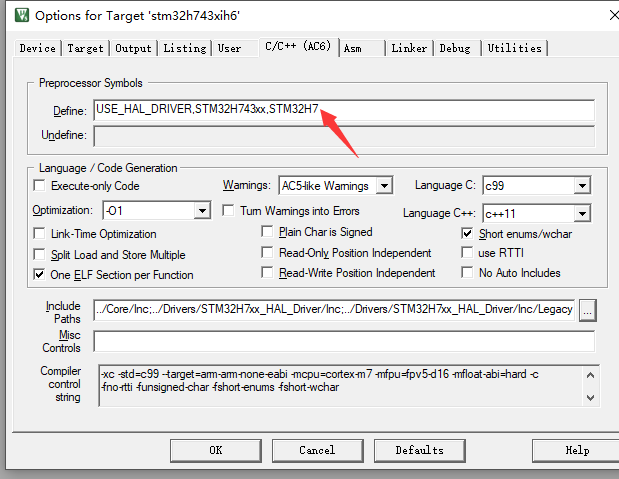

USB Device 移植要点
^^^^^^^^^^^^^^^^^^^^^^

- 使用 **stm32cubemx** 创建工程，配置基本的 RCC、UART (作为log使用)

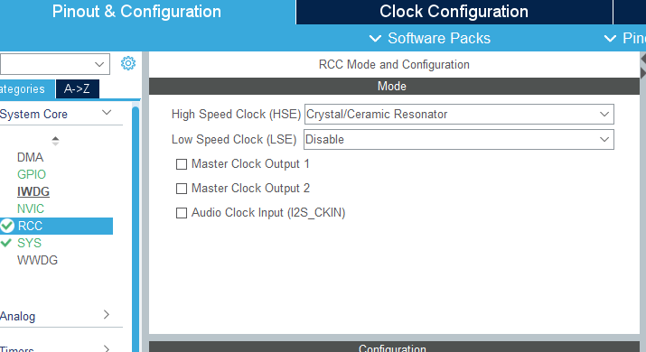
.. figure:: img/stm32_2.png

- 如果使用 fsdev ip，勾选 **USB** 。如果使用 dwc2 ip，勾选 **USB_OTG_FS** 或者勾选  **USB_OTG_HS**。开启 USB 中断，其他配置对我们没用，代码中不会使用任何 st 的 usb 库。

.. figure:: img/stm32_3_1.png
.. figure:: img/stm32_3.png

- 配置 usb clock 为 48M

.. figure:: img/stm32_4_1.png
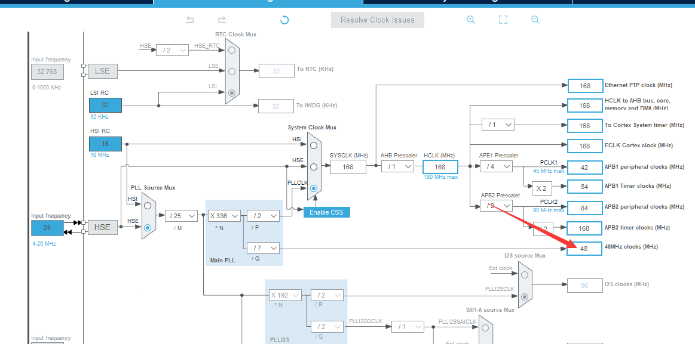

- 选择好工程，这里我们选择 keil，设置好 stack 和 heap，如果使用 msc 可以推荐设置大点，然后点击 **Generate Code**。

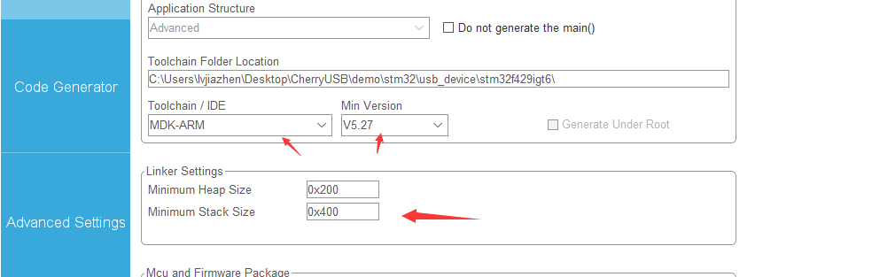

- 添加 CherryUSB 必须要的源码（ **usbd_core.c** 、 **usb_dc_dwc2.c** 或者是 **usb_dc_fsdev.c**  ）,以及想要使用的 class 驱动，可以将对应的 class template 添加方便测试。

.. figure:: img/stm32_6.png

- 头文件该加的加

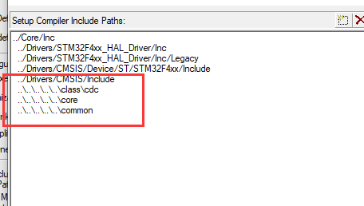

- 复制一份 **cherryusb_config_template.h**，放到 `Core/Inc` 目录下，并命名为 `usb_config.h`

.. figure:: img/stm32_8.png

- 如果使用 dwc2 ip，编译选项中需要添加 `CONFIG_USB_DWC2_PORT=xxx`，使用 PA11/PA12 则 **xxx=FS_PORT**，使用 PB14/PB15 则 **xxx=HS_PORT**

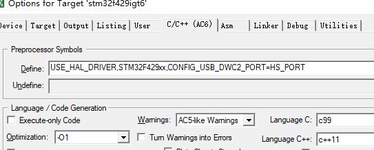

- 编译器推荐使用 **AC6**。勾选 **Microlib**，并实现 **printf** ，方便后续查看 log。

.. figure:: img/stm32_10.png
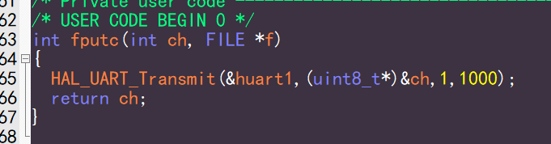

- 拷贝 **xxx_msp.c** 中的 **HAL_PCD_MspInit** 函数中的内容到 **usb_dc_low_level_init** 函数中，屏蔽 st 生成的 usb 中断函数和 usb 初始化

.. figure:: img/stm32_12.png
.. figure:: img/stm32_13.png
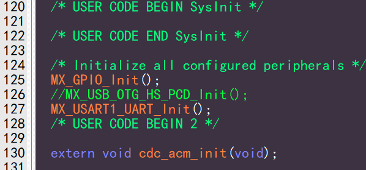

- 调用 template 的内容初始化，就可以使用了

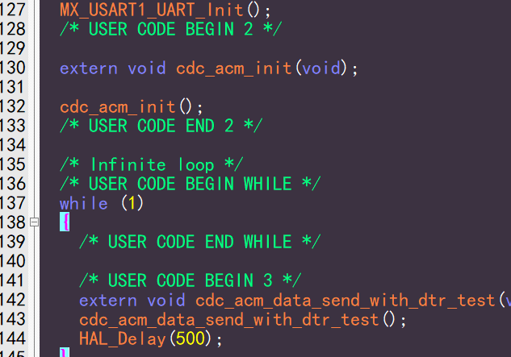

USB Host 移植要点
^^^^^^^^^^^^^^^^^^^^^^

前面 7 步与 Device 一样。需要注意，host 驱动只支持带 dma 的 hs port (引脚是 PB14/PB15)，所以 fs port (引脚是 PA11/PA12)不做支持（没有 dma 你玩什么主机）。

- 添加 CherryUSB 必须要的源码（ **usbh_core.c** 、 **usbh_hub.c** 、 **usb_hc_dwc2.c** 、以及 **osal** 目录下的适配层文件）,以及想要使用的 class 驱动，并且可以将对应的 **usb host.c** 添加方便测试。

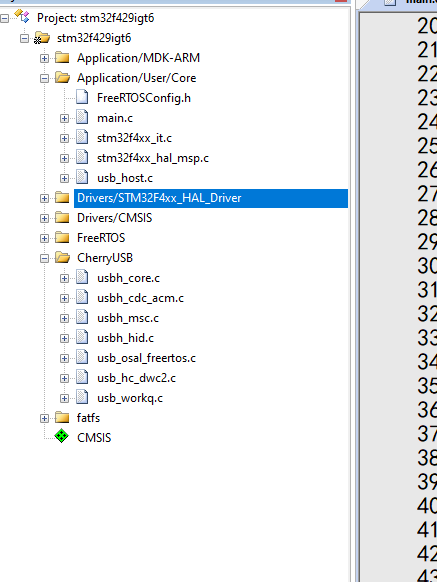

- 编译器推荐使用 **AC6**。勾选 **Microlib**，并实现 **printf** ，方便后续查看 log。

.. figure:: img/stm32_10.png

- 拷贝 **xxx_msp.c** 中的 **HAL_HCD_MspInit** 函数中的内容到 **usb_hc_low_level_init** 函数中，屏蔽 st 生成的 usb 中断函数和 usb 初始化

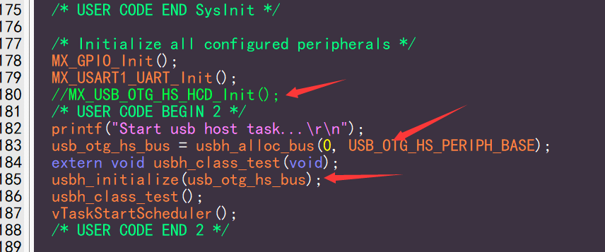
.. figure:: img/stm32_13.png
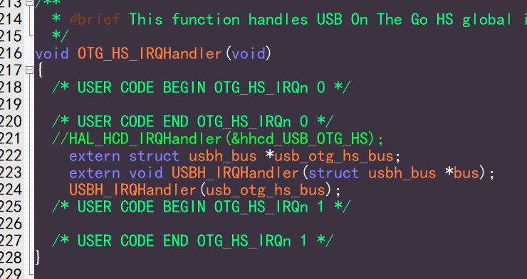

- 调用 **usbh_initialize** 以及 os 需要的启动线程的函数即可使用

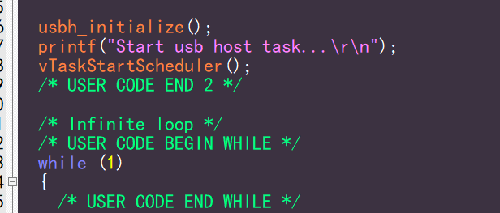

- 如果使用 **msc**，并且带文件系统，需要自行添加文件系统文件了，对应的 porting 编写参考 **fatfs_usbh.c** 文件。

.. figure:: img/stm32_21.png

基于 HPMicro 系列芯片
---------------------------

仓库参考：https://github.com/CherryUSB/cherryusb_hpmicro

- HPM 系列芯片均 USB 2.0 并且内置高速 PHY，支持主从机
- USB 的相关应用位于 `samples/cherryusb` ，根据官方环境搭建完成后，即可编译使用。 
