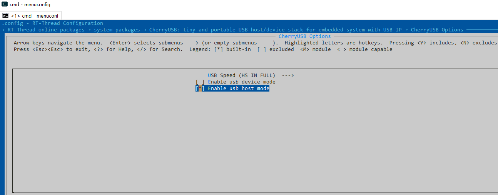

# 基于 RT-Thread 软件包开发指南

[English Version](rt-thread.md)

使用 CherryUSB package 需要在 RT-Thread 的包管理器中选择它，具体路径如下：

```
-> RT-Thread online packages
    -> system packages
        ---  CherryUSB: tiny and portable USB stack for embedded system with USB IP

            CherryUSB Options  ---->
                    USB Speed (FS)  --->
                    [*] Enable usb device mode
                    [ ] Enable usb host mode
                    [*]   Enable usb cdc acm device
                    [ ]   Enable usb hid device
                    [ ]   Enable usb dfu device
                    [ ]   Enable usb msc device
                    [ ]   Enable usb hub device
                    [ ]   Enable usb audio device
                    [ ]   Enable usb video device

            Version (latest)  --->
```

## 基于 STM32 平台

STM32 系列单片机有两种 USB IP,分别是 USB IP 和 USB OTG IP。其中 USB IP，例如 STM32F0、STM32F1、STM32F3等等，USB OTG IP(我们都知道用的是 **synopsys** 公司的)的有 STM32F4、STM32F7、STM32H7等等。当前如果你需要使用 USB Device 功能，porting 接口提供了两种，一种是适配 USB IP的 **fsdev**,另一种是适配 USB OTG IP 的 **synopsys**。

### 使用 USB Device 功能

- 首先，你需要有一个 bsp 工程，之后进入到 `board\CubeMX_Config` 目录下，使用 **STM32CubeMX** 打开后缀名为 `.ioc` 的文件。
- 进入 **Connectivity** 选项，选择 **USB** 或者 **USB_OTG_FS** 或者 **USB_OTG_HS**，并使能 device 功能，在 **NVIC Setting** 中开启 USB 中断。


- 在 **Clock configuration** 栏配置 USB 时钟为 48Mhz.


- 点击 **Generate code**。
- 复制 **SystemClock_Config** 函数内容到 **board.c** 中。
- 实现 ``usb_dc_low_level_init``，并将 ``HAL_PCD_MspInit`` 里面内容复制进来，例如：

```
void usb_dc_low_level_init(void)
{
    /* Peripheral clock enable */
    __HAL_RCC_USB_CLK_ENABLE();
    /* USB interrupt Init */
    HAL_NVIC_SetPriority(USB_LP_CAN1_RX0_IRQn, 0, 0);
    HAL_NVIC_EnableIRQ(USB_LP_CAN1_RX0_IRQn);

}
```

- 由于协议栈默认使用 `printf` 和 `malloc` 和 `free`,所以需要开启 libc 支持或者自己实现。


- 使用 **menuconfig** 配置 **CherryUSB** 软件包，使能 usb device 并勾选需要的 device class。


- 现在我们可以调用 CherryUSB 中的函数来注册描述符、接口、端点中断，并调用 `usb_dc_init`，示例如下：

```
#include <rtthread.h>
#include <rtdevice.h>
#include <board.h>
#include <stdio.h>

extern void usb_dc_init(void);
int main(void)
{
    extern void cdc_init(void);
    cdc_init();
    usb_dc_init();
    while (1)
    {
        uint8_t data_buffer[10] = { 0x31, 0x32, 0x33, 0x34, 0x35, 0x31, 0x32, 0x33, 0x34, 0x35 };
        usbd_ep_write(0x81, data_buffer, 10, NULL);
        rt_thread_mdelay(500);
    }
}

```

- 关于如何注册 class 类可以参考 [stm32 class examples](https://github.com/sakumisu/usb_stack/tree/master/demo/stm32/stm32f103c8t6/example)。

### 使用 USB Host 功能

- 首先，你需要有一个 bsp 工程，之后进入到 `board\CubeMX_Config` 目录下，使用 **STM32CubeMX** 打开后缀名为 `.ioc` 的文件。
- 进入 **Connectivity** 选项，选择 **USB_OTG_FS** 或者 **USB_OTG_HS**，并使能 **host only** 功能，在 **NVIC Setting** 中开启 OTG GLOBAL 中断，其余两个端点中断不需要。


- 在 **Clock configuration** 栏配置 USB 时钟为 48Mhz.
- 点击 **Generate code**。
- 复制 **SystemClock_Config** 函数内容到 **board.c** 中。
- 修改 **usb_hc_synopsys.c** 中 HAL 库头文件包含，例如 `#include "stm32f4xx_hal.h"`。
- 手动增加 **xxx_hal_hcd.c** 和 **xxx_ll_usb.c** 文件
- 由于协议栈默认使用 `printf` 和 `malloc` 和 `free`,所以需要开启 libc 支持或者自己实现。


- 使用 **menuconfig** 配置 **CherryUSB** 软件包，使能 usb host（默认加载所有支持的 class）。


- `main.c` 中调用 `usbh_initialize` 初始化 host 协议栈。

```
#include <rtthread.h>
#include <rtdevice.h>
#include <board.h>
#include "usbh_core.h"
/* defined the LED0 pin: PH10 */
#define LED0_PIN    GET_PIN(H, 10)

int main(void)
{
    /* set LED0 pin mode to output */
    rt_pin_mode(LED0_PIN, PIN_MODE_OUTPUT);
    usbh_initialize();
    while (1)
    {
        rt_pin_write(LED0_PIN, PIN_HIGH);
        rt_thread_mdelay(500);
        rt_pin_write(LED0_PIN, PIN_LOW);
        rt_thread_mdelay(500);
    }
}


```

### Demo 演示

- cdc acm device demo


- host demo


### 视频教程

如果对上述步骤还有问题，可以参考 [协议栈在 RT-Thread 包管理器中的使用](https://www.bilibili.com/video/BV1Ef4y1t73d?p=26)。