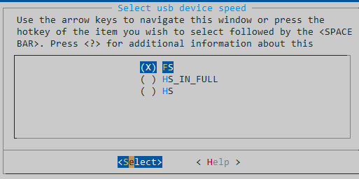
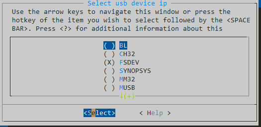
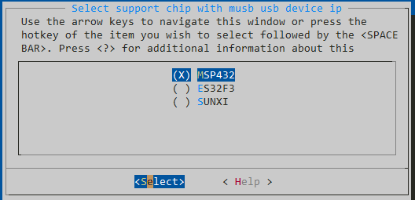
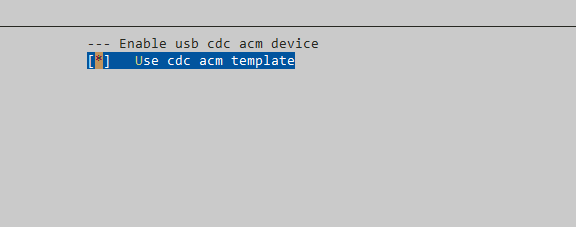
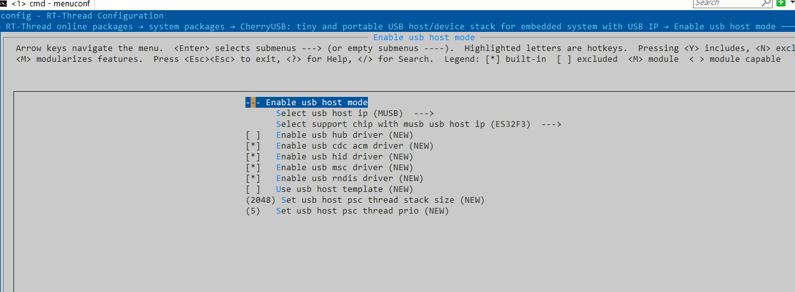

基于 RT-Thread 软件包开发指南
===============================

本节主要介绍使用 RT-Thread 提供的软件包管理器来配置工程，以 env 作为演示。本节操作不同芯片都一样，后续不再重复讲解。打开 env 以后使用 menuconfig 进入包管理器，并在如图所示路径中选择 CherryUSB。

.. figure:: img/env1.png

.. note:: 协议栈默认使用 printf，而 rt-thread 对这个支持并不是很好，所以推荐添加一个 cflag 在你的工程中： `-Dprintf=rt_kprintf`。

从机配置
--------------------------

* 选择 Enable usb device mode 并敲回车进入。

.. figure:: img/env2.png

* 首先第一个配置是配置 USB 的速度，分为 **FS、HIGH_IN_FULL、HS**,。其中， **HIGH_IN_FULL**  表示设备使用支持高速的 USB IP，但是工作在全速模式下，这里仅使用 **synopsys ip** 时使用。

* 其次第二个配置则是选择 USB device ip，不清楚自己芯片是哪个 ip 的可以参考 **port** 目录下对应的 readme。

* 选择好 USB device ip 以后，还需要选择是哪款芯片，第三个配置则是用来选择芯片，选择以后会帮忙配置相对应的 ip 的一些信息，比如 `USB_BASE` 、 `USBD_Handler` 以及特殊的一些配置等等，如果没找到自己的芯片，可以手动在 `usb_dc_xxx.c` 中修改。

* 接下来是 class 的选择，用哪个 class 勾选哪个就可以了，使能 class 以后，双击进入可以选择一个 demo 的模板参与编译，当然也可以不选，自己写。

* 最后退出保存即可。
* 退出以后不急着编译，需要在代码中实现 `usb_dc_low_level_init` 函数。最后使用芯片能够接受的编译方式进行编译。

主机配置
--------------------------

* 选择 Enable usb host mode 并敲回车进入。

* 和 device 配置一样，需要选择对应的 host ip，以及使用对应 ip 的芯片，如果没找到自己的芯片，可以手动在 `usb_hc_xxx.c` 中修改。
* 默认使用除了 hub 之外的所有 class 驱动。
* 设置 psc 线程的线程栈以及线程优先级。
* 最后退出保存即可。
* 退出以后不急着编译，需要在代码中实现 `usb_hc_low_level_init` 函数。最后使用芯片能够接受的编译方式进行编译。

借助 STM32CubeMX 生成 USB 初始化
----------------------------------

使用 STM32CubeMX 主要是用来生成 usb 时钟、引脚、中断的配置。我们需要点击如图所示文件，并配置好 USB 的时钟、中断，点击 `Generate Code`。生成的时钟配置在 `main.c` 中的 `SystemClock_Config` 文件，将其拷贝到 `board.c` 中。

.. figure:: img/stm32cubemx0.png
.. figure:: img/stm32cubemx1.png
.. figure:: img/stm32cubemx2.png
.. figure:: img/stm32cubemx_clk.png

然后将 `stm32xxxx_hal_msp.c` 中的 `HAL_PCD_MspInit` 或者是 `HAL_HCD_MspInit` 中的内容复制到 `usb_dc_low_level_init` 和 `usb_hc_low_level_init` 函数中，举例如下：

.. figure:: img/stm32_init.png

其他小伙伴的移植笔记
-------------------------
- @kylongmu `stm32h743-st-nucleo移植CherryUSB- CDC串口 <https://club.rt-thread.org/ask/article/3719.html>`_。
