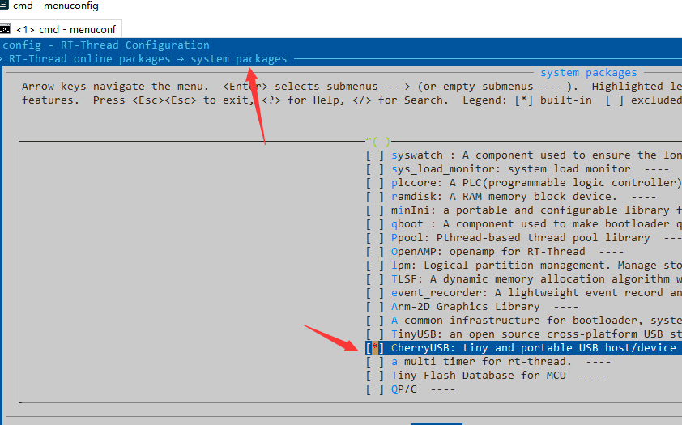
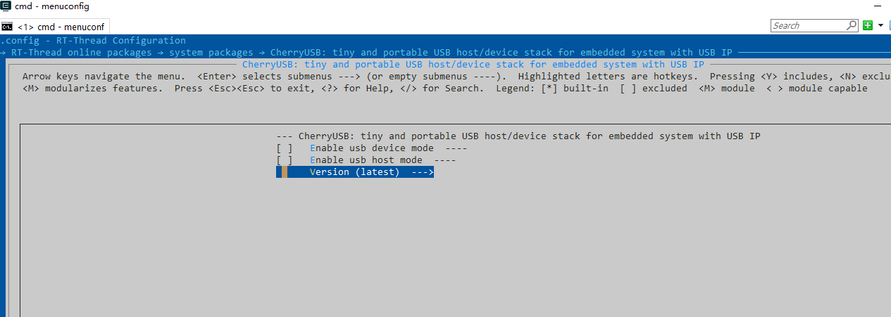
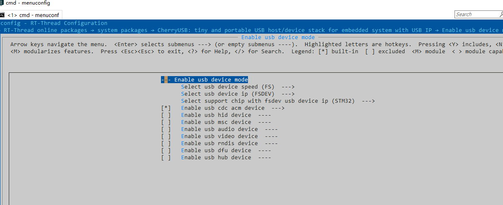
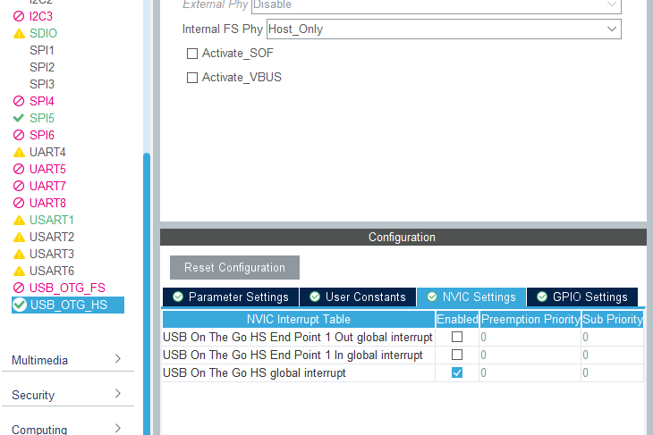

基于 RT-Thread 软件包开发指南
===============================

本节主要介绍使用 RT-Thread 提供的软件包管理器来配置工程，以 env 作为演示。本节操作不同芯片都一样，后续不再重复讲解。打开 env 以后使用 menuconfig 进入包管理器，并在如图所示路径中选择 CherryUSB。

从机配置
--------------------------

* 选择 Enable usb device mode 并敲回车进入。
* 首先第一个配置是配置 USB 的速度，分为 **FS、HS**，表示使用全速还是高速功能。高速功能要求内置高速 PHY 或者外接 PHY
* 其次第二个配置则是选择 USB device ip，不清楚自己芯片是哪个 ip 的可以参考 **port** 目录下对应的 readme。
* 选择你想使用的 class
* 选择是否使用 demo 模板

* 最后退出保存即可。
* 拷贝 `cherryusb_config_template.h` 文件到自己工程目录下，命名为 `usb_config.h`，并添加相应的目录头文件路径,并修改以下内容：

.. code-block:: C

        #include "rtthread.h"

        #define CONFIG_USB_PRINTF(...) rt_kprintf(__VA_ARGS__)

* USB IP 相关的 config 需要用户自己根据芯片实际情况修改
* 退出以后不急着编译，需要在代码中实现 `usb_dc_low_level_init` 函数。
* 调用 `usbd_initialize` 并填入 `busid` 和 USB IP 的 `reg base`， `busid` 从 0 开始，不能超过 `CONFIG_USBDEV_MAX_BUS`
* 以上内容我们推荐放在 **board.c** 中，如下代码：

.. code-block:: C

        void OTG_HS_IRQHandler(void)
        {
        extern void USBD_IRQHandler(uint8_t busid);
        USBD_IRQHandler(0);
        }

        int usbd_init(void)
        {
        xxx_template_init(0, USB_OTG_HS_PERIPH_BASE);
        return 0;
        }

        INIT_APP_EXPORT(usbd_init);

* 使用 `scons --target=mdk5` 或者 `scons` 进行编译，如果是mdk，需要使用 AC6 编译器

主机配置
--------------------------

* 选择 Enable usb host mode 并敲回车进入。
* 选择 USB host ip，不清楚自己芯片是哪个 ip 的可以参考 **port** 目录下对应的 readme。
* 根据需要勾选 class 驱动
* 选择是否开启模板 demo，请注意， msc 禁止使能，因为默认对接到 dfs。

* 最后退出保存即可。
* 拷贝 `cherryusb_config_template.h` 文件到自己工程目录下，命名为 `usb_config.h`，并添加相应的目录头文件路径,并实现以下内容：

.. code-block:: C

        #include "rtthread.h"

        #define CONFIG_USB_PRINTF(...) rt_kprintf(__VA_ARGS__)

* USB IP 相关的 config 需要用户自己根据芯片实际情况修改
* 在代码中实现 `usb_hc_low_level_init` 函数
* 调用 `usbh_initialize` 并填入 `busid` 和 USB IP 的 `reg base`， `busid` 从 0 开始，不能超过 `CONFIG_USBHOST_MAX_BUS`
* 以上内容我们推荐放在 **board.c** 中，如下代码：

.. code-block:: C

        void OTG_HS_IRQHandler(void)
        {
        extern void USBH_IRQHandler(uint8_t busid);
        USBH_IRQHandler(0);
        }

        int usbh_init(void)
        {
        usbh_initialize(0, USB_OTG_HS_PERIPH_BASE);
        return 0;
        }

        INIT_APP_EXPORT(usbh_init);

* 使用 `scons --target=mdk5` 或者 `scons` 进行编译，如果是mdk，需要使用 AC6 编译器
* 如果使用的是 GCC ，需要在链接脚本(ld)中添加如下代码：

.. code-block:: C

        /* section information for usbh class */
        . = ALIGN(4);
        __usbh_class_info_start__ = .;
        KEEP(*(.usbh_class_info))
        __usbh_class_info_end__ = .;

借助 STM32CubeMX 生成 USB 初始化
----------------------------------

使用 STM32CubeMX 主要是用来生成 usb 时钟、引脚、中断的配置。我们需要点击如图所示文件，并配置好 USB 的时钟、中断，点击 `Generate Code`。

.. figure:: img/stm32cubemx0.png
.. figure:: img/stm32cubemx1.png

.. figure:: img/stm32cubemx_clk.png

- 将 `main.c` 中的 `SystemClock_Config` 替换掉 `board.c` 中的配置

.. figure:: img/stm32_init2.png

- 将 `stm32xxxx_hal_msp.c` 中的 `HAL_PCD_MspInit` 或者是 `HAL_HCD_MspInit` 中的内容复制到 `usb_dc_low_level_init` 和 `usb_hc_low_level_init` 函数中，举例如下：

.. figure:: img/stm32_init.png
