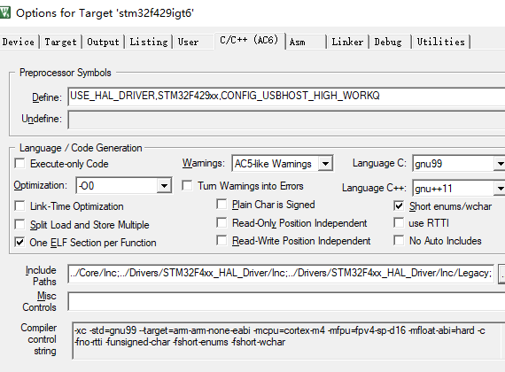
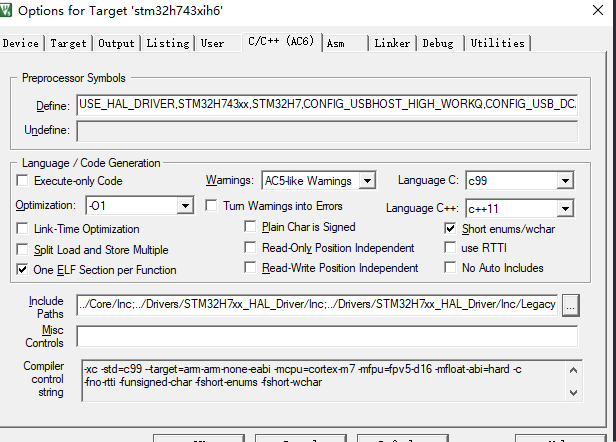
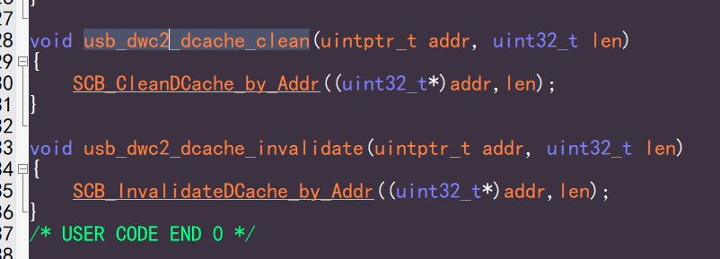
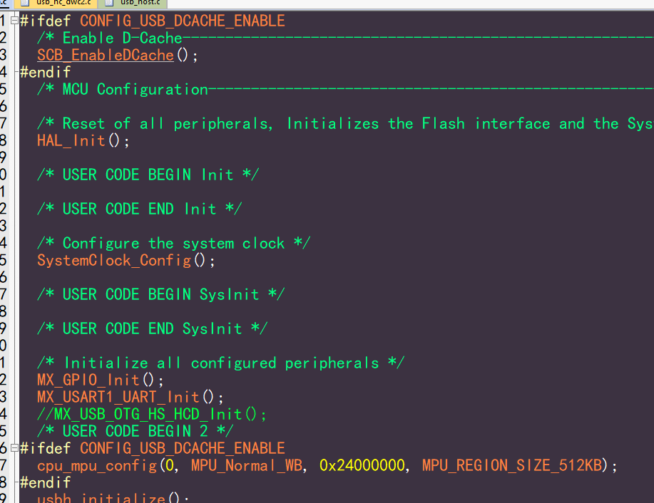

基于 STM32F1/F4/H7 开发指南
=============================

本节是基于 STM32 三个系列芯片的使用，涵盖 F1/F4/H7，其余芯片基本类似，不再赘述，具体区别有：

- usb ip 区别：F1使用 fsdev，F4/H7使用 dwc2
- dwc2 ip 区别： fs port 和 hs port(带 dma 和不带 dma 功能)
- F4 与 H7 cache 区别、USB BASE 区别

工程样例试用
-----------------------

默认提供以下 demo 工程：

- F103 使用 fsdev ip
- F429 主从使用 hs port
- H7 设备使用 fs port，主机使用 hs port，并且主机带 cache 支持

默认删除 Drivers ，所以需要使用 stm32cubemx 生成一下 Drivers 目录下的文件，demo 底下提供了 **stm32xxx.ioc** 文件，双击打开，点击 **Generate Code** 即可。

.. caution:: 生成完以后，请使用 git reset 功能将被覆盖的 `main.c` 和 `stm32xxx_it.c` 文件撤回，禁止被 cubemx 覆盖。

USB Device 移植要点
-----------------------

- 使用 **stm32cubemx** 创建工程，配置基本的 RCC、UART (作为log使用)

.. figure:: img/stm32_1.png
.. figure:: img/stm32_2.png

- 如果使用 fsdev ip，勾选 **USB** 。如果使用 dwc2 ip，勾选 **USB_OTG_FS** 或者勾选  **USB_OTG_HS**。开启 USB 中断，其他配置对我们没用，代码中不会使用任何 st 的 usb 库。

.. figure:: img/stm32_3_1.png
.. figure:: img/stm32_3.png

- 配置 usb clock 为 48M

.. figure:: img/stm32_4_1.png
.. figure:: img/stm32_4.png

- 选择好工程，这里我们选择 keil，设置好 stack 和 heap，如果使用 msc 可以推荐设置大点，然后点击 **Generate Code**。

.. figure:: img/stm32_5.png

- 添加 CherryUSB 必须要的源码（ **usbd_core.c** 、 **usb_dc_dwc2.c** 或者是 **usb_dc_fsdev.c**  ）,以及想要使用的 class 驱动，可以将对应的 class template 添加方便测试。

.. figure:: img/stm32_6.png

- 头文件该加的加

.. figure:: img/stm32_7.png

- 复制一份 **usb_config.h**，这里放到 `Core/Inc` 目录下

.. figure:: img/stm32_8.png

- 如果使用 dwc2 ip，编译选项中需要添加 `CONFIG_USB_DWC2_PORT=xxx`，使用 PA11/PA12 则 **xxx=FS_PORT**，使用 PB14/PB15 则 **xxx=HS_PORT**

.. figure:: img/stm32_9.png

- 编译器推荐使用 **AC6**。勾选 **Microlib**，并实现 **printf** ，方便后续查看 log。
.. figure:: img/stm32_10.png
.. figure:: img/stm32_11.png

- 拷贝 **xxx_msp.c** 中的 **HAL_PCD_MspInit** 函数中的内容到 **usb_dc_low_level_init** 函数中，屏蔽 st 生成的 usb 中断函数和 usb 初始化

.. figure:: img/stm32_12.png
.. figure:: img/stm32_13.png
.. figure:: img/stm32_14.png

- 调用 template 的内容初始化，就可以使用了

.. figure:: img/stm32_15.png

USB Host 移植要点
-----------------------

前面 7 步与 Device 一样。需要注意，host 驱动只支持带 dma 的 hs port，所以 fs port 不做支持（没有 dma 你玩什么主机）。

- 添加 CherryUSB 必须要的源码（ **usbh_core.c** 、 **usb_hc_dwc2.c** 、以及 **osal** 目录下的适配层文件）,以及想要使用的 class 驱动（推荐添加除了 hub 之外的所有的 class），可以将对应的 usb host template 添加方便测试。

.. figure:: img/stm32_16.png

- 编译选项中需要添加 `CONFIG_USBHOST_HIGH_WORKQ`,作用是在线程中复位 port。

- 如果使用 STM32H7 或者 F7 ，需要添加 `STM32H7` 或者 `STM32F7` 编译选项
- 如果使用的是 F7/H7 这种带 cache功能的，由于 dma 原因，所以需要刷 cache，编译选项中需要添加 `CONFIG_USB_DCACHE_ENABLE`,并实现刷 cache的两个函数。当然，可以不开 dcahe功能，就不需要添加编译选项。
并且需要搭配 MPU 使用，如果是新手，对 cache不了解，推荐关闭 cache功能。默认 cache 使用 Write Back 属性。

.. note:: STM32 h7/f7 usb dma 访问的 ram 只能是从 0x24000000 开始的地址，所以，推荐关闭 0x20000000 开始的地址。

.. figure:: img/stm32_17_4.png

- 编译器推荐使用 **AC6**。勾选 **Microlib**，并实现 **printf** ，方便后续查看 log。
.. figure:: img/stm32_10.png
.. figure:: img/stm32_11.png

- 拷贝 **xxx_msp.c** 中的 **HAL_HCD_MspInit** 函数中的内容到 **usb_hc_low_level_init** 函数中，屏蔽 st 生成的 usb 中断函数和 usb 初始化

.. figure:: img/stm32_18.png
.. figure:: img/stm32_13.png
.. figure:: img/stm32_19.png

- 调用 **usbh_initialize** 以及 os 需要的启动线程的函数即可使用

.. figure:: img/stm32_20.png

- 如果使用 **msc**，并且带文件系统，需要自行添加文件系统文件了，对应的 porting 编写参考 **fatfs_usbh.c** 文件。

.. figure:: img/stm32_21.png