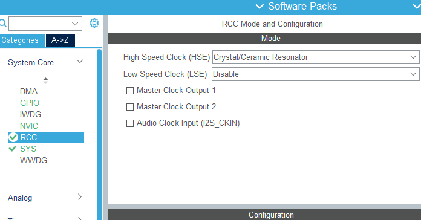
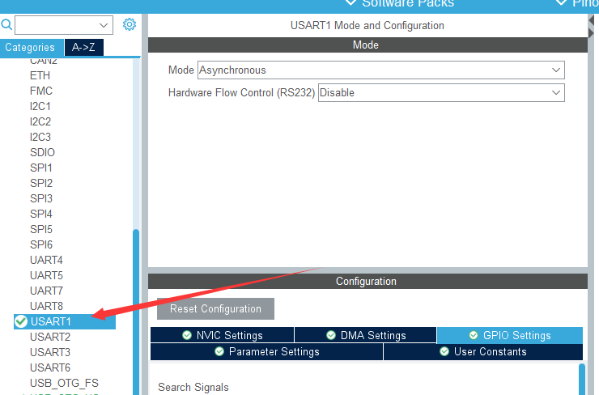
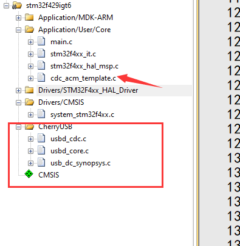
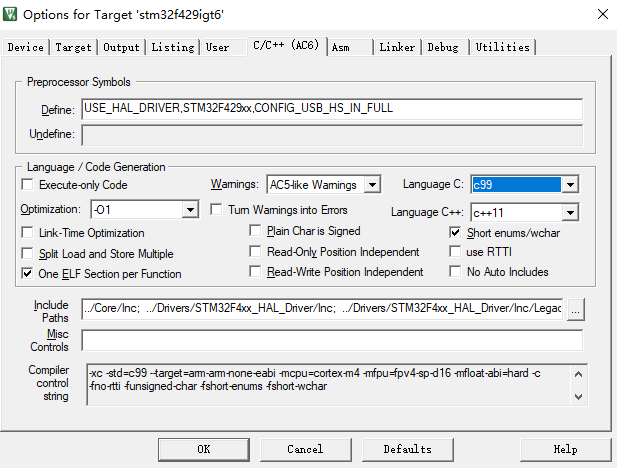
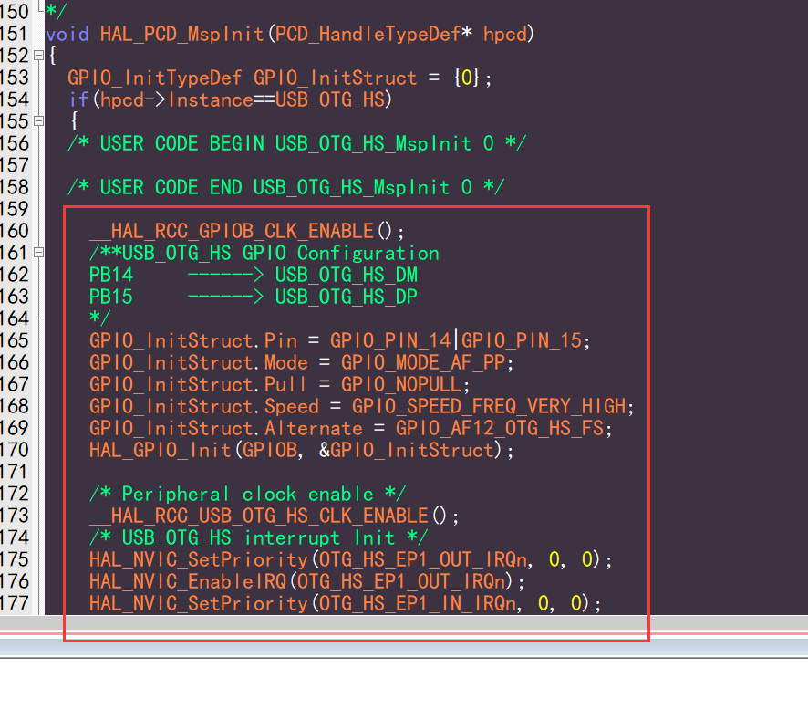
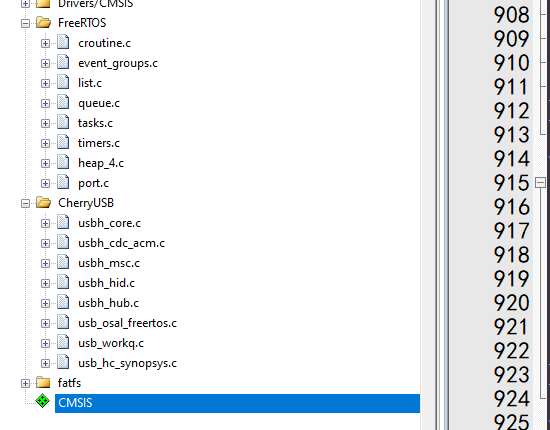

基于 STM32F429 开发指南
=========================

本节是基于 stm32f429 开发板的使用，仓库中已经默认有主从机的 demo ，其余 stm32 系列，基本类似，所以后续不再赘述。

.. note:: stm32的 porting 使用寄存器编写，所以 st 的 usb 库没有一丁点用，想删就删。（ps 主机还没用寄存器，所以删不了）

工程样例试用
-----------------------

默认删除 Drivers ，所以需要使用 stm32cubemx 生成一下 Drivers 目录下的文件，demo 底下提供了 **stm32f429igt6.ioc** 文件，双击打开，点击 **Generate Code** 即可。

USB Device 移植要点
-----------------------

- 使用 **stm32cubemx** 创建工程，配置基本的 RCC、UART (作为log使用)

- 如果使用 PA11 和 PA12，勾选 **USB_OTG_FS**，否则勾选  **USB_OTG_HS**，并按下面进行配置，我们只需要开启中断和 gpio 配置，其他配置对我们没用。

.. figure:: img/stm32f429_3.png

- 配置 usb clock 为 48M

.. figure:: img/stm32f429_4.png

- 选择好工程，这里我们选择 keil，设置好 stack 和 heap，如果使用 msc 可以推荐设置大点，然后点击 **Generate Code**。

.. figure:: img/stm32f429_5.png

- 添加 CherryUSB 必须要的源码（ **usbd_core.c** 、 **usb_dc_synopsys.c** ）,以及想要使用的 class 驱动，可以将对应的 class template 添加方便测试。

- 头文件该加的加

.. figure:: img/stm32f429_7.png

- 复制一份 **usb_config.h**，这里放到 `Core/Inc` 目录下

.. figure:: img/stm32f429_8.png

- 如果使用 PB14 和 PB15，并且仅使用 FS 模式，编译选项中添加 `CONFIG_USB_HS_IN_FULL`，剩下的按照下图配置，编译器推荐使用 **AC6**。打开 **Microlib**，后续 **printf** 使用

.. figure:: img/stm32f429_9.png

- 实现 printf，如果关闭 usb 的log，可以不实现

.. figure:: img/stm32f429_11.png

- 拷贝 **xxx_msp.c** 中的 **HAL_PCD_MspInit** 函数中的内容到 **usb_dc_low_level_init** 函数中，屏蔽 st 生成的 usb 中断函数和 usb 初始化

.. figure:: img/stm32f429_13.png
.. figure:: img/stm32f429_14.png
.. figure:: img/stm32f429_15.png

- 主函数屏蔽 **stm32cubemx** 生成的中断函数和 usb 初始化，然后调用 template 的内容初始化，就可以使用了

USB Host 移植要点
-----------------------

前面 9 步与 Device 一样，目前 Host 暂时用的 st 的 hal 库，后面有时间了再整理成寄存器的并进行优化。

- 添加 CherryUSB 必须要的源码（ **usbh_core.c** 、 **usb_hc_synopsys.c** 、以及 **osal** 目录下的适配层文件）,以及想要使用的 class 驱动（推荐添加除了 hub 之外的所有的 class），可以将对应的 usb host template 添加方便测试。

- 主函数屏蔽 st 的 usb 初始化，屏蔽 st 生成的 usb 中断函数，然后调用 **usbh_initialize** 以及 os 需要的启动线程的函数即可使用

.. figure:: img/stm32f429_17.png

- 如果使用 **msc**，并且带文件系统，需要自行添加文件系统文件了，对应的 porting 编写参考 **fatfs_usbh.c** 文件。

.. figure:: img/stm32f429_18.png