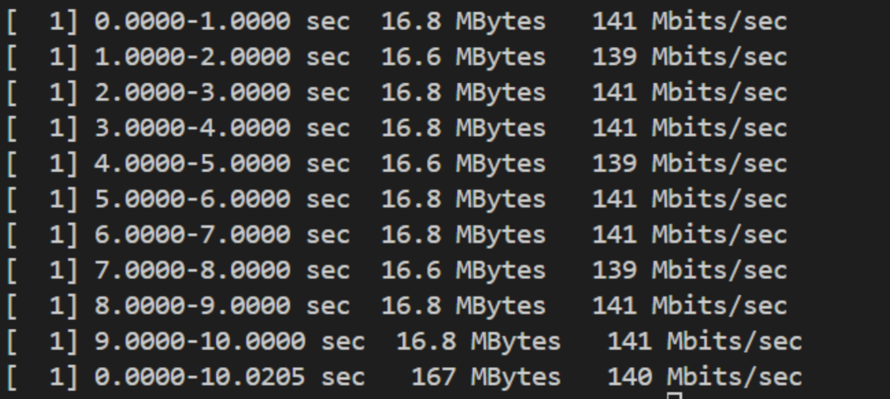
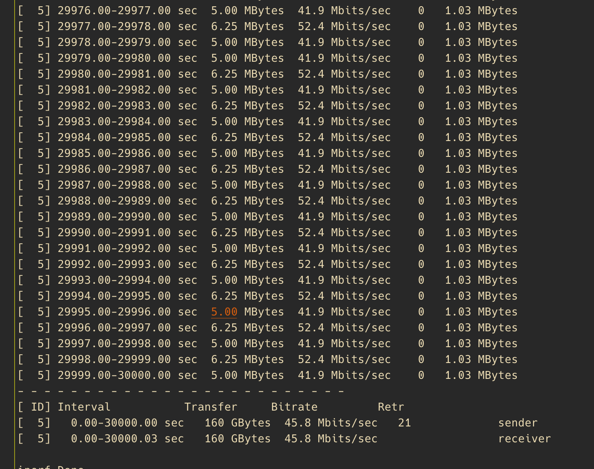
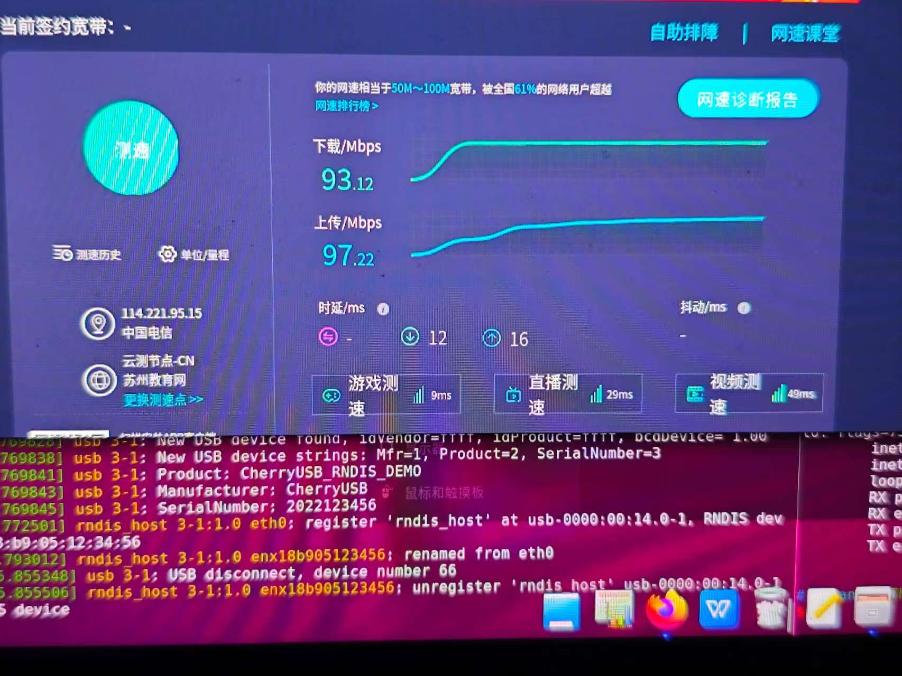

.. _performace_show:

性能展示
==============================

以下演示了 CherryUSB 在不同应用中的性能表现。主要演示高速模式，全速看不出什么性能差异。

CDC ACM 通信
----------------

可以达到硬件极限性能，当然需要硬件理论支持到这速度，CherryUSB 就支持到这速度,举例如下：

- HPM 系列(从机可以到 42MB/S, 主机 44MB/S, 已经达到硬件极限)
- BL 系列（从机 32MB/S, 主机 25MB/S, 已经达到硬件极限）
- STM32F4 全速（从机 900KB/S, 主机 1.12MB/S, 已经达到硬件极限）

从机测速demo: cdc_acm_template.c 并且关闭 log，脚本使用 `tools/test_srcipts/test_cdc_speed.py`
主机测速demo: usb_host.c 中 TEST_USBH_CDC_SPEED=1

USB Device MSC
-----------------

演示 USB Device MSC 使用 SDXC3.0 + EMMC 测试。

.. figure:: img/usbdev_msc.png

USB Device RNDIS
-----------------------

.. note:: 默认 rndis 仅支持单包，因此下面速度为最低速度。多包支持需要联系作者。

演示 USB Device RNDIS 局域网下搭配 lwip 的速度。

作为 client

作为 server

演示 USB Device RNDIS + WIFI 透传测试。

演示 USB Device RNDIS + 百兆以太网透传测试。

USB Device UVC
-----------------------

演示 USB Device UVC + 摄像头传输 YUYV/MJPEG 640 * 480 图像。FPS 30。

.. figure:: img/usbdev_uvc_mjpeg.png
.. figure:: img/usbdev_uvc_yuv.png

USB Host HUB
-----------------------

多级 hub 支持，演示 1托 7 HUB

.. figure:: img/usbhost_hub.png
.. figure:: img/usbhost_hub2.png

USB Host MSC
-----------------------

演示 USB Host MSC 在 USB2.0 和 USB3.0 下的速度，U盘推荐使用固态测试。

.. figure:: img/usbhost_msc_xhci.png

USB Host UVC
-----------------------

演示 USB Host UVC 驱动 648 * 480 YUV 摄像头。FPS 30。

.. figure:: img/usbhost_uvc.gif

USB Host WIFI
-----------------------

演示 USB Host 驱动 BL616 USB WIFI。

.. figure:: img/usbhost_wifi.png
