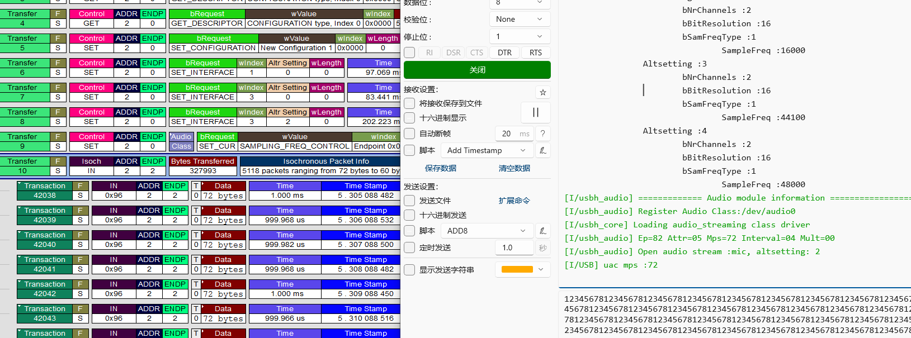

商业支持
==============================

以下内容为商业收费类，如需支持，请邮件到 1203593632@qq.com。

- 主机 UVC & UAC 类 EHCI IP 中 ISO 驱动和 UAC/UVC 框架

.. figure:: img/ehci_hostuvc1.png
.. figure:: img/ehci_hostuvc2.png

- 主机 UVC & UAC 类 DWC2 IP 中 ISO 驱动和 UAC/UVC 框架

.. figure:: img/dwc2_hostuvc1.png
.. figure:: img/dwc2_hostuvc2.png

- 主机 UVC & UAC 类 MUSB IP 中 ISO 驱动和 UAC/UVC 框架, MUSB 需要为 mentor 公司制定的标准 IP

- 主从机 MTP 类驱动
- USB 网卡类高性能版本优化,包含 CDC-NCM, CDC-RNDIS, 私有类驱动（支持多包发送和接收），下面举例 RNDIS

.. figure:: img/rndistx.png
.. figure:: img/rndisrx.png

- 定制化 class 驱动或者 IP 驱动
- 技术支持相关