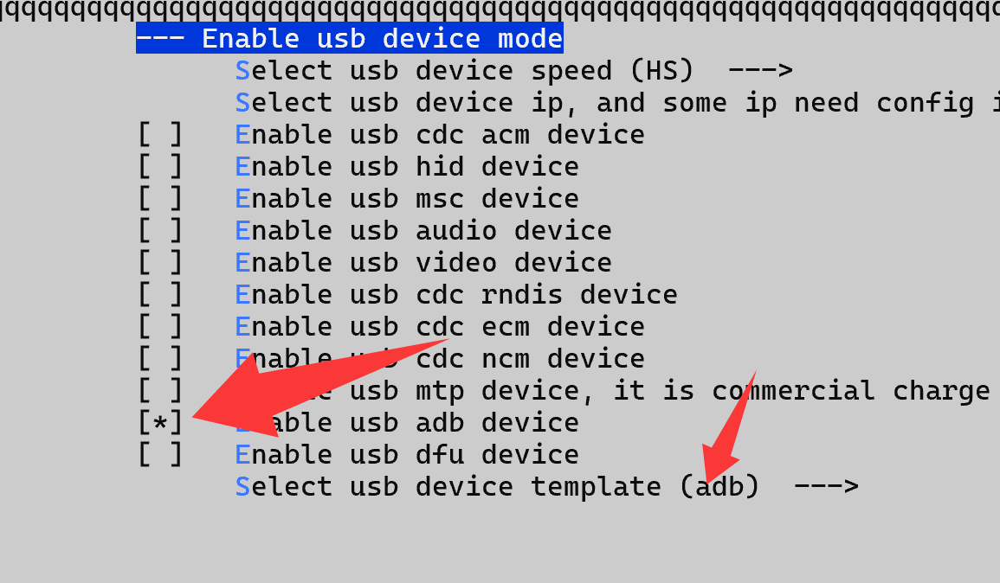

ADB Device
=================

adb device demo 参考 `demo/adb/usbd_adb_template.c` 模板。默认适配 **cherrysh** (`platform/demo/adb/cherrysh_port.c`) 和 **rt-thread msh** (`platform/rtthread/usbd_adb_shell.c`)，只需要在 main 中添加以下初始化即可。

.. code-block:: C

    cherryadb_init(0, xxxxx);

如果使用 rt-thread，还需要在 menuconfig 中使能 adb device。

进入 adb
--------------

- 使用 **cherrysh** 时枚举完成以后自动进入 adb 模式
- 使用 **msh** 需要在 **msh** 中输入 ``adb_enter`` 进入 adb 模式

退出 adb
--------------

- 使用 **cherrysh** 时输入 ``exit`` 退出 adb 模式
- 使用 **msh** 需要在 **msh** 中输入 ``adb_exit`` 退出 adb 模式

.. figure:: img/cherryadb.png

.. figure:: img/rtt_adb_shell2.png
