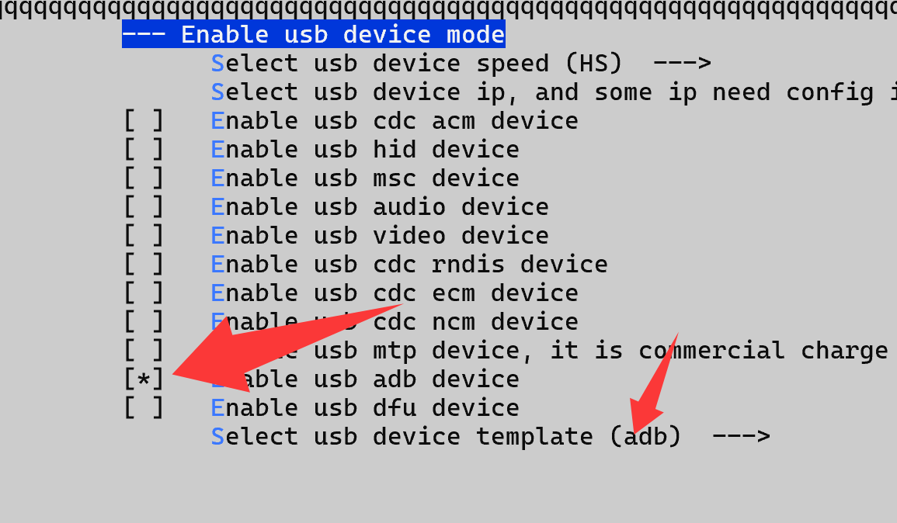
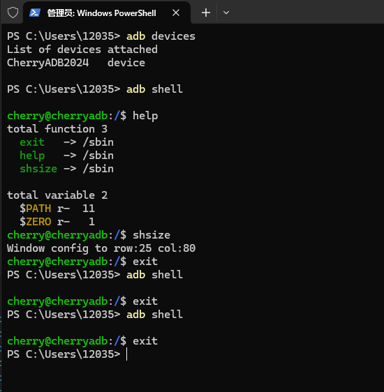
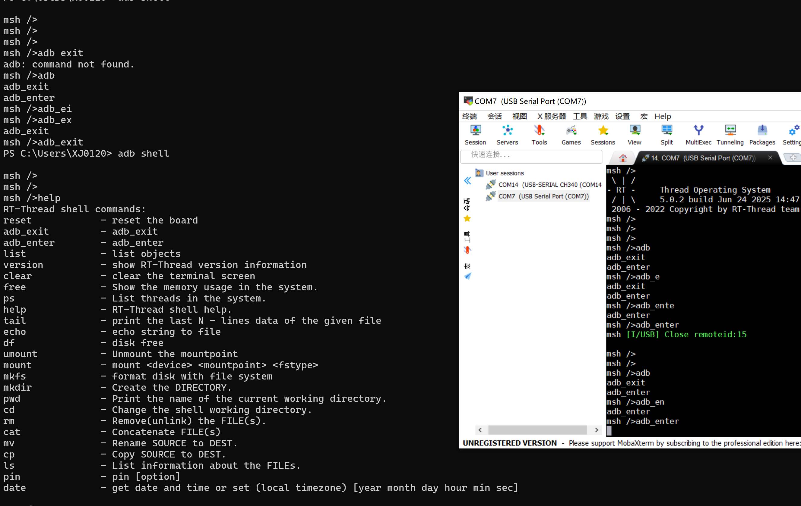

ADB Device
=================

adb device demo 参考 `demo/adb_template.c` 模板。调用如下：

.. code-block:: C

    cherryadb_init(0, xxxxx);

如果使用 rt-thread，还需要在 menuconfig 中使能 adb device。

shell 使用
-------------------

默认支持 **cherrysh** 和 **rt-thread msh**，如果使用其他 shell，需自行适配。

.. note:: 如使用 cherrysh，请将 class/adb/usbd_adb_cherrysh.c 加入到编译系统

sync 使用
-------------------

默认支持 **fatfs** 和 **rt-thread dfs**。如果使用 fatfs， **需要在代码初始化之前 mount 文件系统，并且根路径为 "/" **。参考 **platform/fatfs/vfs_fatfs_port.c**。

.. note:: 如使用 sync 功能和 fatfs，请将 class/adb/usbd_adb_sync.c，platform/fatfs/vfs_fatfs_port.c 加入到编译系统

退出 adb
--------------

- 使用 **cherrysh** 时输入 ``exit`` 退出 adb 模式
- 使用 **msh** 需要在 **msh** 中输入 ``adb_exit`` 退出 adb 模式

