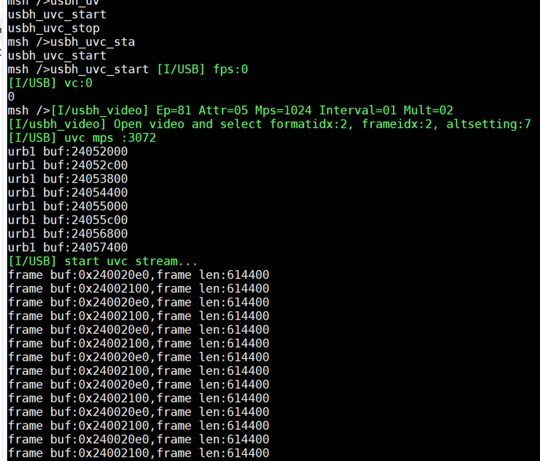

商业支持
==============================

以下内容为商业收费类，如需支持，请邮件到 1203593632@qq.com。

- OHCI 驱动

.. figure:: img/ohci.png

- EHCI IP 中 ISO 驱动和 UAC/UVC 框架，搭配主机 UVC & UAC 类（这部分是开源的）使用。iso 支持一个微帧 1/2/3 包，支持 MJPEG 和 YUV 摄像头

.. figure:: img/ehci_hostuvc1.png
.. figure:: img/ehci_hostuvc2.png

演示 USB Host UVC 驱动 648 * 480 YUV 摄像头。FPS 30。

.. figure:: img/usbhost_uvc.gif

- DWC2 IP 中 ISO 驱动和 UAC/UVC 框架，搭配主机 UVC & UAC 类（这部分是开源的）使用。iso 支持一个微帧 1/2/3 包，支持 MJPEG 和 YUV 摄像头

.. figure:: img/dwc2_hostuvc1.png

.. figure:: img/dwc2_hostuvc3.png
.. figure:: img/dwc2_hostuac.png

- MUSB IP 中 ISO 驱动和 UAC/UVC 框架，搭配主机 UVC & UAC 类（这部分是开源的）使用。MUSB 需要为 mentor 公司制定的标准 IP

- 从机 MTP 类驱动, 支持多文件和多文件夹，支持 MCU 端增删文件并与 PC 同步

.. figure:: img/mtpdev.png

- 从机 TMC 类驱动

.. figure:: img/tmcdev1.png
.. figure:: img/tmcdev2.png

- USB 网卡类高性能版本优化,包含 CDC-NCM, CDC-RNDIS, 私有类驱动（支持多包发送和接收），下面举例 RNDIS

.. figure:: img/rndistx.png
.. figure:: img/rndisrx.png

- 定制化 class 驱动或者 IP 驱动适配
- 技术支持相关