商业支持
==============================

以下内容为商业收费类，如需支持，请邮件到 1203593632@qq.com。下面列举了部分产品报价单，其他产品请联系邮箱咨询。

.. list-table:: CherryUSB 报价单
    :widths: 10 10 10 10
    :header-rows: 1

    * - 产品
      - 描述
      - 价格
      - 授权性质
    * - Host UVC & UAC with EHCI driver
      - 包括主机 UAC/UVC 框架，EHCI ISO 驱动，以及对应参考例程
      - 库 3W RMB OR 源码 5W RMB（不含税）
      - Royalty-free
    * - Host UVC & UAC with DWC2 driver
      - 包括主机 UAC/UVC 框架，DWC2 ISO 驱动，以及对应参考例程
      - 库 1W RMB OR 源码 1.5W RMB（不含税）
      - Royalty-free
    * - Host UVC & UAC with MUSB driver
      - 包括主机 UAC/UVC 框架，MUSB ISO 驱动，以及对应参考例程
      - 库 1W RMB OR 源码 1.5W RMB（不含税）
      - Royalty-free
    * - OHCI Host Driver
      - OHCI 驱动
      - 库 0.5W RMB OR 源码 1W RMB（不含税）
      - Royalty-free
    * - MTP Device Class Driver
      - MTP 驱动，以及对应参考例程（包括虚拟文件系统示例，FATFS 文件系统示例）
      - 库 0.5W RMB OR 源码 1W RMB（不含税）
      - Royalty-free

- EHCI IP 中 ISO 驱动和 UAC/UVC 框架，搭配主机 UVC & UAC 类（这部分是开源的）使用。支持 ISO 和 bulk 模式，iso 支持一个微帧 1/2/3 包，支持 MJPEG 和 YUV 摄像头

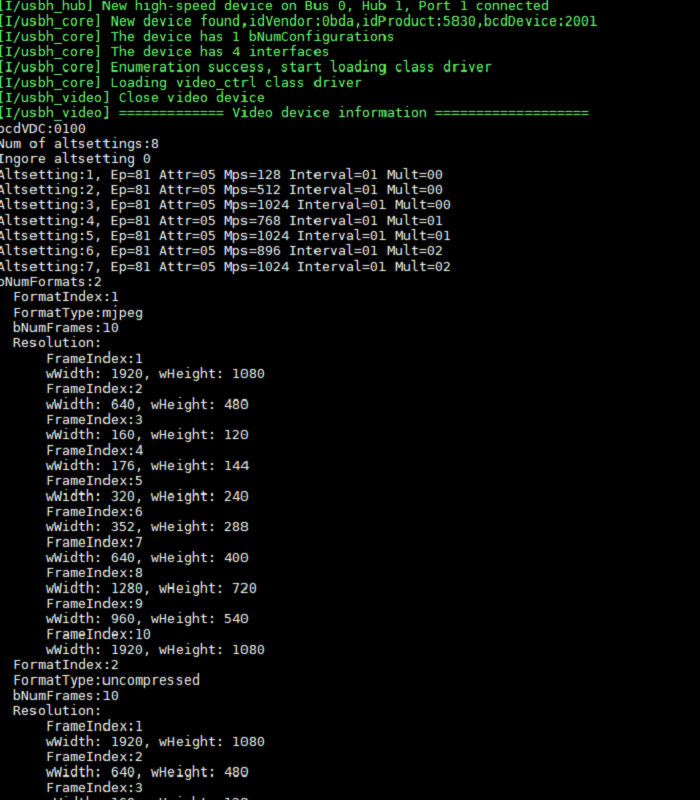
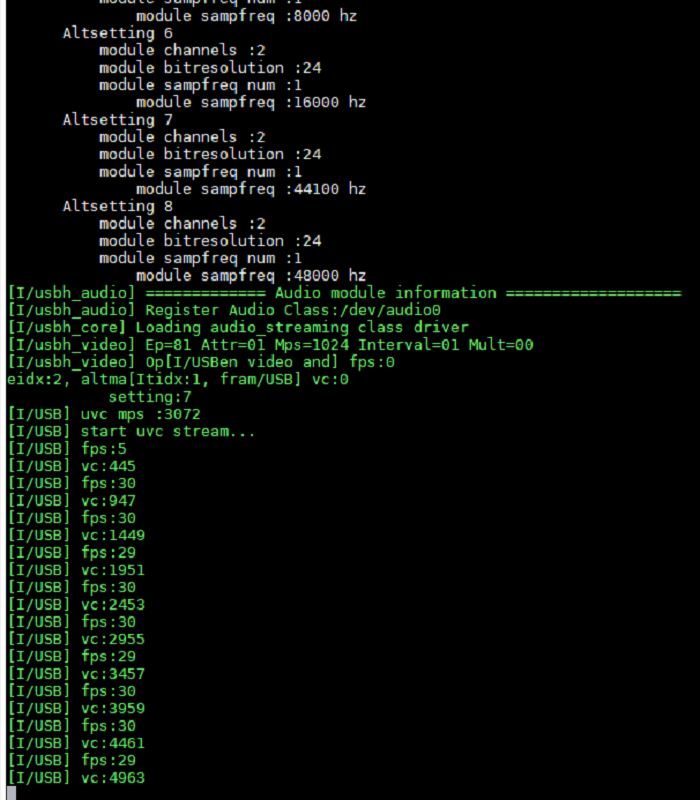
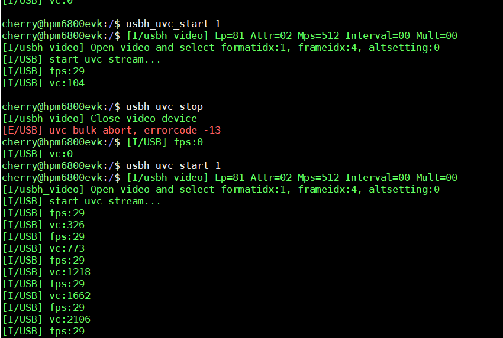

演示 USB Host UVC 驱动 648 * 480 YUV 摄像头。FPS 30。

.. figure:: img/usbhost_uvc.gif

- DWC2 IP 中 ISO 驱动和 UAC/UVC 框架，搭配主机 UVC & UAC 类（这部分是开源的）使用。支持 ISO 和 bulk 模式，iso 支持一个微帧 1/2/3 包，支持 MJPEG 和 YUV 摄像头

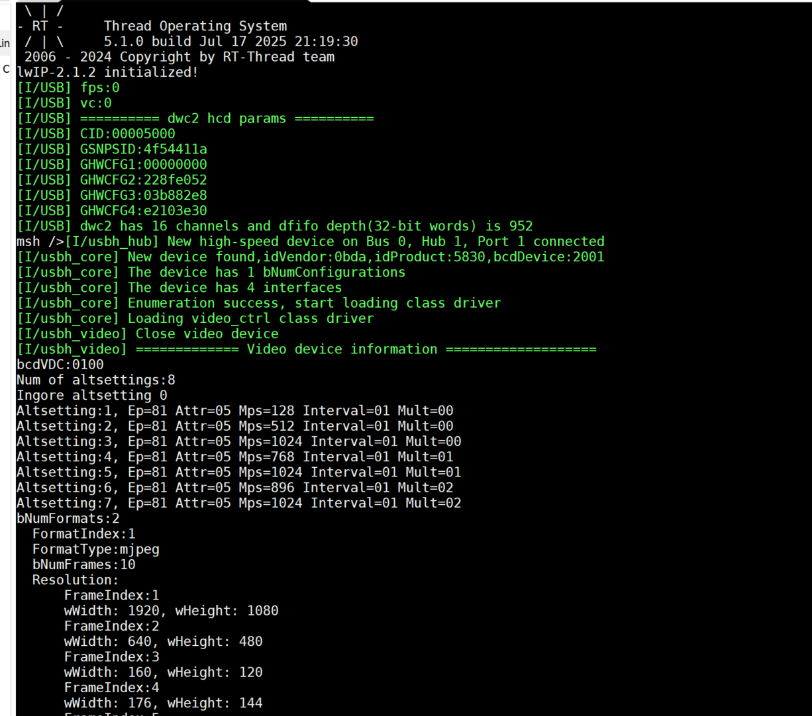
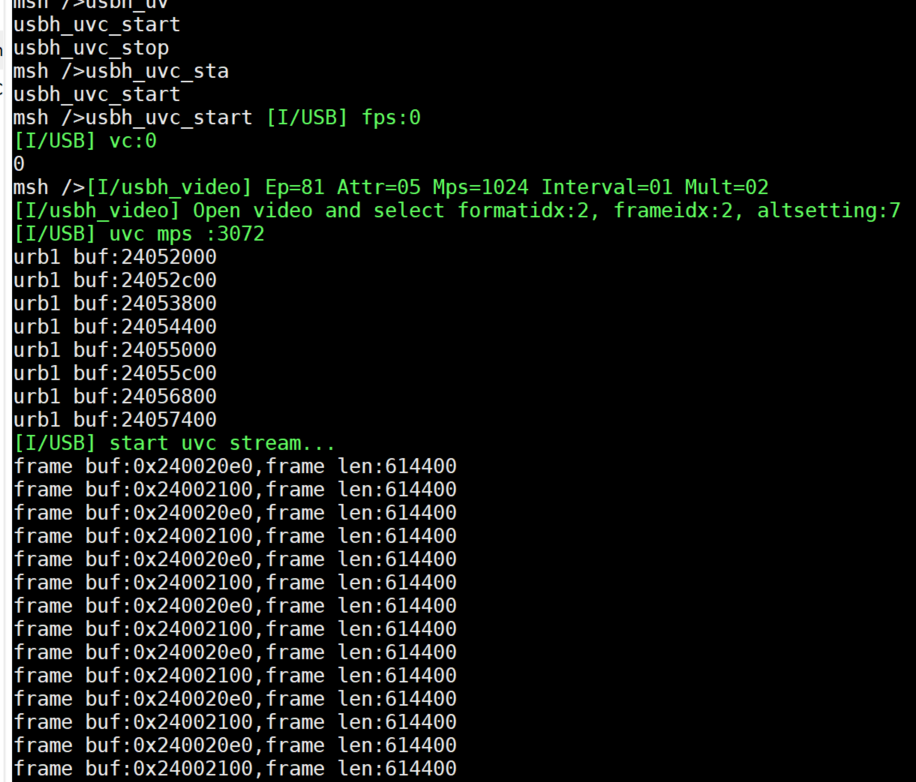
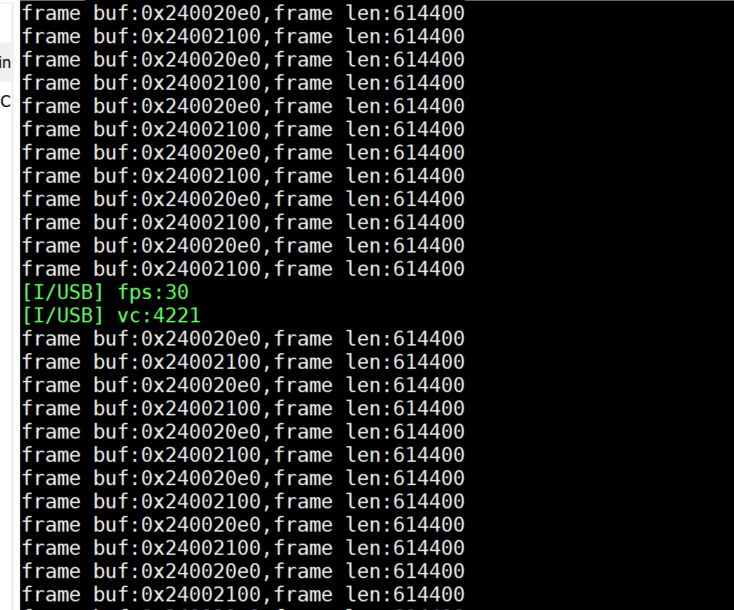
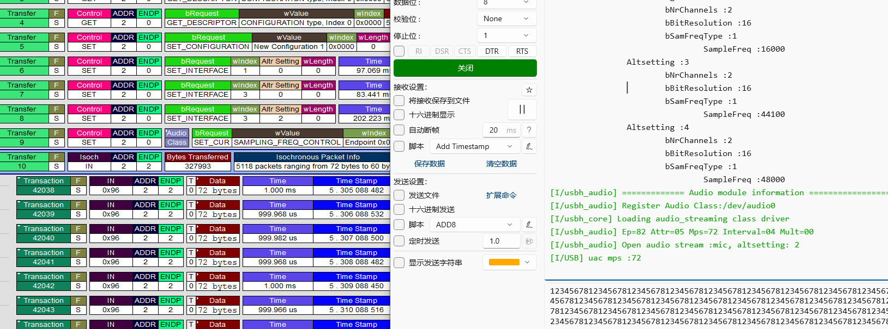

- MUSB IP 中 ISO 驱动和 UAC/UVC 框架，搭配主机 UVC & UAC 类（这部分是开源的）使用。支持 ISO 和 bulk 模式，支持 MJPEG 和 YUV 摄像头，MUSB 需要为 mentor 公司制定的标准 IP

- OHCI 驱动

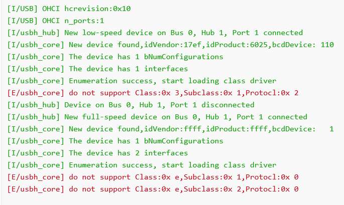

- 从机 MTP 类驱动, 支持多文件和多文件夹，支持 MCU 端增删文件并与 PC 同步

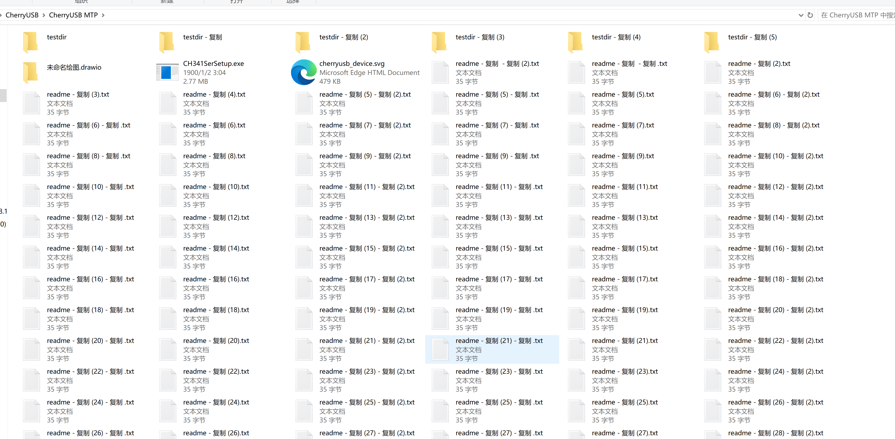

- 从机 TMC 类驱动

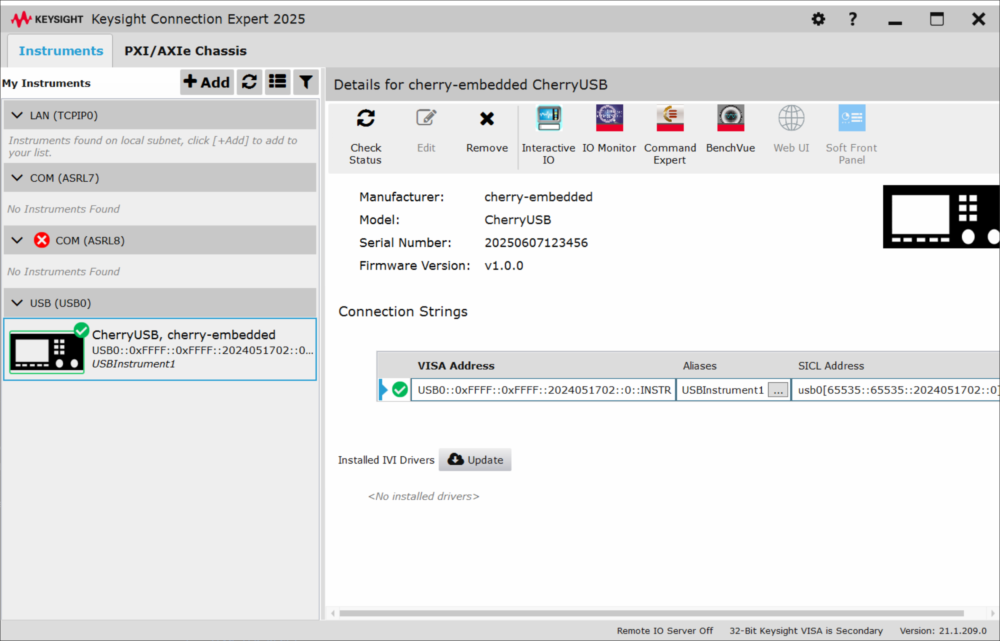
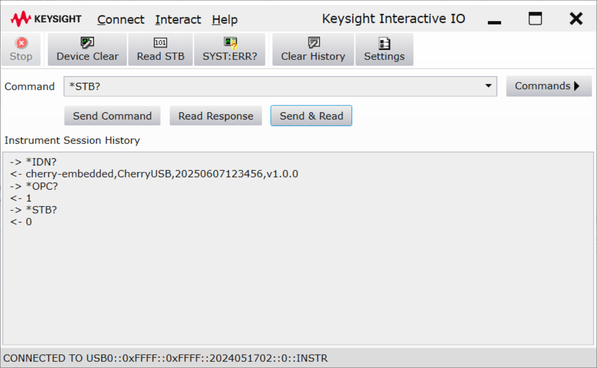

- USB 网卡类高性能版本优化,包含 CDC-NCM, CDC-RNDIS, 私有类驱动（支持多包发送和接收），下面举例 RNDIS

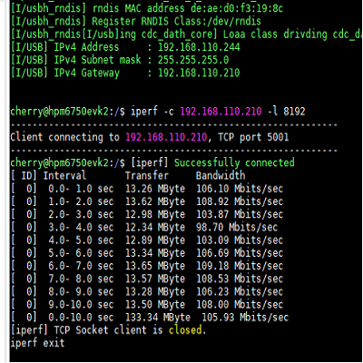
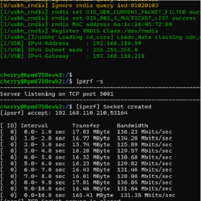

- 主机 DFU 驱动支持
- 主机 USBIP 支持

- 定制化 class 驱动或者 IP 驱动适配
- 技术支持相关
