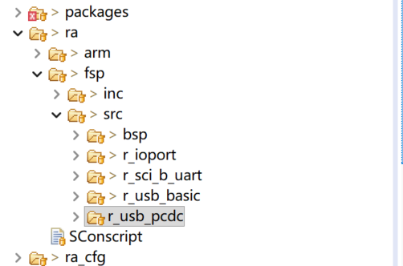

# Note

Refer to https://github.com/zephyrproject-rtos/hal_renesas

- Make sure usb interrupts exist in RASC.

- Remove all fsp usb source code. Otherwise you will build fail with multi function definitions.

## Support Chip List

- RA